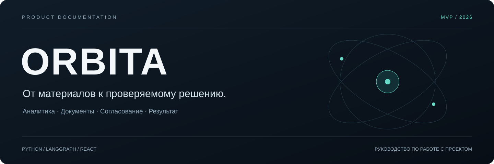
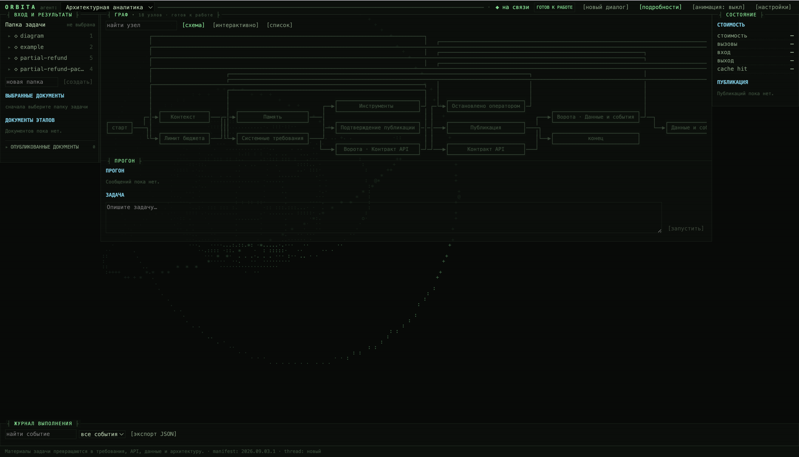
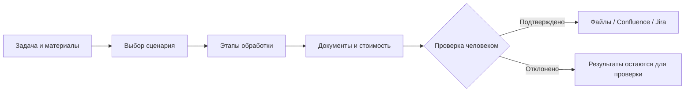

<div align="center">



**Проектная аналитика с видимым процессом и контролем результата.**

Материалы задачи → документы → проверка человеком → сохранение или публикация.

[Начать работу](docs/GETTING_STARTED.md) · [Руководство пользователя](docs/USER_GUIDE.md) · [Вся документация](docs/README.md) · [English](README.en.md)

</div>

---

Orbita помогает аналитику собрать требования, описать API и архитектуру, найти расхождения в документах и подготовить задачи Jira. Вы задаёте вопрос, выбираете материалы и наблюдаете за выполнением в веб-интерфейсе: какой этап работает, что он написал и сколько стоили обращения к модели.

Это локальный MVP на Python, LangGraph и React. Для первого полноценного запуска нужны Python, Node.js и ключ модели. Jira, Confluence и PostgreSQL подключаются отдельно; начать можно с файлов из репозитория.

## Что можно сделать

| Сценарий в интерфейсе                | Когда использовать                                                                         | Результат                                                                                                                                     |
| :------------------------------------------------------ | :---------------------------------------------------------------------------------------------------------- | :----------------------------------------------------------------------------------------------------------------------------------------------------- |
| **Архитектурная аналитика** | Есть задача, переписка, требования или ссылки на источники | Требования, контракт API, данные и события, архитектура, ревью                                         |
| **Подготовка задачи**             | Есть доступ к Jira, задача ещё неполная                                         | Пробелы, найденный контекст, план работ и первичная документация                                |
| **Документация схемы**           | Есть исходный файл draw.io                                                                  | Описание системы, компонентов и связей, страница документации и ревью                       |
| **Сверка пакета**                     | Нужно проверить согласованность нескольких документов      | Трассировка требований, расхождения и заключение                                                            |
| **Jira-декомпозиция**                 | Документацию нужно превратить в работу команды                     | Backlog, карточки и, при подключённой Jira, создание задач или формы для ручной проверки |
| **Обновление документа**       | Есть исходный документ и новые решения                                     | Проверяемые точечные изменения и отдельная новая версия                                               |
| **Нагрузочное тестирование** (`nt`) | Есть завершённое НТ и метрики Prometheus/InfluxDB | Baseline, вердикт SLA, полнота диагностики, аномалии и гипотезы причин |
| **Проведение нагрузочного тестирования** (`nt_run`) | Нужно подготовить и выполнить НТ на разрешённом стенде | План и k6-скрипт, пробный и основной прогоны, живые метрики и отчёт |

Для каждого сценария есть [инструкция с готовым запросом](docs/WORKFLOWS.md).

Для НТ есть два отдельных сценария: [**`nt` — анализ завершённого теста**](docs/NT.md) и [**`nt_run` — подготовка и проведение нового теста**](docs/NT_RUN.md). Для `nt_run` дополнительно нужны локальный runner и k6. После основного прогона он сам вызывает `nt` для исторического анализа.

Статус выполнения k6, его измерения и вердикт SLA — разные результаты. `completed` не означает `PASSED`, а вывод модели не заменяет вычисленное поле `analysis_result`. [Пример на локальном стенде](docs/NT_RUN_TESTBED.md) показывает, как читать эти данные.

## Первый запуск

1. Подготовьте **Python 3.11–3.13** и **Node.js 22** — эти версии покрывает конфигурация CI проекта.
2. Из корня репозитория создайте виртуальное окружение и установите зависимости:

```powershell
python -m venv .venv
.venv\Scripts\python.exe -m pip install -r requirements.txt
```

3. Если `.env` ещё нет, скопируйте `.env.example` в `.env`. Заполните `LLM_API_KEY` и проверьте `LLM_PROVIDER` / `LLM_MODEL`. Для первого запуска выставьте:

```dotenv
PUBLISH_TARGET=file
PUBLISH_REQUIRE_APPROVAL=1
JIRA_CREATE_ISSUES=0
```

4. Откройте два терминала в корне проекта. В терминале backend сначала выполните `$env:PYTHONUTF8="1"` для корректного вывода Unicode. Оставьте оба процесса работающими:

| Терминал | Команда для Windows PowerShell                                                                   |
| :--------------- | :--------------------------------------------------------------------------------------------------------- |
| Backend          | `.venv\Scripts\langgraph.exe dev --host 127.0.0.1 --port 2024 --no-browser --allow-blocking`             |
| Frontend         | Сначала`npm.cmd --prefix web ci`, затем `npm.cmd --prefix web run dev -- --host 127.0.0.1` |

5. Откройте **http://localhost:5173**, выберите «Архитектурная аналитика» и папку `partial-refund`. Отправьте: «Собери системные требования и проект решения по частичному возврату заказа. Укажи противоречия в источниках и открытые вопросы». Проверьте документы и подтвердите сохранение.

Результат появится в `published/`. Генерация использует платный API выбранной модели; время и стоимость зависят от материалов и настроек.

**[Полная инструкция →](docs/GETTING_STARTED.md)** — Windows, Linux/macOS, проверка подключения и первый результат. **[Docker →](docs/DEPLOYMENT.md)** — backend, данные, frontend и сохранность файлов.

## Как выглядит работа



*Снимок рабочего пространства со сценарием «Архитектурная аналитика». Интерфейс проведения НТ показан в [примере nt-testbed](docs/NT_RUN_TESTBED.md#что-видно-в-интерфейсе). Правила обновления кадров — в [визуальных материалах](docs/VISUALS.md).*



Подтверждения зависят от настроек. По умолчанию публикация и создание задач Jira требуют решения оператора; остановки между аналитическими этапами включаются отдельно.

## Документация по задачам

| Мне нужно…                                                                                  | Куда перейти                                                                     |
| :--------------------------------------------------------------------------------------------------- | :------------------------------------------------------------------------------------------ |
| Запустить весь проект                                                             | [Установка и первый запуск](docs/GETTING_STARTED.md)                   |
| Понять, какие данные подготовить и куда положить файлы | [Материалы задачи](docs/INPUTS.md)                                            |
| Разобраться с кнопками, этапами и результатами               | [Работа в интерфейсе](docs/USER_GUIDE.md)                                   |
| Повторить конкретный сценарий                                             | [Рабочие сценарии](docs/WORKFLOWS.md)                            |
| Настроить модель, бюджет и публикацию                                | [Конфигурация](docs/CONFIGURATION.md)                                            |
| Подключить Jira и Confluence                                                              | [Интеграции](docs/INTEGRATIONS.md)                                                 |
| Развернуть в Docker и сохранить данные                                    | [Развёртывание](docs/DEPLOYMENT.md)                                             |
| Найти причину ошибки                                                               | [Диагностика](docs/TROUBLESHOOTING.md)                                            |
| Изменять код и добавлять сценарии                                       | [Архитектура](docs/ARCHITECTURE.md) · [Разработка](docs/DEVELOPMENT.md) |

## Границы MVP

Результаты модели требуют содержательной проверки. Интерфейс показывает документы, состояния и стоимость, но не заменяет согласование требований командой. История всех запусков и повтор произвольного узла не заявлены как доступные функции UI; восстановление текущего треда зависит от сохранённого состояния сервера.

Текстовые материалы и `.drawio` поддерживаются напрямую. PDF, DOCX, сканы и изображения нужно предварительно преобразовать в подходящий текстовый формат; распознавания изображений в файловом конвейере нет.

Сервер предназначен для локальной работы. Перед запуском задайте случайный `API_ADMIN_TOKEN` (32–256 ASCII-символов): он обязателен для всего API, включая LangGraph. Для общего доступа нужны TLS и индивидуальная аутентификация. Подробнее — [безопасная эксплуатация](SECURITY.md).

---

[Отдельный пакет costmeter](packages/costmeter/README.md) · [Статья и исторические замеры кеша](docs/article.md) · [Тестовые материалы](docs/TEST_DATA.md) · [MIT License](LICENSE)
