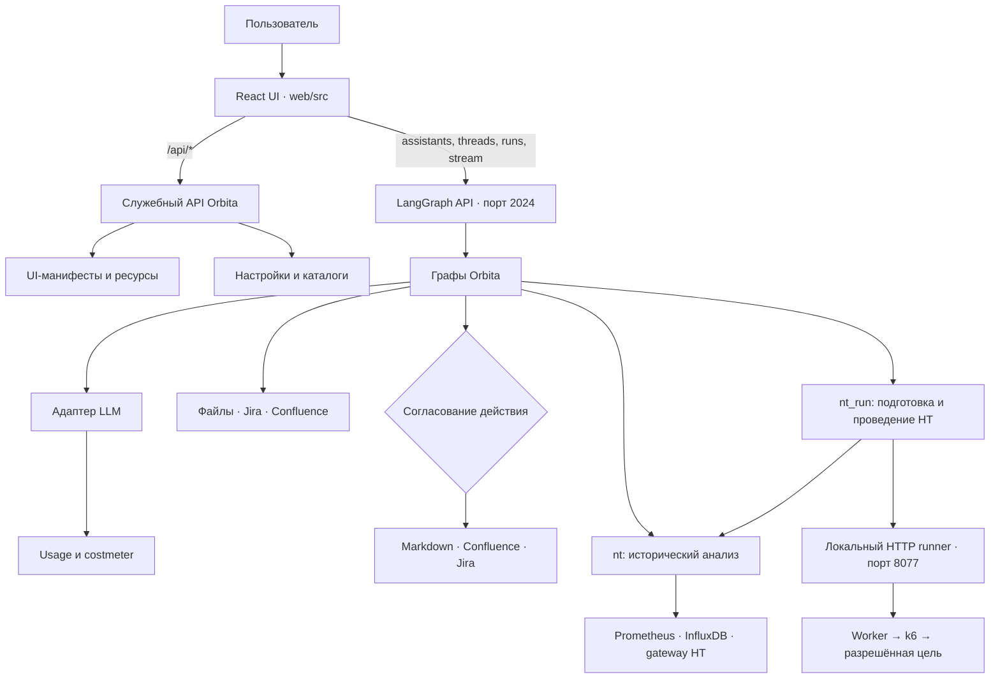
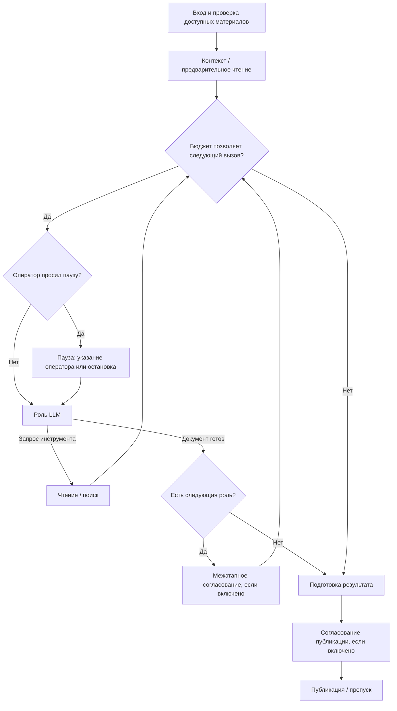
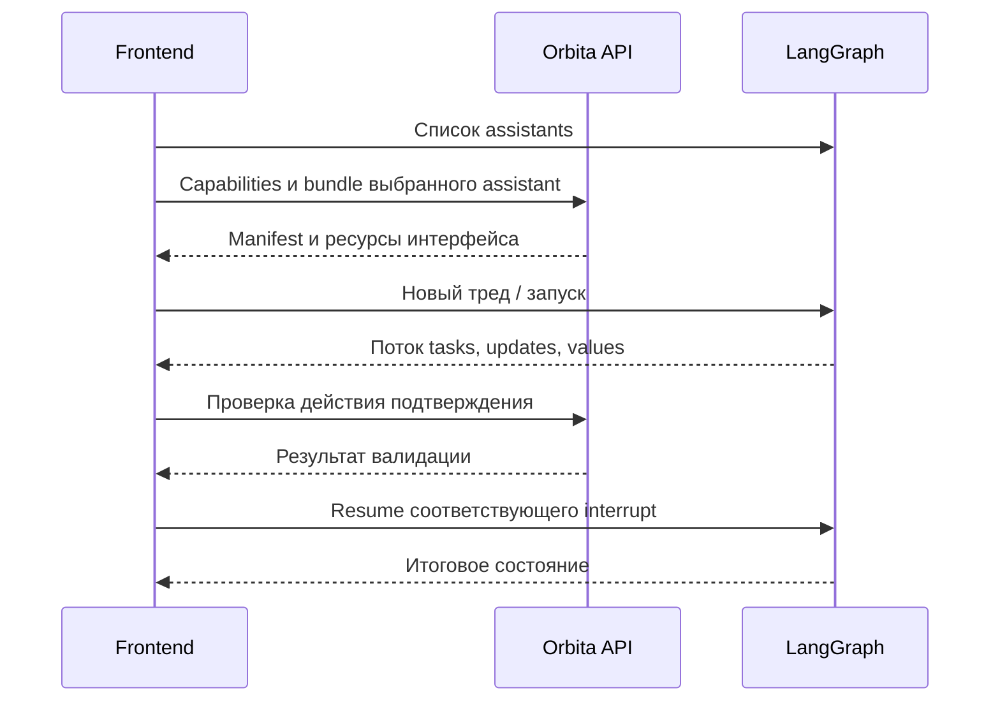
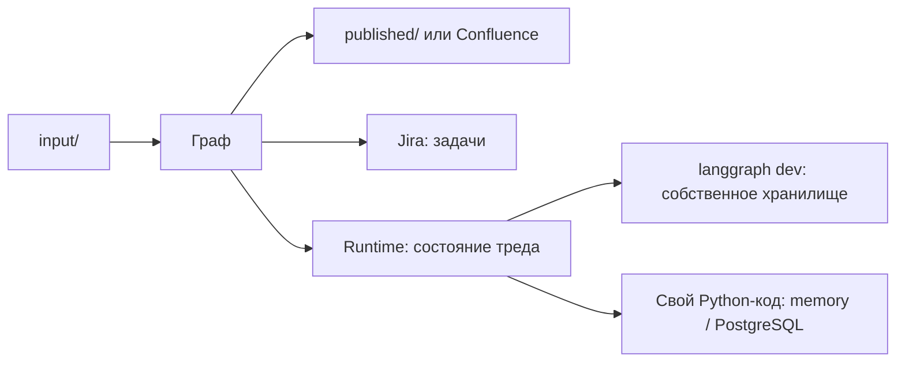

# Архитектура Orbita

[Документация](README.md) / Устройство проекта

**Orbita состоит из веб-интерфейса, LangGraph backend и подключаемых источников/приёмников.** Модель пишет документы и предлагает действия. Код управляет последовательностью, читает файлы, проверяет структурированные планы и выполняет разрешённую запись.

## Компоненты

В dev-режиме Vite проксирует запросы к Python-серверу. Frontend не хранит ключ модели и не выполняет вызовы LLM самостоятельно. Служебный API и стандартное API LangGraph работают на одном backend-порту, но имеют разные обязанности.

## Графы и общий конвейер

В [`langgraph.json`](../langgraph.json) зарегистрированы восемь графов. Пять используют общий сборщик конвейеров; `update`, `nt` и `nt_run` строят собственные последовательности и используют общие компоненты Orbita.

| Graph ID | Исходник | Модельные роли |
| :--- | :--- | :--- |
| `agent` | [`graph.py`](../src/agent/graph.py) | requirements, api, data, architecture, review |
| `prep` | [`prep_graph.py`](../src/agent/prep_graph.py) | intake, gaps, research, plan, draft |
| `drawio` | [`drawio_graph.py`](../src/agent/drawio_graph.py) | survey, components, page, review |
| `audit` | [`audit_graph.py`](../src/agent/audit_graph.py) | trace, conflicts, verdict |
| `jira` | [`jira_graph.py`](../src/agent/jira_graph.py) | scope, backlog, review, issues |
| `update` | [`update_graph.py`](../src/agent/update_graph.py) | changes; затем проверка и применение кодом |
| `nt` | [`nt_graph.py`](../src/agent/nt_graph.py) | Расчёты SLA кодом, затем ограниченное исследование и отчёт модели |
| `nt_run` | [`nt_run_graph.py`](../src/agent/nt_run_graph.py) | Планировщик с инструментами; проверка и запуск кодом; вложенный `nt` |

Упрощённая схема обычного конвейера:

Это схема принципа, не буквальная топология каждого графа. Реальные узлы зависят от конвейера: у Jira есть создание задач, у audit — предварительная проверка пакета, у drawio — разбор схемы. Точную топологию показывает UI.

Прогон останавливается тремя разными способами, и различать их важно. Межэтапное согласование и согласование публикации запланированы заранее и включаются настройками. **Пауза** приходит снаружи и посреди работы: кнопка интерфейса оставляет заявку (`POST /api/ui/pause`), узел роли видит её перед следующим обращением к модели и вызывает `interrupt()`. Оператор дописывает недостающее и продолжает ход с того же места либо останавливает конвейер — тогда готовые документы публикуются, а оставшиеся этапы не выполняются. Заявка живёт рядом с графом, а не в состоянии треда: писать в состояние снаружи во время прогона — гонка с чекпоинтером. Реализация — [`pause.py`](../src/agent/pause.py).

Количество ролей не равно количеству LLM-вызовов: роль может несколько раз вызвать инструменты. Бюджет проверяется по накопленной стоимости до очередного обращения, поэтому последний выполненный вызов может вывести сумму за лимит.

## Документы и состояние

`State` хранит сообщения, артефакты этапов, usage, состояние согласования и публикации. Следующие роли получают необходимые результаты предыдущих. Отсутствующий этап должен оставаться явным отсутствием, а не имитацией готового документа.

Код до модели выполняет то, что не требует генерации: проверку путей, разбор draw.io, чтение явных источников и формальную сверку пакета. Модель отвечает за содержательный анализ; её выводы не становятся автоматически проверенными фактами.

В `update` модель возвращает структурированный план замен. [`update_plan.py`](../src/agent/update_plan.py) проверяет исходные фрагменты и основания в материалах, применяет допустимые замены и формирует diff. Согласованный результат сохраняется отдельной версией, исходный документ не перезаписывается этим процессом.

## Контур проведения НТ

`nt_run` получает от runner список разрешённых целей и лимиты. Модель предлагает структурированный `Plan`; `nt_run/plan.py` проверяет его и компилирует k6-скрипт. Подтверждение оператора привязано к плану и данным. Runner повторно проверяет ограничения, сохраняет файлы и выполняет `k6 inspect`, затем граф запускает пробный и основной тесты.

HTTP-сервер runner и worker — отдельные процессы. SQLite в `.nt-runs/runner.sqlite3` хранит подготовленные планы, идентификаторы и результаты; worker контролирует k6, пороги и heartbeat независимо от модели. Один runner допускает один активный тест. Неопределённый исход блокирует новый запуск до подтверждения остановки.

После основного теста `nt_run` передаёт его статус и фактический период в `nt`, подставляя runner как источник метаданных. Исторические ряды по-прежнему приходят из настроенных источников `nt`; k6 summary не превращается в Prometheus-ряд. Вложенная публикация отключена, общий бюджет модели учитывает оба графа. Затем формируется отчёт кампании и применяется обычная политика публикации.

Контракты, статусы и восстановление описаны в [NT_RUN.md](NT_RUN.md); исторические расчёты — в [NT.md](NT.md).

## UI engine

Backend отдаёт описание интерфейса для графа: поля ввода, подписи узлов, виджеты результатов, формы подтверждения и разрешённые действия. Frontend сопоставляет их со статическим реестром компонентов.

Состояние LangGraph остаётся главным источником данных. `values` сверяет вычисленное состояние frontend, `tasks` сообщает события жизни узлов, `updates` дополняет ход выполнения.

Реализация объявляет поддержку live-событий узлов и сверки снимков. Она не объявляет долговременный replay событий, исторические версии manifest, fork треда и retry произвольного узла. При отсутствии подходящего manifest есть упрощённый интерфейс. Подробности — [UI engine](UI_ENGINE_IMPLEMENTATION.md).

## Хранение

Чекпоинт треда, файлы результатов и память между тредами — разные данные. Файл в `published/` не восстанавливает тред; наличие PostgreSQL рядом с dev-сервером не переносит туда его состояние. Таблица сохранности для Docker — в [развёртывании](DEPLOYMENT.md).

Runner отдельно сохраняет `.nt-runs/`: SQLite и файлы k6 не входят в чекпоинт LangGraph и не заменяются отчётом в `published/`. История планировщика `run_history` хранится в состоянии треда; для разбора после завершения временного CLI-процесса нужна [выгрузка стенограммы](NT_RUN_TESTBED.md).

## Стоимость и кеш

Системные промпты обычных ролей имеют стабильные общие части. Динамические материалы добавляются так, чтобы не менять начало без необходимости. Это создаёт условия для кеширования у провайдера, но попадание в кеш зависит от модели, времени и конкретного запроса.

[`costmeter`](../packages/costmeter/README.md) выделен в отдельный пакет. Он нормализует usage, учитывает вход из кеша, вход вне кеша, запись кеша и выход. Таблица цен и ручные переопределения дают оценку в USD. Исторические эксперименты сохранены в [статье](article.md); их цифры не являются гарантией для текущего запуска.

## Карта исходников

| Область | Файлы |
| :--- | :--- |
| Описание и сборка конвейеров | `pipeline.py`, `builder.py`, `roles.py`, `*_roles.py` |
| Исполнение и переходы | `nodes.py`, `routes.py`, `runtime.py`, `state.py`, `pause.py` |
| Вход и источники | `inputs.py`, `sources.py`, `drawio.py`, `checks.py` |
| LLM | `providers.py`, `tool_compat.py`, `prompts.py`, `*_prompts.py` |
| Сохранение | `publishers.py`, `documents.py`, `render.py`, `drafts.py` |
| Atlassian | `confluence.py`, `jira.py`, `jira_writer.py`, `jira_plan.py`, `jira_fields.py`, `jira_forms.py`, `request_pacing.py` |
| Настройки и API | `config.py`, `settings_io.py`, `api.py` |
| Контекст и хранение | `knowledge.py`, `memory.py`, `checkpointer.py` |
| Анализ НТ | `nt_graph.py`, `nt/`, `integrations/` |
| Проведение НТ | `nt_run_graph.py`, `nt_run/plan.py`, `nt_run/client.py`, `nt_run/runner.py`, `nt_run/worker.py`, `scripts/serve_nt_runner.py` |
| Backend UI engine | `src/agent/ui_engine/` |
| Frontend | `web/src/App.tsx`, `web/src/engine/`, `web/src/panels/` |

Короткие имена Python-файлов в таблице относятся к `src/agent/`.

---

Далее: [Разработка и проверки →](DEVELOPMENT.md) · [Контракты UI →](UI_ENGINE_IMPLEMENTATION.md)
