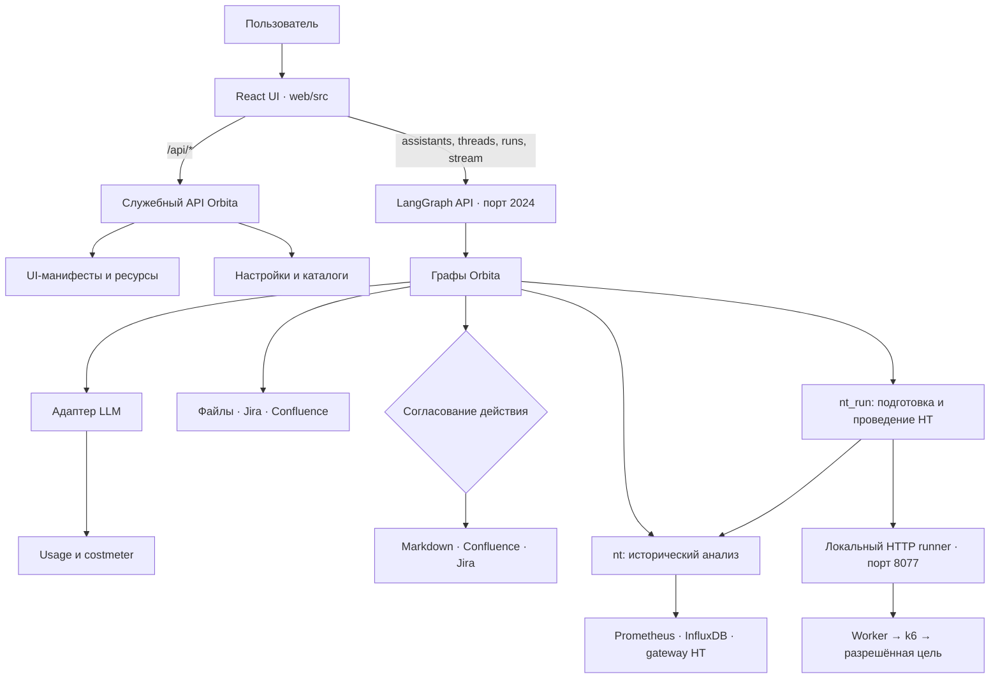
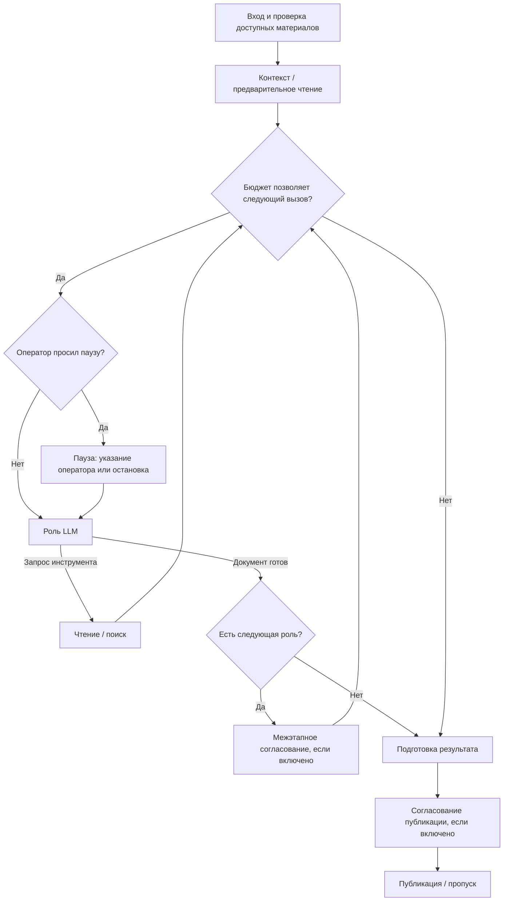
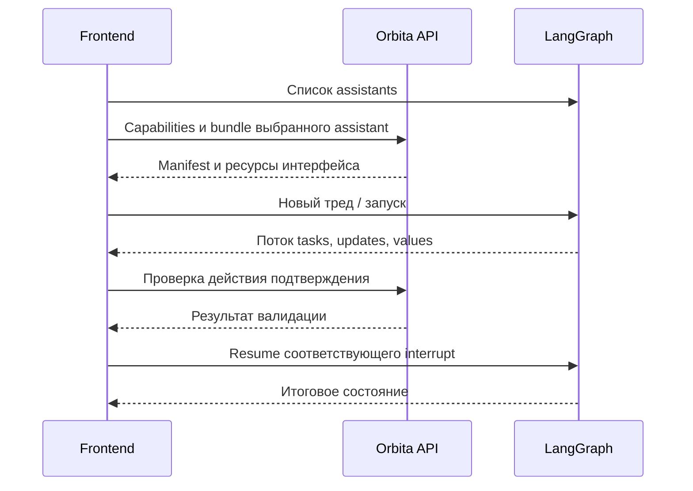
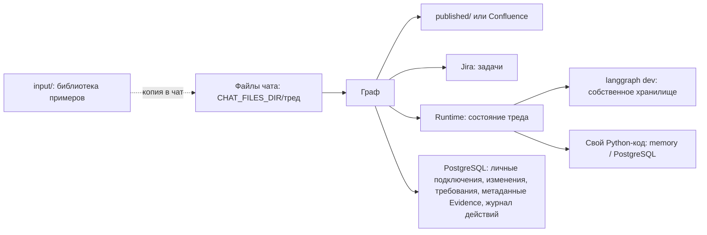

# Архитектура Orbita

[Документация](README.md) / Устройство проекта

**Orbita состоит из веб-интерфейса, LangGraph backend и подключаемых источников/приёмников.** Модель пишет документы и предлагает действия. Код управляет последовательностью, читает файлы, проверяет структурированные планы и выполняет разрешённую запись.

## Компоненты

```mermaid
flowchart TB
    U["Пользователь"] --> W["React UI · web/src"]
    W -->|"assistants, threads, runs, stream"| L["LangGraph API · порт 2024"]
    W -->|"/api/*"| A["Служебный API Orbita"]
    A --> M["UI-манифесты и ресурсы"]
    A --> S["Настройки и каталоги"]
    L --> G["Графы Orbita"]
    G --> P["Адаптер LLM"]
    P --> C["Usage и costmeter"]
    G --> I["Файлы · Jira · Confluence"]
    G --> H{"Согласование действия"}
    H --> O["Markdown · Confluence · Jira"]
    G --> NT["nt: исторический анализ"]
    NT --> TS["Prometheus · InfluxDB · gateway НТ"]
    G --> NR["nt_run: подготовка и проведение НТ"]
    NR --> R["Локальный HTTP runner · порт 8077"]
    R --> K["Worker → k6 → разрешённая цель"]
    NR --> NT
```

В dev-режиме Vite проксирует запросы к Python-серверу. Frontend не хранит ключ модели и не выполняет вызовы LLM самостоятельно. Служебный API и стандартное API LangGraph работают на одном backend-порту, но имеют разные обязанности.

## Графы и общий конвейер

В [`langgraph.json`](../langgraph.json) зарегистрированы девять графов. Шесть используют общий сборщик конвейеров; `update`, `nt` и `nt_run` строят собственные последовательности и используют общие компоненты Orbita.

| Graph ID | Исходник | Модельные роли |
| :--- | :--- | :--- |
| `agent` | [`graph.py`](../src/agent/graph.py) | requirements, api, data, architecture, review |
| `prep` | [`prep_graph.py`](../src/agent/prep_graph.py) | intake, gaps, research, plan, draft |
| `drawio` | [`drawio_graph.py`](../src/agent/drawio_graph.py) | survey, components, page, review |
| `audit` | [`audit_graph.py`](../src/agent/audit_graph.py) | trace, conflicts, verdict |
| `jira` | [`jira_graph.py`](../src/agent/jira_graph.py) | scope, backlog, review, issues |
| `metrics` | [`flow_graph.py`](../src/agent/flow_graph.py) | summary; показатели потока доски Jira считает код ([`flow.py`](../src/agent/flow.py)) |
| `update` | [`update_graph.py`](../src/agent/update_graph.py) | changes; затем проверка и применение кодом |
| `nt` | [`nt_graph.py`](../src/agent/nt_graph.py) | Расчёты SLA кодом, затем ограниченное исследование и отчёт модели |
| `nt_run` | [`nt_run_graph.py`](../src/agent/nt_run_graph.py) | Планировщик с инструментами; проверка и запуск кодом; вложенный `nt` |

Упрощённая схема обычного конвейера:

```mermaid
flowchart TD
    A["Вход и проверка доступных материалов"] --> B["Контекст / предварительное чтение"]
    B --> C{"Бюджет позволяет следующий вызов?"}
    C -->|"Да"| Z{"Оператор просил паузу?"}
    Z -->|"Нет"| D["Роль LLM"]
    Z -->|"Да"| Y["Пауза: указание оператора или остановка"]
    Y --> D
    D -->|"Запрос инструмента"| T["Чтение / поиск"]
    T --> C
    D -->|"Документ готов"| E{"Есть следующая роль?"}
    E -->|"Да"| F["Межэтапное согласование, если включено"]
    F --> C
    E -->|"Нет"| H["Подготовка результата"]
    C -->|"Нет"| H
    H --> I["Согласование публикации, если включено"]
    I --> J["Публикация / пропуск"]
```

Это схема принципа, не буквальная топология каждого графа. Реальные узлы зависят от конвейера: у Jira есть создание задач, у audit — предварительная проверка пакета, у drawio — разбор схемы. Точную топологию показывает UI.

Прогон останавливается тремя разными способами, и различать их важно. Межэтапное согласование и согласование публикации запланированы заранее и включаются настройками. **Пауза** приходит снаружи и посреди работы: кнопка интерфейса оставляет заявку (`POST /api/ui/pause`), узел роли видит её перед следующим обращением к модели и вызывает `interrupt()`. Оператор дописывает недостающее и продолжает ход с того же места либо останавливает конвейер — тогда готовые документы публикуются, а оставшиеся этапы не выполняются. Заявка живёт рядом с графом, а не в состоянии треда: писать в состояние снаружи во время прогона — гонка с чекпоинтером. Реализация — [`pause.py`](../src/agent/pause.py).

Количество ролей не равно количеству LLM-вызовов: роль может несколько раз вызвать инструменты. Бюджет проверяется по накопленной стоимости до очередного обращения, поэтому последний выполненный вызов может вывести сумму за лимит.

### Реестр графов и вложенный режим

[`graph_registry.py`](../src/agent/graph_registry.py) — один список графов: имя, модуль с `build_graph()`, остановки (`interrupt()` с полем `action`), записи наружу и вложенные графы. Тесты сверяют его с `langgraph.json`, с формами остановок в UI-манифестах и со скомпилированной топологией, поэтому новый граф или новая остановка без записи в реестре не проходят CI.

Граф, который вызывает другой граф ради результата, передаёт ему `configurable.nested=true`. Вложенный прогон не спрашивает оператора и ничего не пишет наружу: без этого под оркестратором оператор подтверждал бы одно и то же дважды, а публикация уезжала бы дважды. Каждая остановка и запись ведут себя так, как записано в реестре:

| Во вложенном прогоне | Что это | Примеры |
| :--- | :--- | :--- |
| `kept` | остаётся | пауза оператора: её просит человек, а не граф |
| `skipped` | не выполняется | межэтапные ворота, запись в долгую память, резервное сохранение файла |
| `proposed` | становится предложением в `state.proposals` | публикация, заведение задач Jira, запуск НТ, вопрос уточнения `nt_run` |
| `refused` | отклоняется без вопроса | запросы к источникам, составленные моделью в `nt` |

Предложение ([`proposals.py`](../src/agent/proposals.py)) содержит вид действия (`kind` совпадает с `action` остановки), политику графа (`approval_required` — спросил бы граф сам по своим настройкам), payload, который граф показал бы оператору, и данные для выполнения. Вызывающий собирает предложения, спрашивает оператора один раз и выполняет одобренные через `proposals.apply(proposal, {"decision": "approved", "id": ...})`. Перед записью сверяется то же, что сверяет сам граф: отпечаток предложения, решение именно по нему, назначение публикации и версии страниц на момент предпросмотра, отпечаток плана карточек Jira. Выполняются публикация и заведение задач; запуск НТ и уточнение выполняет только `nt_run` верхнего уровня — за ними следует продолжение графа.

Флаг может прислать и клиент API: режим только убирает действия и ничего не разрешает сверх обычного прогона.

## Документы и состояние

`State` хранит сообщения, артефакты этапов, usage, состояние согласования и публикации. Следующие роли получают необходимые результаты предыдущих. Отсутствующий этап должен оставаться явным отсутствием, а не имитацией готового документа.

Код до модели выполняет то, что не требует генерации: проверку путей, разбор draw.io, чтение явных источников и формальную сверку пакета. Модель отвечает за содержательный анализ; её выводы не становятся автоматически проверенными фактами.

В `update` модель возвращает структурированный план замен. [`update_plan.py`](../src/agent/update_plan.py) проверяет исходные фрагменты и основания в материалах, применяет допустимые замены и формирует diff. Согласованный результат сохраняется отдельной версией, исходный документ не перезаписывается этим процессом.

### Evidence, проверка ссылок и изменение

Всё, что читают код и инструменты, выходит вместе с записью [`EvidenceItem`](../src/agent/evidence.py): система и идентификатор источника, версия (`updated` задачи, номер версии страницы, хеш файла), какая часть прочитана, SHA-256 прочитанного текста и чей токен читал — пользователя прогона или общий из `.env`. Записи отдают [`sources.py`](../src/agent/sources.py) и инструменты чтения ([`tools.py`](../src/agent/tools.py)). Идентификатор `EV-3f9a2c` — хеш системы, идентификатора и версии: тот же источник той же версии получает тот же id при любом чтении, поэтому его можно писать в документ. Страница с шапкой, которую ставит сама Orbita, помечается как собственная (`own`): это черновик прошлого прогона, а не первоисточник.

Роли `prep` ссылаются на прочитанное по id: он стоит в первой строке каждого прочитанного блока и ответа инструмента. Прочие графы получают записи Evidence в следах инструментов, но прежние ответы без id: их роли пока пишут старые теги.

Каждый документ `prep` сразу после выпуска проверяет **первый критик** — [`critic.py`](../src/agent/critic.py), без модели. Он проверяет, что каждая ссылка ведёт на прочитанный источник, что слова в «ёлочках» и имена в `обратных кавычках` стоят в том источнике, на который сослались, что собственная страница Orbita не выдана за первоисточник, что утверждения о комментариях не относятся к задаче без комментариев и что имя системы из заголовка одного источника не приписано другому. Пересказ без кавычек критик не судит. Замечания уходят следующим ролям в бриф и приложением «Проверка ссылок» на страницу; счёт стоит строкой под задачей.

**Изменение** ([`changes.py`](../src/agent/changes.py)) — единица работы, которая живёт дольше треда: изменение по задаче Jira, его требования, прочитанные источники и треды. Номер требования даёт код, а не модель: план пишет знакомое требование под прежним номером, а новое — с меткой `R-?1`, `R-?2`, по которой на него ссылаются задачи плана. Код сверяет формулировки с сохранёнными: тот же текст получает тот же номер, даже если модель поставила другой, а номер выбывшего требования не занимается; метки в ссылках задач заменяются окончательными номерами. Узел `change` в конце хода записывает итог в Postgres (миграция 2 в [`db.py`](../src/agent/db.py)) и сверяет номера ещё раз под блокировкой. В базу уходит только то, что тред изменил относительно прочитанного из неё: нетронутое требование могло за это время поменяться в соседнем треде. Номер, выданный в треде, — не заявка на номер в базе: если соседний тред успел его занять, требование получает свой, а план и документация переписываются до публикации. В базу пишутся метаданные Evidence без текста источника: текст прочитан чьим-то токеном и остаётся в треде того, кто читал. Изменение принадлежит тому, кто его ведёт; `GET /api/changes` и `GET /api/changes/{id}` отдают только свои. Без `POSTGRES_URI` прогон идёт как обычно: номера устойчивы в пределах треда, а строка под задачей говорит, что изменение не сохранено. Вложенный прогон изменение не пишет.

### Внешние действия: предложение, согласие, выполнение, сверка

Записи наружу — публикация страниц и файлов, заведение задач Jira, сохранение новой версии в `update` — идут одним порядком из [`actions.py`](../src/agent/actions.py):

| Шаг | Что делает | Где у публикации | Где у Jira |
| :--- | :--- | :--- | :--- |
| Предложение | Цель и операции, у каждой ключ и отпечаток содержимого; отпечаток всего предложения — то, к чему привязано согласие | одобряемый набор `publish_commitment`, отпечаток `commitment_digest` | карточки плана с судьбой каждой из журнала: `create`, `update`, `unchanged`, `recover` (`jira_writer.operations`) |
| Правила | Проверки кодом до вопроса | рубильник, режим, реквизиты, коллизии имён (`_publish_skip`) | рубильник, реквизиты, разбор плана, проект; «всё без изменений» — хода без вопроса |
| Согласие | `interrupt()` показывает `digest`, интерфейс возвращает его в ответе; ответ по другой версии — не согласие (`actions.bind`). Перед записью предложение собирается заново и сравнивается (`actions.stale`) | `approve_node`, затем `_stale_approval` | `_ask`: после ответа предложение собирается с названным проектом; если операции другие — вопрос повторяется с тем, что уедет на самом деле |
| Выполнение | Каждая операция проходит журнал: «отправляем» до запроса, итог после | `write_pages` | `create_issues`: новая заводится, исправленная правится на месте (`PUT` темы, описания и сопоставленных полей), неизменённая не трогается |
| Сверка | Записанное перечитывается и сравнивается в нормализованном виде: `verified`, `differs`, `unverified` | файл — байт в байт; Confluence — версия, заголовок и текст без разметки | тема и описание без разметки ADF и лишних пробелов, метка операции (`verify_issues`) |

Журнал Jira раньше вёлся по ключу «тред, проект, отпечаток плана», и правка плана в том же чате заводила все карточки заново. Теперь область журнала — тред и проект, а карточку узнают по локальному ключу и отпечатку её полей (`Item.digest`). Правка на месте не затирает чужую: перед ней задача читается и сравнивается с тем, что Orbita записала последней; разница — конфликт, правка не отправляется. Прочитанное сверкой после записи становится точкой отсчёта, поэтому нормализация трекера не выглядит чужой правкой. Тип, родитель и метки заведённой задачи правкой не меняются.

Хранилище одно: с `POSTGRES_URI` — таблицы `actions`, `action_approvals`, `action_operations` (миграция 3 в [`db.py`](../src/agent/db.py)), без базы — тот же SQL в файле `JIRA_JOURNAL_PATH`. Отказ базы не подменяется файлом: два журнала по-разному отвечали бы «уже отправлено?». Для Jira журнал обязателен — без него заведение не начинается; публикация уезжает и без журнала, а причина остаётся в `publication.journal_error`. В журнале — заголовки, отпечатки, ключи и ссылки на той стороне, решения с отпечатком и тем, кто решал; тел документов и описаний задач нет. `GET /api/actions` (`?thread=`) и `GET /api/actions/{id}` отдают только свои действия.

Предложения вложенного прогона применяются тем же порядком: `proposals.apply` пишет решение и итог в журнал треда вызывающего. Вложенный граф не знает журнала вызывающего и предлагает заведение, а не правку, поэтому если в треде вызывающего те же карточки уже заведены с другим содержимым, по предложению ничего не пишется. `nt_run` пока ведёт согласие своим `approved_hash` и в журнал действий не пишет.

## Контур проведения НТ

`nt_run` получает от runner список разрешённых целей и лимиты. Модель предлагает структурированный `Plan`; `nt_run/plan.py` проверяет его и компилирует k6-скрипт. Подтверждение оператора привязано к плану и данным. Runner повторно проверяет ограничения, сохраняет файлы и выполняет `k6 inspect`, затем граф запускает пробный и основной тесты.

HTTP-сервер runner и worker — отдельные процессы. SQLite в `.nt-runs/runner.sqlite3` хранит подготовленные планы, идентификаторы и результаты; worker контролирует k6, пороги и heartbeat независимо от модели. Один runner допускает один активный тест. Неопределённый исход блокирует новый запуск до подтверждения остановки.

После основного теста `nt_run` передаёт его статус и фактический период в `nt`, подставляя runner как источник метаданных. Исторические ряды по-прежнему приходят из настроенных источников `nt`; k6 summary не превращается в Prometheus-ряд. Вложенная публикация отключена, общий бюджет модели учитывает оба графа. Затем формируется отчёт кампании и применяется обычная политика публикации.

Контракты, статусы и восстановление описаны в [NT_RUN.md](NT_RUN.md); исторические расчёты — в [NT.md](NT.md).

## UI engine

Backend отдаёт описание интерфейса для графа: поля ввода, подписи узлов, виджеты результатов, формы подтверждения и разрешённые действия. Frontend сопоставляет их со статическим реестром компонентов.

```mermaid
sequenceDiagram
    participant UI as Frontend
    participant API as Orbita API
    participant LG as LangGraph
    UI->>LG: Список assistants
    UI->>API: Capabilities и bundle выбранного assistant
    API-->>UI: Manifest и ресурсы интерфейса
    UI->>LG: Новый тред / запуск
    LG-->>UI: Поток tasks, updates, values
    UI->>API: Проверка действия подтверждения
    API-->>UI: Результат валидации
    UI->>LG: Resume соответствующего interrupt
    LG-->>UI: Итоговое состояние
```

Состояние LangGraph остаётся главным источником данных. `values` сверяет вычисленное состояние frontend, `tasks` сообщает события жизни узлов, `updates` дополняет ход выполнения.

Реализация объявляет поддержку live-событий узлов и сверки снимков. Она не объявляет долговременный replay событий, исторические версии manifest, fork треда и retry произвольного узла. При отсутствии подходящего manifest есть упрощённый интерфейс. Подробности — [UI engine](UI_ENGINE_IMPLEMENTATION.md).

## Хранение

```mermaid
flowchart LR
    C["Файлы чата: CHAT_FILES_DIR/тред"] --> G["Граф"]
    I["input/: библиотека примеров"] -. "копия в чат" .-> C
    G --> P["published/ или Confluence"]
    G --> J["Jira: задачи"]
    G --> R["Runtime: состояние треда"]
    R --> D["langgraph dev: собственное хранилище"]
    R --> S["Свой Python-код: memory / PostgreSQL"]
    G --> Q["PostgreSQL: личные подключения, изменения, требования, метаданные Evidence, журнал действий"]
```

Файлы, загруженные в чат, лежат в папке его треда, и граф получает её по треду прогона (`runtime.options`), а не по имени из запроса: чужой чат ни прочитать, ни запустить нельзя. Опубликованные файлы и долгая память тоже разложены по пользователям. Чекпоинт треда, файлы результатов и память между тредами — разные данные. Файл в `published/` не восстанавливает тред; наличие PostgreSQL рядом с dev-сервером не переносит туда его состояние. Таблица сохранности для Docker — в [развёртывании](DEPLOYMENT.md).

Runner отдельно сохраняет `.nt-runs/`: SQLite и файлы k6 не входят в чекпоинт LangGraph и не заменяются отчётом в `published/`. История планировщика `run_history` хранится в состоянии треда; для разбора после завершения временного CLI-процесса нужна [выгрузка стенограммы](NT_RUN_TESTBED.md).

## Стоимость и кеш

Системные промпты обычных ролей имеют стабильные общие части. Динамические материалы добавляются так, чтобы не менять начало без необходимости. Это создаёт условия для кеширования у провайдера, но попадание в кеш зависит от модели, времени и конкретного запроса.

[`costmeter`](../packages/costmeter/README.md) выделен в отдельный пакет. Он нормализует usage, учитывает вход из кеша, вход вне кеша, запись кеша и выход. Таблица цен и ручные переопределения дают оценку в USD. Исторические эксперименты сохранены в [статье](article.md); их цифры не являются гарантией для текущего запуска.

## Карта исходников

| Область | Файлы |
| :--- | :--- |
| Описание и сборка конвейеров | `pipeline.py`, `builder.py`, `roles.py`, `*_roles.py` |
| Исполнение и переходы | `nodes.py`, `routes.py`, `runtime.py`, `state.py`, `pause.py` |
| Вход и источники | `inputs.py`, `chat_files.py`, `sources.py`, `evidence.py`, `ledger.py`, `drawio.py`, `checks.py` |
| Проверка ссылок и изменение | `critic.py`, `changes.py`, `db.py` |
| LLM | `providers.py`, `tool_compat.py`, `prompts.py`, `*_prompts.py` |
| Сохранение | `publishers.py`, `publish_nodes.py`, `documents.py`, `render.py`, `drafts.py` |
| Внешние действия и журнал | `actions.py`, `jira_journal.py`, `proposals.py`, `db.py` |
| Atlassian | `confluence.py`, `jira.py`, `jira_writer.py`, `jira_plan.py`, `jira_fields.py`, `jira_forms.py`, `request_pacing.py` |
| Настройки и API | `config.py`, `settings_io.py`, `api.py`, `logbook.py` (журнал сервера для `/api/logs`) |
| Контекст и хранение | `knowledge.py`, `memory.py`, `checkpointer.py` |
| Анализ НТ | `nt_graph.py`, `nt/`, `integrations/` |
| Проведение НТ | `nt_run_graph.py`, `nt_run/plan.py`, `nt_run/client.py`, `nt_run/runner.py`, `nt_run/worker.py`, `scripts/serve_nt_runner.py` |
| Backend UI engine | `src/agent/ui_engine/` |
| Frontend | `web/src/App.tsx`, `web/src/engine/`, `web/src/panels/`; журнал и отчёт об ошибке — `web/src/panels/journal/`, `web/src/lib/clientLog.ts`, `web/src/lib/report.ts` |

Короткие имена Python-файлов в таблице относятся к `src/agent/`.

---

Далее: [Разработка и проверки →](DEVELOPMENT.md) · [Контракты UI →](UI_ENGINE_IMPLEMENTATION.md)
