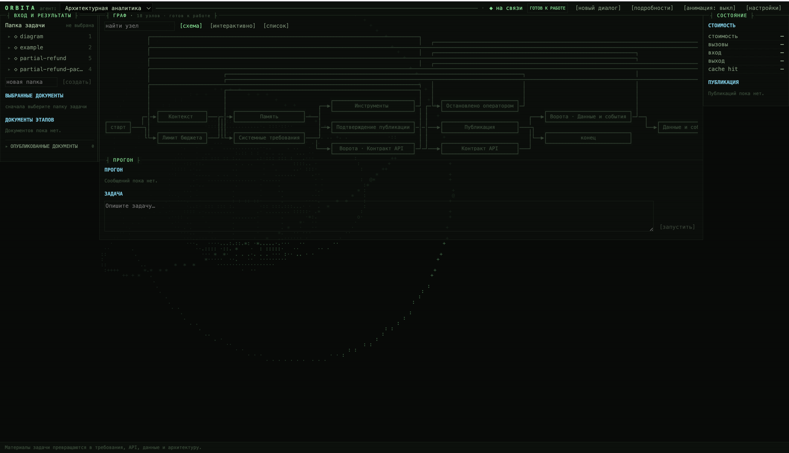

# Установка и первый запуск

[Документация](README.md) / Начало работы

**Результат этой инструкции:** открытый веб-интерфейс Orbita и первый комплект Markdown-документов в `published/`. Все команды выполняются из корня репозитория, если явно не указано другое место.

## Что подготовить

| Нужно                                   | Для чего                                                                                       |
| :------------------------------------------- | :---------------------------------------------------------------------------------------------------- |
| Копия всего репозитория | Backend в`src/`, frontend в `web/`, локальный пакет в `packages/costmeter/`    |
| Python 3.11–3.13                            | Запуск backend; эти версии проверяются в CI                                |
| Node.js 22 и npm                            | Запуск frontend и тестов; CI использует Node 22                                |
| Ключ LLM-провайдера            | Генерация документов:`deepseek`, `openai` или `anthropic`                 |
| Доступ к API модели             | Прямое подключение или корпоративный совместимый шлюз |

Jira, Confluence, PostgreSQL и LangSmith для собственного веб-интерфейса не нужны. Минимум frontend в `package.json` — Node 20, но для тестов движка используйте Node 22, как в CI.

```text
python --version
node --version
npm --version
```

В PowerShell при блокировке `npm.ps1` вызывайте `npm.cmd`. Активировать виртуальное окружение необязательно: ниже команды обращаются к его исполняемым файлам напрямую.

## 1. Установите зависимости

Windows PowerShell:

```powershell
python -m venv .venv
.venv\Scripts\python.exe -m pip install -r requirements.txt
npm.cmd --prefix web ci
```

Linux / macOS:

```bash
python3 -m venv .venv
.venv/bin/python -m pip install -r requirements.txt
npm --prefix web ci
```

`requirements.txt` устанавливает два локальных пакета: `orbita-costmeter` и `orbita-agent` с инструментами разработки. Не переносите только `src/`: без соседнего `packages/costmeter/` установка будет неполной. `npm ci` использует `web/package-lock.json`.

Для Anthropic после основной установки добавьте адаптер:

```powershell
.venv\Scripts\python.exe -m pip install -e ".[anthropic]"
```

На Linux/macOS замените путь к Python на `.venv/bin/python`.

## 2. Создайте `.env`

Файл должен лежать **в корне проекта**, рядом с `langgraph.json`, а не в `web/` или `src/`. Если он уже существует, редактируйте его: повторное копирование с перезаписью удалит ваши настройки.

Windows PowerShell:

```powershell
if (-not (Test-Path -LiteralPath .env)) { Copy-Item -LiteralPath .env.example -Destination .env }
```

Linux/macOS:

```bash
if [ ! -f .env ]; then cp .env.example .env; fi
```

Откройте `.env` в редакторе. Для первого прогона проверьте эти строки:

```dotenv
LLM_PROVIDER=deepseek
LLM_MODEL=deepseek-v4-flash
LLM_API_KEY=your-provider-api-key
AGENT_INPUT_DIR=input
PUBLISH_TARGET=file
PUBLISH_DIR=published
CONFLUENCE_PUBLISH=1
CONFLUENCE_PUBLISH_MODE=each
PUBLISH_REQUIRE_APPROVAL=1
PIPELINE_REQUIRE_APPROVAL=0
JIRA_CREATE_ISSUES=0
```

`your-provider-api-key` замените своим ключом. Название модели выше — значение из репозитория; используйте модель, доступную вашему ключу. Для другого провайдера измените также `LLM_PROVIDER` и `LLM_MODEL`: смена провайдера сама не подбирает модель. Для шлюза добавьте `LLM_API_BASE`.

До запуска backend обязательно задайте в `.env` случайный `API_ADMIN_TOKEN`
длиной 32–256 ASCII-символов. Сгенерировать подходящее значение можно так:

Windows PowerShell:

```powershell
.venv\Scripts\python.exe -c "import secrets; print(secrets.token_urlsafe(32))"
```

Linux / macOS:

```bash
.venv/bin/python -c 'import secrets; print(secrets.token_urlsafe(32))'
```

Скопируйте напечатанное значение в строку `API_ADMIN_TOKEN=` файла `.env`.
Это отдельный токен доступа ко всему HTTP API Orbita, включая `/ok`; ключ
модели для него не подходит. Не публикуйте токен и не добавляйте `.env` в Git.

В шаблоне бюджет треда равен `0`, то есть ограничение отключено. При необходимости задайте `BUDGET_USD_PER_THREAD`; ограничения расчёта описаны в [конфигурации](CONFIGURATION.md).

## 3. Запустите backend

**Терминал 1**, корень репозитория.

Windows PowerShell:

```powershell
$env:PYTHONUTF8="1"
.venv\Scripts\langgraph.exe dev --host 127.0.0.1 --port 2024 --no-browser --allow-blocking
```

Linux/macOS:

```bash
.venv/bin/langgraph dev --host 127.0.0.1 --port 2024 --no-browser --allow-blocking
```

Дождитесь сообщения о готовности. Флаг `--allow-blocking` нужен синхронным операциям файлов и HTTP в текущем backend. В Windows `PYTHONUTF8=1` предотвращает ошибки вывода Unicode в терминале с системной кодировкой. Оставьте терминал открытым.

Проверка из другого терминала, Windows:

```powershell
$apiToken = & .venv\Scripts\python.exe -c "from dotenv import dotenv_values; print(dotenv_values('.env')['API_ADMIN_TOKEN'])"
Invoke-RestMethod -Headers @{ Authorization = "Bearer $apiToken" } http://127.0.0.1:2024/ok
Remove-Variable apiToken
```

Linux/macOS:

```bash
API_ADMIN_TOKEN=$(.venv/bin/python -c 'from dotenv import dotenv_values; print(dotenv_values(".env")["API_ADMIN_TOKEN"])')
curl --fail -H "Authorization: Bearer ${API_ADMIN_TOKEN}" http://127.0.0.1:2024/ok
unset API_ADMIN_TOKEN
```

Ответ `{"ok":true}` подтверждает доступность сервера и верный
`API_ADMIN_TOKEN`, но ещё не проверяет ключ и ответ модели. Запрос без заголовка
`Authorization` или с неверным токеном получает HTTP 401; если токен на сервере
не задан или не соответствует требованиям, API отвечает HTTP 503.

## 4. Запустите frontend

**Терминал 2**, корень репозитория.

Windows PowerShell:

```powershell
npm.cmd --prefix web run dev -- --host 127.0.0.1
```

Linux/macOS:

```bash
npm --prefix web run dev -- --host 127.0.0.1
```

Откройте **http://localhost:5173**. Если порт занят, Vite может выбрать другой: точный адрес указан в терминале. Frontend проксирует API-запросы на `127.0.0.1:2024`.

При первом запросе API браузер попросит `API_ADMIN_TOKEN`, который вы задали в
шаге 2. Изменение токена требует перезапуска сервера.



*Кадр: выбор сценария, панели «ВХОД И РЕЗУЛЬТАТЫ», «ГРАФ», «ПРОГОН» и «СОСТОЯНИЕ». [Требования к снимку](VISUALS.md).*

## 5. Получите первый результат

1. Выберите «Архитектурная аналитика».
2. Создайте новый тред, если открыт предыдущий контекст.
3. В папке задачи выберите `partial-refund`. Она уже есть в `input/`.
4. Оставьте отдельные документы невыбранными, чтобы работать с папкой, и отправьте запрос:

```text
Собери системные требования и проект решения по частичному возврату заказа.
Прочитай все материалы выбранной папки. Укажи противоречия между источниками,
открытые вопросы и критерии приёмки. Не выдавай предположения за решения.
```

5. Наблюдайте за этапами. Длинный документ может генерироваться несколько минут.
6. Откройте документы этапов. При запросе подтверждения проверьте подготовленные файлы и нажмите кнопку согласия.
7. Найдите Markdown-файлы в `published/` и ссылки на результаты в интерфейсе.

При настройках выше полный прогон аналитики готовит пять документов. Их имена формируются из заголовков; это не фиксированные `01.md`–`05.md`. Если публикация отклонена или произошла ошибка, документы могут остаться только в состоянии треда.

## Как понять, что всё работает

| Проверка                                                                          | Ожидаемый результат                                                                                                             |
| :---------------------------------------------------------------------------------------- | :------------------------------------------------------------------------------------------------------------------------------------------------ |
| `/ok` отвечает                                                                  | Backend доступен                                                                                                                          |
| Видны шесть сценариев и папки                                    | Frontend получил данные API                                                                                                          |
| Появился текст первого этапа                                     | Модель доступна и обработка началась                                                                              |
| Появилось подтверждение сохранения                        | Выполнение дошло до публикации                                                                                         |
| После согласия есть файлы в`published/`                          | Полный путь от входа до сохранения завершён                                                                  |
| Результат замечает расхождения встречи и письма | Прочитан существенный контекст; подробная проверка — в[тестовых данных](TEST_DATA.md) |

## Остановка и следующий запуск

Нажмите `Ctrl+C` в обоих терминалах. Для следующего запуска повторите только шаги 3 и 4. Зависимости переустанавливают после их изменения, а `.env` создают один раз.

После редактирования `.env` перезапустите backend. Файлы в `published/` сохраняются независимо от остановки процессов. Не удаляйте `.langgraph_api/`, если рассчитываете продолжить текущие треды.

---

Далее: [Свои материалы →](INPUTS.md) · [Интерфейс →](USER_GUIDE.md) · [Диагностика →](TROUBLESHOOTING.md)
