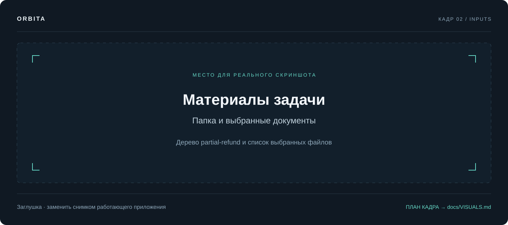

# Материалы задачи

[Документация](README.md) / Входные данные

**Одна папка — одна задача.** Положите материалы на машину, где работает backend, затем выберите папку в интерфейсе. Ввод пути к файлу на ноутбуке не передаёт файл удалённому серверу.

## Куда класть файлы

По умолчанию `AGENT_INPUT_DIR=input`. Создайте внутри него отдельную папку:

```text
claude_langGraph/
├── .env                         настройки и ключи
├── input/
│   ├── example/                  короткий встроенный пример
│   ├── partial-refund/           материалы для аналитики
│   ├── partial-refund-package/   пакет для сверки и декомпозиции
│   └── my-task/                  ваша задача
│       ├── ticket.md             что нужно сделать и зачем
│       ├── meeting.md            решения и вопросы встречи
│       ├── current-api.md        действующий контракт
│       ├── sample.csv            небольшой пример данных
│       └── system.drawio         исходная схема, если есть
└── published/                    сохранённые результаты
```

Имена `my-task`, `ticket.md` и остальные — пример, а не обязательный шаблон. Подпапки внутри задачи допустимы; путь файла показывается относительно папки задачи.

Создание папки через интерфейс создаёт каталог на сервере. **Загрузки файлов через браузер в текущем UI нет:** скопируйте файлы через файловую систему. После изменения состава папки обновите данные интерфейса или страницу браузера.

Для Docker нужно отдельно подключить `input/` к контейнеру — см. [развёртывание](DEPLOYMENT.md).

## Что подготовить по содержанию

| Материал | Что должно быть внутри |
| :--- | :--- |
| Описание задачи | Цель, пользователи, ожидаемое изменение, границы, критерии результата |
| Текущая документация | Как система работает сейчас, ограничения, контракты |
| Встречи и переписка | Дата, решения, их авторство, нерешённые вопросы |
| Примеры данных | Небольшой обезличенный набор, объяснение колонок, удачные и ошибочные случаи |
| Схема | Исходный `.drawio` с осмысленными подписями компонентов и связей |

Сохраняйте даты и явно отмечайте, какое решение заменяет предыдущее. Если документов нет, можно начать с подробного текста задачи, но результат будет ограничен этим описанием.

Шаблон `ticket.md`:

```markdown
# Частичный возврат заказа

## Зачем
Оператору нужно возвращать деньги за отдельные позиции заказа.

## Сейчас
Доступен только возврат всего заказа.

## Нужно
- Выбирать позиции и количество.
- Показывать рассчитанную сумму до подтверждения.
- Предотвращать повторную операцию при повторном запросе.

## Ограничения
Используем действующий эквайринг. Возврат доставки пока не согласован.

## Критерии приёмки
- Частичный возврат не превышает остаток оплаченной суммы.
- Повторный запрос с тем же ключом не создаёт второй возврат.

## Открытые вопросы
Кто согласует возврат после передачи заказа в доставку?
```

## Форматы

| Тип | Поддержка |
| :--- | :--- |
| Markdown и текст | `.md`, `.markdown`, `.txt`, `.rst`, `.log` |
| Структурированные данные | `.json`, `.yaml`, `.yml`, `.toml`, `.ini`, `.cfg`, `.csv`, `.tsv`, `.xml` |
| Фрагменты кода | `.py`, `.js`, `.ts`, `.tsx`, `.jsx`, `.sql`, `.sh`, `.html`, `.css` |
| draw.io | `.drawio` в сценарии «Документация схемы» |
| PDF, DOCX, XLSX | Прямого разбора нет. Экспортируйте текст в Markdown/TXT, таблицы — в CSV |
| PNG, JPEG, сканы, скриншоты | Не читаются как содержимое задачи. Перенесите нужный текст; для схем передайте исходный `.drawio` |

Сохраняйте текст в UTF-8. Чтение `.env` также разрешено файловым кодом, поэтому не кладите рабочие файлы с ключами в папку задачи. Скриншоты для документации проекта хранятся отдельно в `docs/assets/screenshots/` и не являются входом модели.

## Папка целиком или выбранные файлы

**Папка без выбора документов:** предоставляет материалы всей задачи. В аналитике файлы читает роль через инструменты; в сценариях с предварительным чтением код собирает источник до генерации.

**Выбранные документы:** нажмите на нужные текстовые файлы в дереве; можно выбрать несколько. В загрузчике готового пакета это ограничивает источник. В аналитике и подготовке задачи выбор служит указанием модели, с чего начать: файловые инструменты всё ещё могут читать соседние файлы той же папки. Если материалы не должны смешиваться, разложите их по разным папкам.

**Схема:** в «Документации схемы» выберите конкретный `.drawio`, особенно если их несколько.

**Обновление документа:** отдельно выберите один основной документ и один или несколько новых материалов. Здесь выбор только папки недостаточен, а основной документ нельзя одновременно указать новым материалом.



*Кадр: дерево `partial-refund` и выделенные файлы. Должна быть видна разница между выбором папки и отдельных документов.*

## Ограничение объёма

`AGENT_INPUT_MAX_CHARS=20000` ограничивает обычное чтение одного файла; при превышении читается начало с пометкой об обрезке. В сценариях с предварительным чтением пакета этот параметр также ограничивает общий объём материалов.

Для обычного файлового инструмента `0` означает чтение без обрезки. Однако общий загрузчик пакета и автоматическое чтение внешних ссылок в текущей реализации при `0` не читают материалы: для этих путей оставляйте положительное значение и увеличивайте его при необходимости. Это ограничение реализации, а не отсутствие файлов в вашей папке.

В «Обновлении документа» тот же параметр ограничивает **сумму основного документа и новых материалов**. Сценарий откажется от слишком большого комплекта: применять изменения к обрезанному исходнику нельзя.

Для разобранной схемы используется `DIAGRAM_MAX_CHARS=60000`. Чем больше вход, тем дольше и дороже обработка. Если важная часть документа не попала в контекст, разделите комплект или увеличьте лимит и перезапустите backend.

## Как использовать готовые документы повторно

Файлы из `PUBLISH_DIR` доступны как «готовые документы». Каталог первого уровня внутри этой папки может отображаться отдельным комплектом. Это позволяет передать сохранённую аналитику в сверку или Jira-декомпозицию.

Выберите только относящиеся к задаче файлы: корень `published/` может содержать результаты разных прогонов. Публикация не обещает автоматически раскладывать каждый прогон в отдельную папку. Для собственного комплекта можно скопировать нужные файлы в `input/my-package/`.

## Источники по ссылке

В сценариях с внешним чтением можно дать ссылку Confluence с числовым page ID, ссылку Jira `/browse/PROJECT-123` или ключ `PROJECT-123`. Интеграция должна быть настроена на тот же сервер. Короткие ссылки Confluence `/x/...` и страницы `/display/...` автоматически не разрешаются.

Примеры и переменные — в [интеграциях](INTEGRATIONS.md). Ссылка на произвольный сайт не означает, что Orbita умеет прочитать его как страницу Confluence.

---

Далее: [Работа в интерфейсе →](USER_GUIDE.md) · [Выбор сценария →](WORKFLOWS.md)
