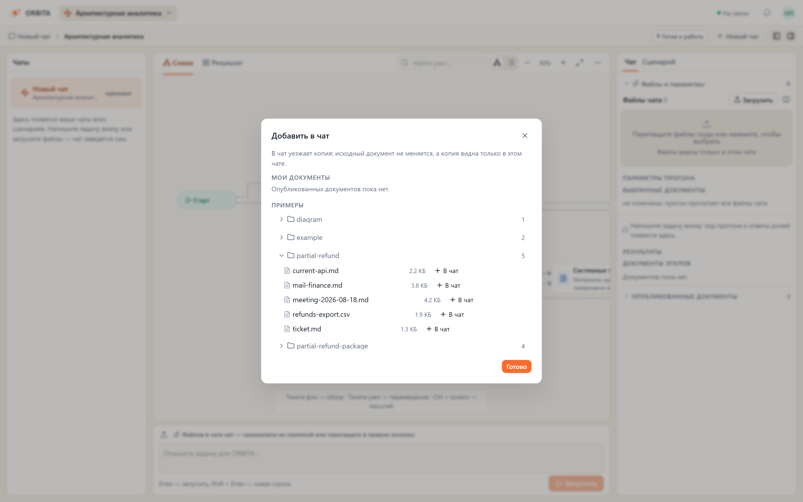

# Материалы задачи

[Документация](README.md) / Входные данные

**Один чат — одна задача.** Загрузите файлы в чат из браузера, отметьте нужные и отправьте задачу. Файлы чата видит только его владелец: они лежат на сервере в папке треда, и граф получает её по треду прогона, а не по имени из запроса.

## Как добавить файлы

- **Загрузить:** кнопка «Загрузить» во вкладке «Чат» правой колонки, скрепка у поля задачи или перетаскивание файлов в список. Чата ещё нет — он заведётся с первым файлом.
- **Из библиотеки:** значок книги рядом с «Загрузить». Там общие примеры и ваши опубликованные документы; в чат уезжает копия.



- **Отметить:** ничего не отмечено — прогон прочитает все файлы чата. Отметьте документы, если нужны только они. Графу схем нужна одна отмеченная схема, если их в чате несколько; графу обновления — один «основной» документ и «материалы».


Отмеченные файлы видны галочкой в списке, чипами в «Параметрах прогона» и строкой над полем задачи («Файлов в чате: 5 · отмечено: 2 файла»).

Файл с тем же именем заменяется. Удаляется файл корзиной у строки (второе нажатие подтверждает), а все файлы чата — вместе с чатом.

| Ограничение | Значение |
| :--- | :--- |
| Форматы | Текстовые (`.md`, `.txt`, `.csv`, `.json`, `.yaml`, `.xml`, `.sql` и другие из `inputs.TEXT_SUFFIXES`) и схемы `.drawio` |
| Кодировка | UTF-8; текст в Windows-1251 перекодируется при загрузке |
| Размер одного файла | `CHAT_FILE_MAX_BYTES`, по умолчанию 5 МБ |
| Файлов в чате | До 100 |
| Где лежат | `CHAT_FILES_DIR/<id треда>`, по умолчанию `data/chats/`; в Docker — `/data/chats` на томе `data` |

## Библиотека примеров

`AGENT_INPUT_DIR` (по умолчанию `input/`) — общая библиотека: её папки видит каждый вошедший, и файл из неё копируется в чат, а не читается напрямую. Заводит папки администратор — на сервере (или запросом `POST /api/inputs` с правами администратора). Кладите туда только то, что можно показывать всем.

```text
claude_langGraph/
├── .env                         настройки и ключи
├── input/                       библиотека примеров
│   ├── example/                  короткий встроенный пример
│   ├── partial-refund/           материалы для аналитики
│   ├── partial-refund-package/   пакет для сверки и декомпозиции
│   └── diagram/                  схема orders-export.drawio
├── data/chats/                  файлы чатов, по папке на тред
└── published/                   сохранённые результаты; документы пользователей — в users/<sub>/
```

Для Docker `input/` подключён к контейнеру штатным `docker-compose.yml` — см. [развёртывание](DEPLOYMENT.md).

## Что подготовить по содержанию

| Материал | Что должно быть внутри |
| :--- | :--- |
| Описание задачи | Цель, пользователи, ожидаемое изменение, границы, критерии результата |
| Текущая документация | Как система работает сейчас, ограничения, контракты |
| Встречи и переписка | Дата, решения, их авторство, нерешённые вопросы |
| Примеры данных | Небольшой обезличенный набор, объяснение колонок, удачные и ошибочные случаи |
| Схема | Исходный `.drawio` с осмысленными подписями компонентов и связей |

Сохраняйте даты и явно отмечайте, какое решение заменяет предыдущее. Если документов нет, можно начать с подробного текста задачи, но результат будет ограничен этим описанием.

Шаблон `ticket.md`:

```markdown
# Частичный возврат заказа

## Зачем
Оператору нужно возвращать деньги за отдельные позиции заказа.

## Сейчас
Доступен только возврат всего заказа.

## Нужно
- Выбирать позиции и количество.
- Показывать рассчитанную сумму до подтверждения.
- Предотвращать повторную операцию при повторном запросе.

## Ограничения
Используем действующий эквайринг. Возврат доставки пока не согласован.

## Критерии приёмки
- Частичный возврат не превышает остаток оплаченной суммы.
- Повторный запрос с тем же ключом не создаёт второй возврат.

## Открытые вопросы
Кто согласует возврат после передачи заказа в доставку?
```

## Форматы

| Тип | Поддержка |
| :--- | :--- |
| Markdown и текст | `.md`, `.markdown`, `.txt`, `.rst`, `.log` |
| Структурированные данные | `.json`, `.yaml`, `.yml`, `.toml`, `.ini`, `.cfg`, `.csv`, `.tsv`, `.xml` |
| Фрагменты кода | `.py`, `.js`, `.ts`, `.tsx`, `.jsx`, `.sql`, `.sh`, `.html`, `.css` |
| draw.io | `.drawio` в сценарии «Документация схемы» |
| PDF, DOCX, XLSX | Прямого разбора нет. Экспортируйте текст в Markdown/TXT, таблицы — в CSV |
| PNG, JPEG, сканы, скриншоты | Не читаются как содержимое задачи. Перенесите нужный текст; для схем передайте исходный `.drawio` |

Сохраняйте текст в UTF-8. Не загружайте в чат файлы с ключами и паролями: всё, что лежит в чате, может прочитать модель. Скриншоты для документации проекта хранятся отдельно в `docs/assets/screenshots/` и не являются входом модели.

## Все файлы чата или отмеченные

**Ничего не отмечено:** прогон получает все файлы чата. В аналитике файлы читает роль через инструменты; в сценариях с предварительным чтением код собирает источник до генерации.

**Отмеченные документы:** поставьте галочку у нужных файлов; можно отметить несколько. В загрузчике готового пакета это ограничивает источник. В аналитике и подготовке задачи отметка служит указанием модели, с чего начать: файловые инструменты всё ещё могут читать соседние файлы того же чата. Если материалы не должны смешиваться, заведите для них разные чаты.

**Схема:** в «Документации схемы» отметьте конкретный `.drawio`, если их в чате несколько. Единственную схему граф возьмёт сам; из нескольких без отметки не возьмёт никакую и откажет до вызова модели.

**Обновление документа:** у каждого файла две отметки — «основной» (один документ, который обновляется) и «материал» (новые материалы, один или несколько). Основной документ нельзя одновременно отметить материалом.

## Ограничение объёма

`AGENT_INPUT_MAX_CHARS=20000` действует в двух смыслах, и различать их важно.

| Что читается | Как применяется потолок |
| --- | --- |
| Один документ: инструмент роли, предпросмотр в интерфейсе | На файл. При превышении читается начало с пометкой об обрезке |
| Комплект материалов: файлы чата, источники по ссылкам, основной документ и новые материалы при обновлении | На весь набор. Файлы читаются по порядку, пока остаётся место; непрочитанные перечисляются отдельно |

`AGENT_INPUT_MAX_CHARS=0` означает отсутствие ограничения в обоих случаях: материалы читаются целиком. Это не «ноль символов» — непустой набор файлов не превращается в отказ «ни один файл не прочитан».

Для обычного файлового инструмента `0` означает чтение без обрезки. Однако общий загрузчик пакета и автоматическое чтение внешних ссылок в текущей реализации при `0` не читают материалы: для этих путей оставляйте положительное значение и увеличивайте его при необходимости. Это ограничение реализации, а не отсутствие файлов в чате.

В «Обновлении документа» тот же параметр ограничивает **сумму основного документа и новых материалов**. Сценарий откажется от слишком большого комплекта: применять изменения к обрезанному исходнику нельзя.

Для разобранной схемы используется `DIAGRAM_MAX_CHARS=60000`. Чем больше вход, тем дольше и дороже обработка. Если важная часть документа не попала в контекст, разделите комплект или увеличьте лимит и перезапустите backend.

## Как использовать готовые документы повторно

Ваши опубликованные документы лежат в личной папке `PUBLISH_DIR/users/<sub>/` и видны только вам. Чтобы передать сохранённую аналитику в сверку или Jira-декомпозицию, откройте в нужном чате «Добавить из библиотеки» → «Мои документы» и добавьте документ в чат: он уедет туда копией.

Скрипты и интерфейс без входа через Keycloak работают админ-токеном: их документы лежат в корне `PUBLISH_DIR`, как раньше.

## Источники по ссылке

В сценариях с внешним чтением можно дать ссылку Confluence с числовым page ID, ссылку Jira `/browse/PROJECT-123` или ключ `PROJECT-123`. Интеграция должна быть настроена на тот же сервер. Короткие ссылки Confluence `/x/...` и страницы `/display/...` автоматически не разрешаются.

Примеры и переменные — в [интеграциях](INTEGRATIONS.md). Ссылка на произвольный сайт не означает, что Orbita умеет прочитать его как страницу Confluence.

---

Далее: [Работа в интерфейсе →](USER_GUIDE.md) · [Выбор сценария →](WORKFLOWS.md)
