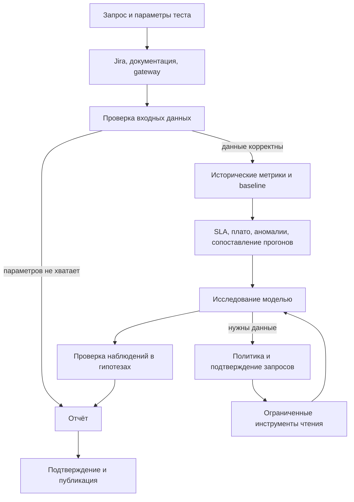
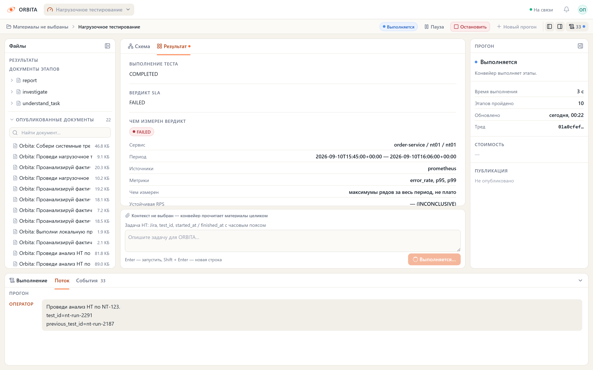
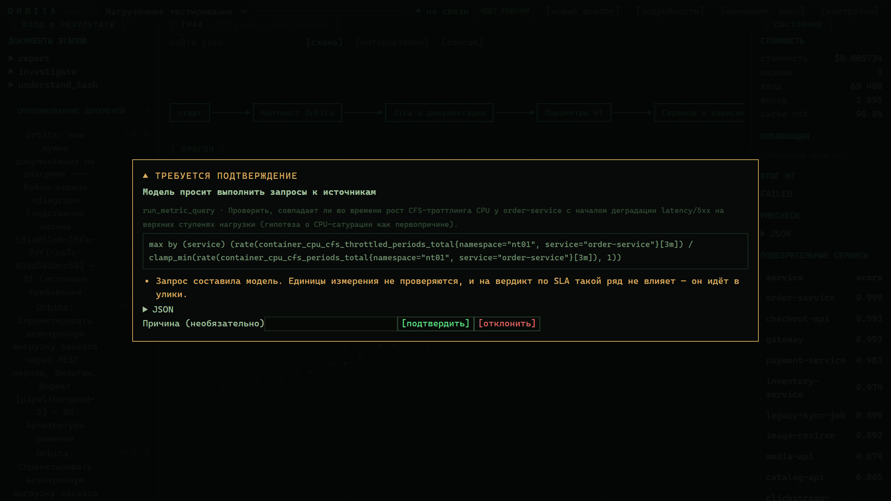
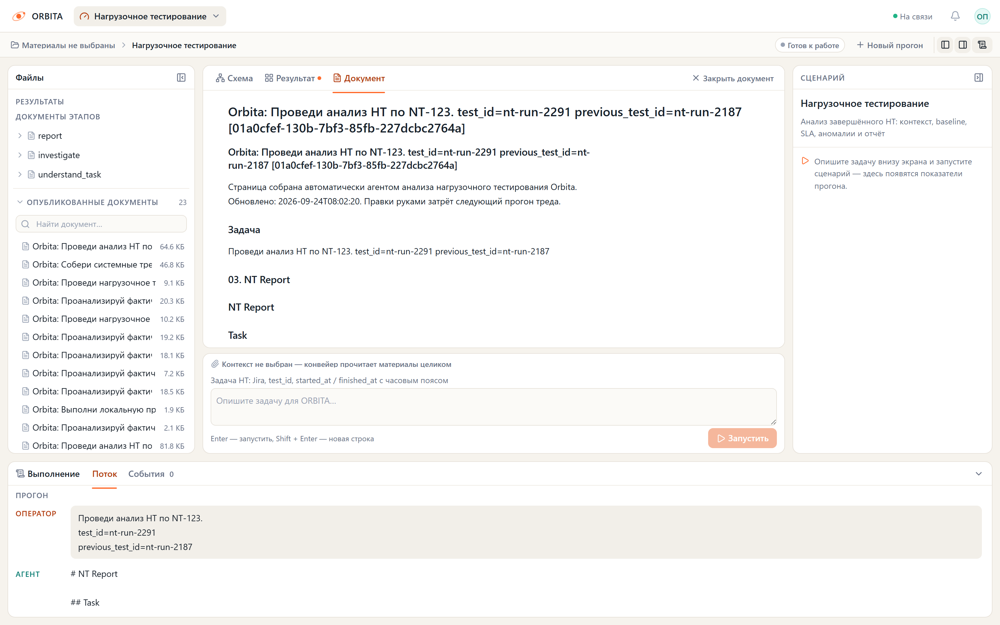

# Анализ нагрузочного тестирования — граф `nt`

Граф анализирует завершённые НТ: получает исторические метрики, проверяет SLA,
выделяет плато нагрузки, сопоставляет прогоны и предлагает проверяемые направления
расследования. Версия методики — `nt-analysis-v3`. Расчёты выполняет Python;
модель интерпретирует ограниченный набор фактов и запрашивает дополнительные данные.

## Результат анализа

Отчёт содержит независимые оценки:

| Поле | Что означает |
| --- | --- |
| `analysis_result` | `PASSED`, `FAILED` или `INCONCLUSIVE` по SLA целевого сервиса |
| `diagnostic_status` | `COMPLETE`, `PARTIAL` или `NOT_RUN`: полнота данных для диагностики |
| `capacity_assessment` | Наблюдаемая устойчивая RPS на плато или причина, почему она не установлена |
| `previous_comparison.status` | `COMPARABLE` или `NOT_COMPARABLE`, с объяснением |
| `hypothesis_assessment` | Принятые/отброшенные гипотезы и результат проверки наблюдений |

`PASSED` не означает, что установлена предельная мощность или исключены все
инфраструктурные проблемы. `COMPLETE` описывает наличие диагностических данных,
а не доказанную причинность. Отсутствие baseline или метрик зависимости не отменяет
проверку полных исторических SLA-рядов целевого сервиса.

## Путь выполнения



LangGraph сохраняет ход выполнения и позволяет продолжить его после решения
оператора. Отказ от запроса возвращается модели как `POLICY_DENIED`; отказ от
публикации в Confluence сохраняет отчёт локально. Повторный запуск анализа и
`Command(resume=...)` — разные действия: resume не пересчитывает метрики.

## Запуск

1. Настройте источник метрик и карту `NT_METRIC_QUERIES`.
2. При необходимости настройте обычные интеграции Jira/Confluence и gateway НТ.
3. Перезапустите backend и выберите «Нагрузочное тестирование» в портале.
4. Передайте параметры теста или его идентификатор, если gateway содержит весь контракт.

```text
Проведи анализ завершённого НТ.
test_id=load-123
```

Можно передать JSON в сообщении, поля state через SDK или `configurable`:

```json
{
  "test_id": "load-123",
  "started_at": "2026-09-01T12:00:00Z",
  "finished_at": "2026-09-01T12:15:00Z",
  "target_service": "checkout-api",
  "environment": "nt",
  "namespace": "nt01",
  "scenario": "checkout-v2",
  "environment_fingerprint": "4cpu-8gb-replicas3-config-a",
  "workload_fingerprint": "checkout-mix-70-30-dataset-v2",
  "ramp_up_seconds": 60,
  "sla_p95_ms": 500,
  "sla_p99_ms": 1000,
  "sla_error_rate": 0.01,
  "services": ["checkout-api", "orders", "postgres"],
  "dependencies": [{"from": "checkout-api", "to": "orders"}],
  "component_profiles": {"checkout-api": "http", "postgres": "postgresql"}
}
```

Обязательны `test_id`, `target_service`, `environment`, `namespace`, границы
завершившегося периода и хотя бы один SLA. Даты — epoch seconds или ISO 8601
с часовым поясом. Период чтения — `[started_at, finished_at)`.

`target_rps`, VU, длительность и сценарий необязательны для проверки SLA.
`ramp_up_seconds` исключает начальную часть теста из оценки плато, но не из SLA.
Отсутствующий статус при полном явном историческом входе трактуется как completed;
статус gateway имеет приоритет над входом. Running-тесты не анализируются.

### Исправления в одном треде

Сообщение `sla_p95_ms=300` применяет новый лимит к тому же тесту. Сохранённые
вычисленные значения не перекрывают новое сообщение. Явный `configurable` имеет
наивысший приоритет; если лимит закреплён там, изменяйте его там же.

Исходные параметры оператора хранятся отдельно (`requested_inputs`) от разрешённых
значений (`resolved_inputs`). Gateway перечитывается при новом запуске; его старые
SLA и статус не превращаются в явные параметры пользователя. Исправление precheck
не наследует искусственный `not_started` предыдущей попытки.

При новом `test_id` старые период, SLA, baseline и scope сбрасываются. Для нового
теста передайте его параметры или настройте gateway. Активный прерванный прогон
сначала завершите или отмените, затем отправляйте новую задачу.

## Карта метрик и источники

```dotenv
NT_PROMETHEUS_URL=https://prometheus.example.internal
NT_PROMETHEUS_TOKEN=
NT_INFLUX_URL=
NT_INFLUX_TOKEN=
NT_INFLUX_VERSION=2
NT_INFLUX_DATABASE=loadtests
NT_INFLUX_ORG=engineering
NT_LOAD_TESTING_URL=https://load-testing.example.internal
NT_LOAD_TESTING_TOKEN=
NT_KUBERNETES_URL=
NT_KUBERNETES_TOKEN=
```

`NT_METRIC_QUERIES` — JSON-объект: каноническая метрика → определение источника.
Пустая карта даёт объяснение в precheck. Готовые исходные шаблоны:

- [`config/nt-prometheus-http.json`](../config/nt-prometheus-http.json): HTTP-коды в `status`;
- [`config/nt-prometheus-testbed.json`](../config/nt-prometheus-testbed.json): карта локального стенда, HTTP-коды в `code`.

Пример отдельного определения:

```json
{
  "p95": {
    "profile": "http",
    "prometheus": "1000 * histogram_quantile(0.95, sum by (service, le) (rate(http_request_duration_seconds_bucket{namespace={{namespace}}}[1m])))"
  }
}
```

Содержимое карты передаётся значением `NT_METRIC_QUERIES`, например через .env.
Пути JSON-файлов не подставляются автоматически. `{{namespace}}` и необязательный
`{{environment}}` заменяются строковыми литералами вместе с кавычками.
Не добавляйте вокруг placeholders дополнительные кавычки.

Карта должна соответствовать реальным exporters, label-ам и единицам. При одинаковых
namespace в разных кластерах задайте фиксированный cluster label или environment
в каждом серверном шаблоне. Для generated queries используйте endpoint, ограниченный
нужным кластером: guard гарантирует namespace, но не угадывает топологию кластеров.

Результат каждой метрики — ровно один ряд на сервис с label `service`.
Неоднозначные ряды отклоняются; p95 разных pod нельзя складывать или усреднять.
Отсутствие ряда ошибок не считается нулём: подготовьте корректный zero-valued
counter/recording rule. В тестовой карте fallback для error_rate задан явно.

Профили: `http`, `postgresql`, `kafka`, `redis`. Общие метрики могут содержать
`profiles: ["http", "postgresql"]`. Контракт единиц:

- latency (`p50`, `p95`, `p99`, `query_latency`, `latency`) — ms;
- `error_rate`, `cpu`, `memory`, `connection_utilization` — доли 0..1;
- `rps` — requests/s; CPU и memory — доля настроенного лимита, не cores/bytes.

Преобразование единиц делается серверным выражением или recording rule.
Некорректные/нечисловые точки и partial warnings учитываются при оценке полноты.

InfluxDB 2 использует Flux `/api/v2/query`, InfluxDB 3 — параметризованный SQL
`/api/v3/query_sql`. Определение метрики может содержать:

```json
{"p95":{"profile":"http","influx":{"measurement":"http_latency","field":"p95_ms"}}}
```

В Influx должны быть заранее агрегированные значения, time, service, namespace и
environment. Автоматического resampling нет: частота и временные метки должны быть
совместимы с `NT_STEP_SECONDS`. Источники не смешиваются внутри ряда; выбирается
более полный корректный ряд, при равном качестве предпочтение у Prometheus.

Текущий Kubernetes — вспомогательный inventory и инструменты `historical: false`.
Сервисы, существующие сейчас, не добавляются как обязательные компоненты исторического
scope. Исторический scope определяется явными входами/зависимостями и метриками теста.

## Расчёты

### SLA и полнота

Любая доступная точка, нарушающая оператор SLA, означает `FAILED`. По умолчанию
числовые поля задают включительную верхнюю границу (`<=`). Строгий `<` из gateway
или текста сохраняется; в JSON его задаёт `sla_comparators`, например
`{"p95":"<","error_rate":"<="}`. `PASSED` требует завершённого теста и полного покрытия всех SLA-метрик
целевого сервиса: минимум 3 точки, 80% ожидаемого количества, проверка границ и
разрывов не более двух шагов, отсутствие invalid points и partial warning.
Иначе — `INCONCLUSIVE`.

Проверяются максимумы временных рядов сервисных p95/p99. Это не p95/p99 всей
популяции запросов теста; сравнивать с агрегатом генератора нагрузки как с той же
статистикой нельзя. Baseline (по умолчанию 600 секунд до теста) нужен для диагностики.
Его отсутствие отражается в `diagnostic_gaps`, а не отменяет валидный SLA-вердикт.

### Плато и устойчивая нагрузка

Плато — непрерывный участок положительного RPS, где полный разброс относительно
минимума не превышает `NT_PLATEAU_TOLERANCE_PERCENT` (по умолчанию 10%). Сначала
исключается указанный ramp-up, затем начало каждого плато на `NT_SETTLING_SECONDS`
(30 секунд). Измеренная часть должна иметь минимум 3 точки и длительность не менее
`NT_STABLE_SECONDS` (60 секунд).

Для устойчивой RPS **вся измеренная часть плато** должна соблюдать каждый SLA,
с синхронными корректными точками. Поздняя деградация дисквалифицирует плато:
его ранний благополучный отрезок не становится доказательством мощности.
Результат — наибольший минимум RPS среди подходящих плато. Если плато нет, метрики
неполны или фаз больше 64, результат не установлен с явной причиной.

### Диагностические сигналы

Рост RPS, throughput, трафика и числа реплик сам по себе не повышает ranking.
Статистические spikes, trends и корреляции ищутся внутри измеренных плато;
переходы нагрузки не выдаются за деградацию. Ухудшение направления учитывается:
падение latency не является spike проблемы, для hit_rate ухудшение — снижение.

Rolling median/MAD: окно 5 точек, robust z > 3.5, порог относительного изменения
25% при MAD=0. Корреляция: совпадающие timestamps, минимум 5 точек, |r| ≥ 0.8;
это наблюдение, не причинность.

Дополнительные диагностические пороги (не SLA): CPU/memory ≥0.9,
connection_utilization ≥0.85, cpu_throttling ≥0.2. Для pod_restarts, deadlocks,
evictions и errors фиксируются приращения счётчика, а не его исторический итог.
Пороговые значения находятся в `anomaly_detector.SATURATION` и требуют проверки
семантики конкретного exporter перед использованием карты.

Score = `1 − product(1 − weight)` по уникальным `(metric, signal-kind)`.
Стандартные веса: threshold .6, saturation .4, counter_increase .3,
spike/trend .2, baseline .25 (последний доступен отдельному detector API;
в основном графе idle baseline не повышает рейтинг). `NT_ANOMALY_WEIGHTS`
переопределяет карту целиком; отсутствующие виды получают 0. Score — приоритет
проверки, не вероятность причины.

### Предыдущий прогон

Для `previous_test_id` нужны совпадающие service/environment/namespace,
`environment_fingerprint` и профиль операций. Fingerprint окружения описывает
ресурсы, реплики и существенные настройки, но не должен включать изменяемую
версию приложения, если сравниваются релизы.

Профиль операций проверяется по `workload_fingerprint`, если он есть хотя бы у
одного теста; иначе по совпадающему непустому `scenario`. Fingerprint должен
описывать смесь операций и набор данных, а не желаемое заключение.

При отсутствии подтверждения сопоставимости результат — `NOT_COMPARABLE`.
Различия медиан за весь период доступны только как `descriptive_metrics`.
При совместимости сопоставляются полные плато с близким RPS и длительностью
измеренной части, различающейся не более чем на 20%, без повторного использования
одного плато. `matched_phases` содержит интервалы, нагрузки и изменения медиан.
Устойчивая RPS сравнивается только при полном сопоставлении наборов плато и
установленной устойчивой нагрузке у обоих тестов, под текущими SLA.

Ухудшение медианы на сопоставимой ступени не менее чем на
`comparison.REGRESSION_RELATIVE` (25%) попадает в `regressions` и в улики как
`regression:<сервис>:<метрика>`. Улика на метрику одна: берётся худшая ступень,
а `plateaus` показывает, на скольких ступенях ухудшение повторилось. Только на
эти улики гипотеза о регрессии и может сослаться: `descriptive_metrics` за весь
период таким наблюдением не являются.
Метрики трафика исключены — по ним ступени сопоставлялись. Для механизмов
насыщения (cpu, memory, connection_utilization, cpu_throttling) регрессии
недостаточно: там по-прежнему нужен выход за диагностический порог.

## Модель и проверка гипотез

`understand_task` может скопировать явно присутствующие идентификаторы/даты;
для каждого значения требуется дословная цитата. Числа и SLA модель не назначает.
Найденный ею test_id также загружается через gateway.

Исследование получает вопрос оператора, ограниченный контекст источников,
целевой сервис, ближайших соседей, TOP-N подозрительных сервисов и агрегаты.
Начальный и финальный JSON ограничены 48 000 символов. Сокращение брифа не удаляет
полный журнал улик из состояния и отчёта. Сырые точки освобождаются после расчётов.

Каждая гипотеза должна указать service, mechanism, description, evidence_ids,
необязательные counter_evidence_ids и конкретную next_check. Механизмы:
`cpu_saturation`, `memory_pressure`, `connection_pool`, `queue_backlog`,
`latency_regression`, `error_increase`, `restarts`, `unknown`.

Код проверяет существование ссылок **и** подходящие исторические наблюдения нужного
сервиса/метрики. Текст документации, текущие pods и generated queries с
непроверенными единицами сами по себе не подтверждают именованный механизм.
Принятые гипотезы содержат наблюдения с исходными значениями и следующую проверку.
Уверенность задаёт код: максимум `possible`; при противоречиях/непроверенных
данных — `unknown`. `causality=not_established` сохраняется всегда: автоматической
сертификации причины нет. Отклонённые гипотезы перечислены с причинами.

Последний разрешённый вызов модели выполняется без инструментов и резервируется
под итоговый JSON. Недоступность LLM, бюджет или исчерпание времени не уничтожают
детерминированный отчёт. Все внешние тексты считаются недоверенными данными.

## Инструменты и подтверждение

Доступны ограниченные инструменты чтения Jira/Confluence, метрик, Kubernetes,
статуса/результатов теста. `NT_GENERATED_QUERIES=1` дополнительно разрешает
`discover_metrics` и `run_metric_query`; по умолчанию они выключены.

Discovery читает `/api/v1/series` и `/api/v1/metadata` для сервиса в период теста.
Модель сначала узнаёт имена, затем составляет запрос. Guard требует точного
равенства label `namespace` namespace прогона в каждом селекторе, явно названной
метрики, агрегации `by (service)`, допустимых функций и ограниченного range.
Подзапросы, offset, @, __name__ и повторные matchers запрещены. Строковые литералы
не считаются синтаксисом; `exported_namespace` не заменяет `namespace`.

Результат composed query обязан содержать один ряд на сервис. Неоднозначные ряды
и partial result отклоняются; интервалы остаются полуоткрытыми. Такие запросы
попадают только в улики и никогда не меняют SLA.

`NT_TOOL_APPROVAL`: `generated` (по умолчанию), `all` или `off`. В первых двух
режимах соответствующие вызовы требуют interrupt/resume. Оператор видит сам
запрос и цель. В режиме off отчёт не утверждает, что запрос подтвердил человек.

## Gateway НТ

Read-only контракт: `GET /tests/{id}` и `GET /tests/{id}/results`.
Идентификатор: `[A-Za-z0-9_-]{1,128}`. Поля соответствуют входному JSON выше;
`status` нормализуется в `test_status`. Карточка и результаты могут дополнять
друг друга, но конфликтующие значения отклоняются. Running-статус имеет приоритет.
Идентификатор, контур и временные границы не могут противоречить gateway.

Поддерживается список thresholds, например:

```json
[{"metric":"http_req_duration","expression":"p(95)<500"},
 {"metric":"http_req_failed","expression":"rate<0.010"}]
```

Нормализуются p95/p99 в ms, error_rate/cpu/memory в доли. Поддерживаются `<`, `<=`,
`≤` и единицы ms, мс, s, %, ratio. Операторы `<` и `<=` сохраняются в `sla_comparators` и одинаково применяются
к SLA, плато и сравнению прогонов.
`observed`, `passed` и summary генератора не заменяют расчёт по историческим рядам.
Неподдерживаемые выражения явно останавливают precheck.

## Эксплуатация и проверка

Основные ограничения сервера:

```dotenv
NT_STEP_SECONDS=30
NT_BASELINE_SECONDS=600
NT_MAX_WINDOW_SECONDS=86400
NT_CONCURRENCY=4
NT_MAX_SERIES=500
NT_MAX_POINTS=200000
NT_TOP_N=5
NT_TIMEOUT_SECONDS=300
NT_MAX_INVESTIGATION_CALLS=4
NT_STABLE_SECONDS=60
NT_SETTLING_SECONDS=30
NT_PLATEAU_TOLERANCE_PERCENT=10
NT_GENERATED_QUERIES=0
NT_TOOL_APPROVAL=generated
NT_QUERY_RANGE_SECONDS=900
NT_DISCOVERY_LIMIT=40
```

HTTP: timeout 10 секунд, одна повторная попытка, без redirects; ответ до 8 MB,
gateway metadata до 64 KB. Дедлайн запрещает новые операции; уже выполняющийся
вызов завершается по своему timeout. Время ожидания решения оператора входит
в дедлайн, поэтому задайте `NT_TIMEOUT_SECONDS` с учётом процесса согласования.

Отчёт включает `analysis_policy`: версию методики, шаг, настройки плато,
политику approval и SHA-256 карты метрик. Сохраняйте соответствующую версию карты
рядом с конфигурацией развёртывания. Чекпоинты и отчёты содержат рабочие данные:
используйте существующие механизмы защиты API и хранилищ Orbita из [SECURITY.md](../SECURITY.md).

Перед эксплуатацией на реальных данных:

1. Проверьте карту, units и labels на контролируемом прогоне с известным результатом.
2. Из окружения backend выполните `python scripts/diagnose_nt.py --test-id <id> --check-metrics`.
3. Сверьте SLA и выделенные плато с исходными метриками и нагрузочным профилем.
4. Проверьте сценарии недоступного источника, отказа от query и resume публикации.
5. Для сравнения прогонов настройте воспроизводимые fingerprints окружения и нагрузки.

Автоматическая проверка без внешней сети и платных вызовов:

```bash
.venv/bin/python -m pytest
.venv/bin/ruff check src tests scripts packages
npm --prefix web run build
npm --prefix web run test:engine
```

`tests/test_nt_reliability.py` покрывает исправления входа, обновление gateway,
исторический scope, обходы guard, неоднозначные ряды, разгон/плато/позднюю деградацию,
сопоставимость нагрузок и проверку гипотез. Реальные exporter mappings и качество
свободного текста конкретной модели требуют отдельной проверки на вашем стенде.

## Локальный стенд и исторические примеры

`python scripts/serve_nt_testbed.py` запускает backend с `.env.nt-testbed` поверх
`.env` в памяти; loopback добавляется в NO_PROXY. Фронтенд запускается отдельно:
`npm --prefix web run dev`. `python scripts/demo_nt_testbed.py` выполняет консольный
прогон; query approvals в нём подтверждаются автоматически, используйте его только
для подготовленного стенда. `python scripts/shoot_nt_portal.py` пересобирает снимки
по реальному прогону; нужен extra `[docs]` и Chromium Playwright.

[Пример отчёта старой методики](examples/nt-run-2291.md) и снимки ниже — архив
версии до `nt-analysis-v2`; они не являются эталоном новых расчётов и confidence.





## Границы поставки

Это законченный контур **анализа завершённых тестов**. Запуск нагрузки,
наблюдение за текущим тестом, изменение интенсивности и остановка не подключены.
Методы управления в HTTP-адаптере возвращают POLICY_DENIED. Для подключения такого
контура нужны реальные контракты управляющей системы, идемпотентность команд,
отдельные права и подтверждения. `integrations/logs.py` предоставляет только
Protocol и ограниченную группировку; конкретного Loki/Elasticsearch adapter нет.
