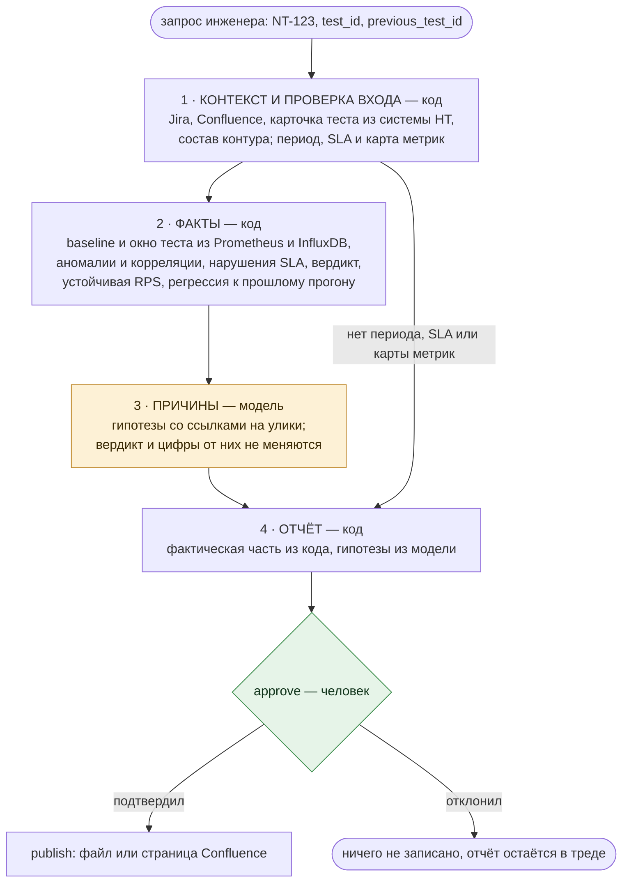
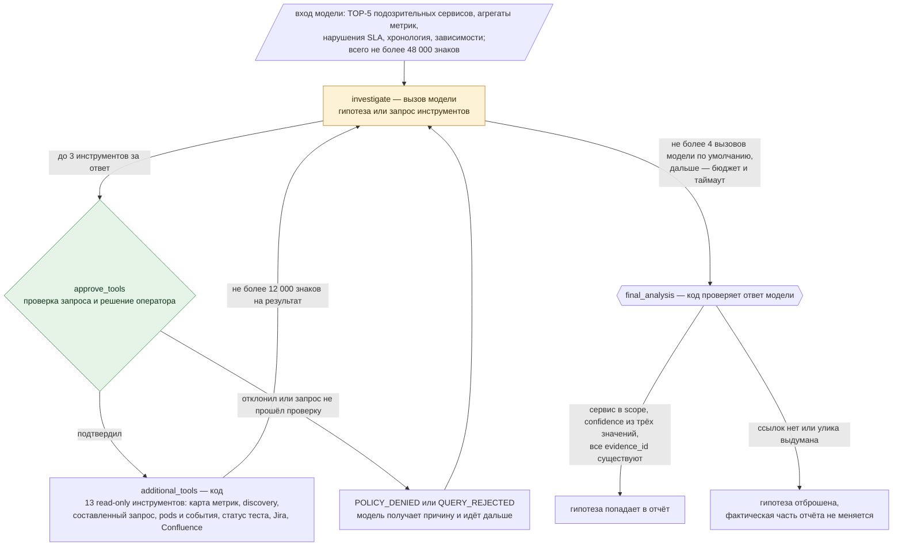
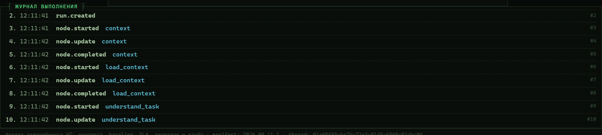
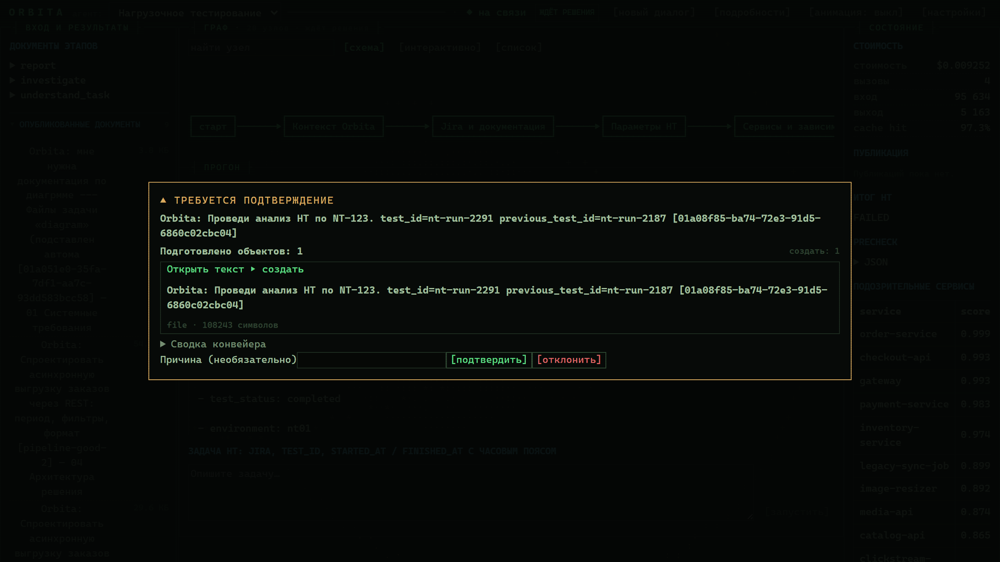
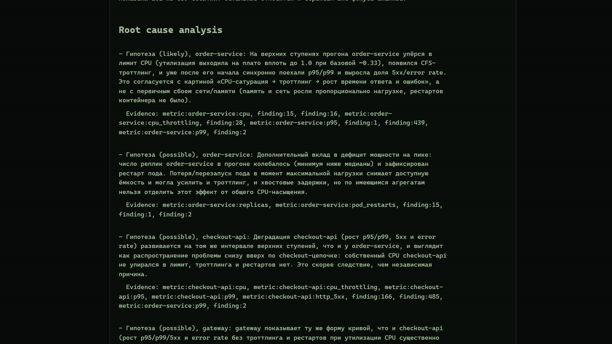
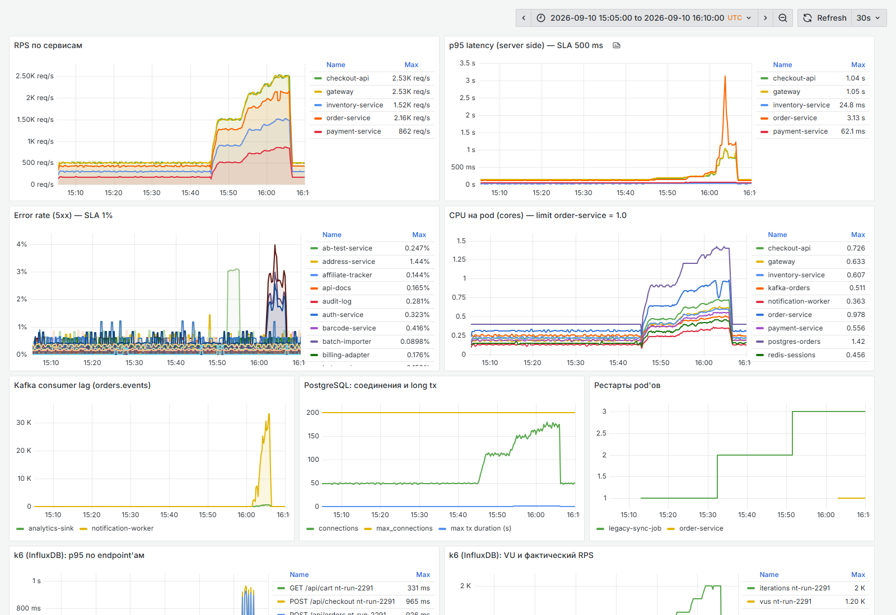

# Анализ нагрузочного тестирования — граф `nt`

Реализован **MVP 1 из ТЗ: анализ завершённого НТ**. Граф встроен в Orbita, использует
её провайдеров LLM, учёт токенов и стоимости, budget gate перед каждым модельным
вызовом, память, публикацию и существующий UI engine. Отдельного приложения нет.

Жёлтым отмечен этап, где рассуждает модель; зелёным — остановка на решении
человека. Остальное считает код; где именно работает модель и что ей не позволено —
в разделе [«Где здесь ИИ»](#где-здесь-ии).



Узлы графа по порядку:

```text
context → load_context → understand_task → discover_scope → precheck
  → collect_baseline → collect_metrics → detect_anomalies → compare_baseline
  → evaluate_test → investigate ⇄ approve_tools → additional_tools → final_analysis
  → report → remember → approve → publish
```

При некорректном входе `precheck → report`: выводятся причины остановки, ошибки
источников и действия для продолжения, без пустых разделов анализа. Проверки
периода, SLA и карты метрик независимы: отсутствие дат не скрывает пустой
`NT_METRIC_QUERIES`. Доступность URL в браузере не заменяет эти проверки;
к API источников обращается Python-backend из своего окружения.

## Где здесь ИИ

Модель вызывается в двух узлах графа, и оба раза — вокруг текста, а не вокруг цифр.

**`understand_task` — только если параметров не хватает.** Когда `test_id`, сервис,
окружение, namespace и границы периода уже пришли из запроса или из системы НТ, узел
не делает ни одного вызова. Если их нет, модель достаёт идентификаторы из текста
задачи Jira и страниц Confluence, а код проверяет, что каждое значение дословно есть
в исходном тексте. Числовые параметры из естественного языка не угадываются:
`p95 < 500ms` и `errors < 1%` разбирает код, как и JSON и строки `key=value`.

**`investigate` — разбор причин.** Модель получает уже посчитанные факты и решает,
каких не хватает: она может запросить метрику по сервису из scope, текущие pods и
события Kubernetes, статус теста, задачу Jira или страницу Confluence. Ни PromQL,
ни адреса, ни имена метрик она не сочиняет — инструмент принимает только имя метрики
из серверной карты и сервис из обнаруженного контура.



Ответ модели проходит через `final_analysis`. Гипотеза попадает в отчёт, только если
сервис есть в обнаруженном контуре, уверенность — одно из трёх значений
(`likely`, `possible`, `unknown`) и **все ссылки на улики существуют**. Выдуманный
`evidence_id` отбрасывает гипотезу целиком; значение `confirmed` не принимается —
подтвердить причину по агрегатам нельзя.

Чего модель не делает:

- не назначает `PASSED` / `FAILED` / `INCONCLUSIVE` — это делает код по SLA и полноте рядов;
- не пишет фактическую часть отчёта: параметры, аномалии, хронологию и сравнение
  с прошлым прогоном собирает `report`;
- не выбирает период, baseline и устойчивую нагрузку;
- не формирует запросы к источникам и не ходит в них напрямую;
- ничего не публикует: запись идёт после `approve` и только через publisher Orbita.

Если провайдер недоступен, прогон не падает: в отчёт попадает ошибка
`LLM_UNAVAILABLE`, фактическая часть и вердикт остаются на месте. Перед каждым
модельным вызовом срабатывает budget gate Orbita, а стоимость прогона видна
в интерфейсе — на стенде это около $0.005 при попадании в кеш 97–98%.

### Запросы, которые составляет модель

Серверная карта метрик отвечает за вердикт, но она конечна: чего в ней нет, того
разбор не увидит. Поэтому исследованию можно разрешить два дополнительных
инструмента — они выключены по умолчанию и включаются `NT_GENERATED_QUERIES=1`.

`discover_metrics` отвечает на вопрос «что вообще есть у этого сервиса»: имена
рядов за период теста, их метки и HELP от exporter'а. Читается это запросом
метаданных (`/api/v1/series` и `/api/v1/metadata`), без значений. Выдача
ограничена `NT_DISCOVERY_LIMIT`, а наверх списка поднимаются имена, упомянутые
в тексте задачи: на боевом Prometheus имён тысячи, и порядок решает.

`run_metric_query` выполняет PromQL, который написала модель. Перед этим запрос
проходит проверку в `nt/query_guard.py`, и правила там не про синтаксис:

- каждый селектор обязан нести `namespace` прогона — иначе ряд приедет из чужого
  контура, а отчёт будет утверждать обратное;
- результат обязан агрегироваться `by (service)`;
- диапазон в селекторе ограничен `NT_QUERY_RANGE_SECONDS`, подзапросы, `offset`
  и `@` запрещены: они разворачиваются в тысячи вычислений или уводят окно
  в сторону от периода теста;
- функции — только из списка, `__name__` как селектор запрещён.

Непрошедший проверку запрос до оператора не доходит: модель получает причину
отказа (`QUERY_REJECTED`) и может исправиться. Прошедший — показывается
оператору целиком, и до подтверждения не выполняется.

Ряды из такого запроса живут **только в уликах**. В `metric_snapshots`, из
которых считается SLA, они не попадают, поэтому вердикт `PASSED`/`FAILED`
не зависит от того, что придумала модель. В отчёте появляется раздел
`Composed queries` с дословным текстом каждого выполненного запроса — иначе
цифру из него нельзя ни повторить, ни оспорить.

Ограничение, которое видно сразу на стенде: exporter'ы без меток `namespace`
и `service` так не читаются. `kafka_consumergroup_lag` в стенде размечен
`topic` и `consumergroup` — составленный запрос к нему будет отклонён проверкой.
Для таких метрик нужен recording rule, приводящий их к контракту, или запись
в серверную карту.

### Подтверждение перед выполнением

Остановку делает узел `approve_tools`. Что именно спрашивать, решает
`NT_TOOL_APPROVAL`:

- `generated` (по умолчанию) — только запросы, которые составила модель;
- `all` — любой вызов инструмента в исследовании, включая метрики из карты;
- `off` — не спрашивать; годится для прогонов по стенду, не для боевого контура.

Остановка — тот же `interrupt()` LangGraph, что и перед публикацией, и решение
принимает тот же оператор, который запустил прогон: в портале это окно
«ТРЕБУЕТСЯ ПОДТВЕРЖДЕНИЕ» с текстом запроса и пояснением модели, в Studio или
SDK — `Command(resume=...)`. Отказ не роняет прогон: на отклонённый вызов модель
получает `POLICY_DENIED` с причиной оператора, а исследование продолжается
с тем, что уже собрано.

## Как запустить

1. Настройте Jira/Confluence обычными переменными Orbita, если контекст находится там.
2. Настройте хотя бы один источник метрик и серверную карту `NT_METRIC_QUERIES` ниже.
3. Перезапустите backend, выберите **«Нагрузочное тестирование»** в UI.
4. Отправьте задачу и параметры завершённого НТ. Для нового теста создавайте новый тред.

Если Jira содержит параметры и границы завершённого НТ, достаточно:

```text
Проведи анализ НТ по NT-123.
```

Если настроен `NT_LOAD_TESTING_URL` и gateway возвращает параметры, период и SLA
завершённого теста, достаточно идентификатора:

```text
Проведи анализ завершённого НТ.
test_id=nt-run-2291
```

Сам по себе `test_id` не содержит период, сервис или SLA: без этих данных в gateway
или контексте их нужно передать явно. JSON-блок в конце сообщения допускается без
закрывающих тройных обратных кавычек, но сам JSON должен быть корректным и полным.

В ином случае дополните запрос. Все значения ниже — **пример входа**, а не результаты измерений:

````text
Проведи анализ НТ по NT-123.

```json
{
  "test_id": "load-123",
  "started_at": "2026-09-01T12:00:00Z",
  "finished_at": "2026-09-01T12:10:00Z",
  "target_service": "checkout-api",
  "environment": "nt",
  "namespace": "nt01",
  "target_rps": 2000,
  "scenario": "checkout-v2",
  "sla_p95_ms": 500,
  "sla_p99_ms": 1000,
  "sla_error_rate": 0.01,
  "services": ["checkout-api", "order-service", "kafka-orders"],
  "dependencies": [
    {"from": "checkout-api", "to": "order-service"},
    {"from": "order-service", "to": "kafka-orders"}
  ],
  "component_profiles": {"checkout-api": "http", "order-service": "http", "kafka-orders": "kafka"}
}
```
````

При вызове через Python/SDK те же поля можно передать напрямую в state или
`configurable`. Явные параметры важнее контекста Jira/Confluence; противоречащие
друг другу источники требуют явного уточнения. Даты — epoch seconds или ISO 8601
с часовым поясом. Интервал везде полуоткрытый: `[start, end)`.

Обязательны `test_id`, `started_at`, `finished_at`, `target_service`, `environment`,
`namespace` и хотя бы один SLA. Завершение должно находиться в прошлом.
`target_rps`, длительность, ramp-up, VU и сценарий необязательны.
Отсутствующие значения не подменяются предположениями. В отчёте будут перечислены пробелы.
Текст на естественном языке поддерживается для идентификаторов с проверкой цитат;
для численных параметров используйте JSON/`key=value`. Например, `p95 < 500ms`
и `errors < 1%` также разбираются кодом.

Без явного scope граф использует deployments namespace, если Kubernetes подключён,
и дополняет список сервисами из исторических метрик. Текущий список deployments не
доказывает исторический состав контура. Направление dependency задаётся `from → to`.

## Проверка на стенде nt-testbed

Рядом с проектом лежит локальный стенд `nt-testbed`: Prometheus и InfluxDB с записанным
прогоном НТ плюс моки Jira, Confluence, Kubernetes API, логов и системы НТ. На нём граф
прогоняется целиком, не трогая боевые системы.

```bash
cd ../nt-testbed && docker compose up -d
python scripts/demo_nt_testbed.py
```

Скрипт читает `.env` ради провайдера модели и кладёт поверх координаты стенда из
`.env.nt-testbed`, поэтому боевые Jira и Confluence в прогоне не участвуют. Карта метрик
под имена и labels стенда — `config/nt-prometheus-testbed.json`.

Весь запрос — три строки:

```text
Проведи анализ НТ по NT-123.
test_id=nt-run-2291
previous_test_id=nt-run-2187
```

Остальное граф добирает сам: период, статус и SLA — из gateway по `test_id`, контекст
задачи — из Jira и Confluence, состав контура — из deployments namespace.

### Тот же прогон в портале

`demo_nt_testbed.py` печатает итог в терминал. Чтобы пройти прогон так, как его видит
инженер, нужен backend на координатах стенда и обычный фронт Orbita:

```bash
python scripts/serve_nt_testbed.py      # langgraph dev, .env.nt-testbed поверх .env
npm --prefix web run dev                # портал на http://localhost:5173
```

Смешанный `.env` на диск не пишется: значения складываются в памяти процесса. Туда же
дописывается localhost в `NO_PROXY`. Это не формальность: при системном HTTP-прокси
запросы к мокам уходят в него, Jira и gateway отвечают таймаутом, precheck остаётся без
параметров теста — и прогон уходит сразу в отчёт «анализ не выполнен». Снаружи это
выглядит как сломанный граф, хотя не сработала сеть.

В портале выбирается агент «Нагрузочное тестирование», запрос тот же. Узлы ещё идут,
а правая колонка уже показывает посчитанное кодом: вердикт, ranking подозрительных
сервисов, baseline, хронологию, израсходованные токены.


`[подробности]` открывает журнал выполнения — узел, событие, время — и выгрузку его
в JSON.



Остановок в прогоне две. Первая — когда модель просит выполнить запрос, который
написала сама: оператор видит и PromQL целиком, и зачем он нужен. В этом прогоне
она собрала долю троттлинга CPU по order-service из двух счётчиков exporter'а —
со своим окном и фильтром по сервису, — чтобы сверить её начало с деградацией
latency. Проверка к этому моменту уже пройдена: namespace на каждом селекторе,
агрегация `by (service)`, диапазон в пределах лимита. В других прогонах модель
уходит за пределы карты метрик — например к `http_requests_in_flight`, очереди
запросов в обработке, которой в серверной карте нет вовсе.


Вторая — перед записью отчёта: publisher показывает подготовленный документ
и ждёт решения. Без подтверждения не публикуется ничего.



После подтверждения отчёт открывается в портале. Фактическая часть — параметры теста,
SLA, устойчивая нагрузка, аномалии, хронология, сравнение с прошлым прогоном —
собрана кодом из метрик.


Раздел Root cause analysis — то, что пишет модель: гипотезы с уровнем уверенности
и ссылками на конкретные улики, по которым их можно проверить.



Полный отчёт этого прогона — [`examples/nt-run-2291.md`](examples/nt-run-2291.md).
Он большой, около 100 тысяч знаков, и больше половины занимает приложение `Evidence`:
это исходные ряды под ссылками из гипотез, а не текст для чтения. Читаются первые
разделы до `Timeline` и `Root cause analysis` с рекомендациями.

Снимки выше пересобираются одной командой поверх живого прогона — они не рисуются
руками и не устаревают вместе с интерфейсом:

```bash
pip install -e .[docs] && playwright install chromium   # один раз
python scripts/shoot_nt_portal.py
```

Данные, по которым сделан разбор, видны в Grafana стенда — ступени нагрузки, всплеск
p95, CPU order-service на пределе лимита, рост Kafka lag уже после деградации и
рестарт pod'а.



Две поправки при сверке с ключом ответов `data/EXPECTED.md`:

- p95/p99 приходят из гистограммы Prometheus и завышены интерполяцией внутри широких
  бакетов: на верхней ступени получается около 1200 мс против 570 мс у генератора
  нагрузки. Форма кривой и вердикт от этого не меняются.
- `NT_STABLE_SECONDS` по умолчанию 60 секунд — короче плато ступени, поэтому окно
  попадает на разгон, где нагрузка уже высокая, а latency ещё не отреагировала.
  Для этого прогона в `.env.nt-testbed` задано 180.

## Карта метрик

Имена метрик и labels зависят от exporters. Поэтому **универсальных выдуманных
PromQL-запросов по умолчанию нет**: пустая карта даёт `INCONCLUSIVE` без запросов к LLM.
Карту задаёт администратор сервера, её нельзя изменить через тред или tool call.

`config/nt-prometheus-http.json` содержит шаблон для обнаруженных метрик
`http_requests_total` и `http_request_duration_seconds_bucket`: p95, p99, 5xx error rate
и RPS. Он требует labels `namespace`, `service` и `status` (HTTP-код) на счётчике
запросов, `namespace`, `service` и `le` на histogram buckets. Наличие имён метрик
ещё не подтверждает labels или покрытие нужного периода. Проверить фактические
исторические ответы без LLM и публикации можно из терминала backend:

```bash
.venv/bin/python scripts/diagnose_nt.py --test-id nt-run-2291 --check-metrics
```

Команда показывает нормализованные параметры теста, количество samples целевого
сервиса, пропуски и ошибки отдельно для baseline и теста. Обычный запуск без
`--check-metrics` показывает схему gateway, включая выражения thresholds.

Пример для Prometheus с labels `service`, `namespace`, `status` и histogram
`http_request_duration_seconds_bucket`. Перед использованием проверьте имена,
смысл status-кодов и границы rate-window в своей системе:

```dotenv
NT_PROMETHEUS_URL=https://prometheus.example.internal
NT_PROMETHEUS_TOKEN=
NT_METRIC_QUERIES='{"p95":{"profile":"http","prometheus":"1000 * histogram_quantile(0.95, sum by (service, le) (rate(http_request_duration_seconds_bucket{namespace={{namespace}}}[1m])))"},"error_rate":{"profile":"http","prometheus":"sum by(service)(rate(http_requests_total{namespace={{namespace}},status=~\"5..\"}[1m])) / sum by(service)(rate(http_requests_total{namespace={{namespace}}}[1m]))"},"rps":{"profile":"http","prometheus":"sum by(service)(rate(http_requests_total{namespace={{namespace}}}[1m]))"}}'
```

`{{namespace}}` и необязательный `{{environment}}` заменяются **вместе с кавычками**
на безопасные строковые литералы. Не ставьте дополнительные кавычки вокруг placeholders.
Prometheus-шаблон обязательно должен содержать `{{namespace}}`; если namespace не уникален
между кластерами, включите в серверный шаблон фиксированный cluster label или
`{{environment}}`. Пользователь и LLM не передают произвольные PromQL/SQL или endpoint.

Один запрос собирает метрику всех сервисов контура. Результат должен содержать
**ровно один ряд на сервис** и label `service`. Ряды с неоднозначными дополнительными
dimensions отклоняются: суммировать p95 разных pod или усреднять error rate нельзя.
Если у сервиса нет ряда ошибок, пример запроса выше вернёт пустоту, а не ноль:
заведите zero-valued counter/recording rule с правильной семантикой. Отсутствие метрик
не интерпретируется как отсутствие ошибок.

Профили объявлены в `src/agent/nt/metric_profiles.py`: `http`, `postgresql`, `kafka`,
`redis`. Есть все имена метрик из соответствующих списков ТЗ. Для метрик общего типа
можно задать `"profiles": ["http", "postgresql", "kafka", "redis"]`. Если тип сервиса
известен из `component_profiles`, граф выбирает только соответствующие ему метрики.
Без указанного типа профиль определяется серверной картой запросов.
Добавить профиль можно функцией `register_profile()` до сборки конфигурации.

Единицы канонические: `p50/p95/p99/query_latency/latency` — **ms**;
`error_rate/cpu/memory/connection_utilization` — доли **0..1**;
`rps` — requests/s. CPU — доля настроенного лимита, memory — доля лимита памяти,
а не cores/bytes. Преобразования делаются в серверном выражении/recording rule.
Запросы с отрицательными значениями или неверными долями не дают успешный SLA verdict.

### InfluxDB

Поддержаны Flux `/api/v2/query` и SQL `/api/v3/query_sql` через один `query_metric()`.
Настройки:

```dotenv
NT_INFLUX_URL=https://influx.example.internal
NT_INFLUX_TOKEN=
NT_INFLUX_VERSION=2
NT_INFLUX_DATABASE=loadtests
NT_INFLUX_ORG=engineering
NT_METRIC_QUERIES='{"p95":{"profile":"http","influx":{"measurement":"http_latency","field":"p95_ms"}},"error_rate":{"profile":"http","influx":{"measurement":"http_errors","field":"error_ratio"}}}'
```

Для v2 `DATABASE` — bucket; для v3 — database, `ORG` не используется. В measurement
должны быть pre-aggregated значения канонической единицы, time, `service`, `namespace`
и `environment`. Требование «ровно один ряд на сервис» отсекает сырой экспорт генератора нагрузки:
k6 пишет `http_req_duration` с тегами `status` и `expected_response`, то есть разными
рядами для успешных и неуспешных запросов. Это разные популяции, усреднять их
перцентили нельзя — такой источник сначала сводят recording rule или continuous query
к одному ряду на сервис с явно выбранной семантикой.

Flux `_value` и SQL выбранное поле нормализуются одинаково. Для
latency нужен готовый p95/p99 или корректно рассчитанное значение из исходных запросов:
процентиль по ряду p95 не является общим p95 теста. Frequency записей должна
соответствовать `NT_STEP_SECONDS`; автоматическое resampling Influx в MVP не выполняется.

Одна запись карты может содержать и `prometheus`, и `influx`. Источники опрашиваются
независимо; чистый, более полный ряд предпочтительнее неполного. При равном качестве
приоритет у Prometheus. Источники не складываются. Ошибка одного источника сохраняется
в отчёте; полный альтернативный ряд позволяет продолжить анализ.

## Статистика и вердикт

- Baseline по умолчанию — 600 секунд непосредственно перед тестом. Это политика выбора
  периода, а не догадка о метриках. Можно явно задать `baseline_start` / `baseline_end`;
  пересечение с тестом запрещено. Код вычисляет median, p95, p99, min, max и MAD.
- SLA проверяются на целевом сервисе: любое доступное значение выше заданного лимита
  означает `FAILED`, даже если другие источники недоступны. Равенство лимиту допустимо.
- `PASSED` требует завершённого теста, заданных SLA, полноты рядов SLA и baseline:
  не менее трёх точек и 80% ожидаемых samples, ограничений на пропуски/границы периода,
  отсутствия non-finite/некорректных значений и source partial-warning в выбранных рядах.
- При недостаточной полноте, отсутствии SLA или неподтверждённом завершении —
  `INCONCLUSIVE`. Отсутствие инфраструктурной аномалии само по себе не доказывает здоровье.
- Baseline deviation сравнивает median; при нулевой baseline процент не определён.
  Spike detector: rolling median/MAD и robust z-score > 3.5, окно 5 точек. При MAD=0
  проверяется абсолютное изменение относительно уровня, без бесконечных scores.
  Trend — строго растущее окно с изменением более 25%. Correlation — Pearson по
  совпадающим timestamps, минимум 5 точек, |r| ≥ 0.8; это не доказательство причины.
- Score = `1 − product(1 − weight)` по уникальным `(metric, signal-kind)`.
  Веса по умолчанию: threshold 0.6, baseline 0.25, spike 0.2, trend 0.2.
  `NT_ANOMALY_WEIGHTS` позволяет задать словарь весов (неуказанные виды получают 0).
  Повторяющиеся spikes одного вида не повышают score за счёт количества повторов.
- Устойчивая RPS — наибольший минимум RPS в непрерывном окне соблюдения **всех заданных
  SLA** продолжительностью `NT_STABLE_SECONDS`. Это наблюдаемая нижняя оценка,
  а не доказанный максимум мощности. Без синхронных метрик/нагрузки значение неизвестно.

LLM получает TOP-N подозрительных сервисов (по умолчанию 5), агрегаты, сравнение,
зависимости и timeline. Начальный JSON ограничен 48 000 символов. Сырые datapoints
хранятся только в ограниченном состоянии для deterministic analysis; UI скрывает их
массив через redaction. Гипотезы должны ссылаться на `evidence`/`evidence_id` tools;
`confirmed` не принимается. Фактический Markdown-отчёт формируется кодом.

## Диагностика, предыдущий тест и публикация

В исследовании доступны обёртки существующих Jira/Confluence tools, scoped metric
queries, текущее состояние pods/metrics/events, metadata/status теста, а при
включённом `NT_GENERATED_QUERIES` — ещё discovery и составленный моделью запрос
(см. [«Запросы, которые составляет модель»](#запросы-которые-составляет-модель)).
По умолчанию 4 модельных вызова исследования, 3 tool calls в ответе, 12 000 символов
на tool result; `NT_MAX_INVESTIGATION_CALLS` поднимает первый предел до восьми —
discovery и подтверждённый запрос съедают два хода, а последний нужен под ответ.
Все инструменты read-only, без shell. Текущий Kubernetes явно помечается
`historical: false` и не используется для исторического SLA verdict.

Kubernetes подключается через `NT_KUBERNETES_URL` / `NT_KUBERNETES_TOKEN`; используйте
service account с правами только на чтение нужных namespace, deployments, pods,
events и metrics. Service selector — `app.kubernetes.io/name`. Kubeconfig и
произвольный kubectl не исполняются; endpoint настраивает оператор сервера.

Необязательный load-testing gateway задаётся `NT_LOAD_TESTING_URL` /
`NT_LOAD_TESTING_TOKEN`. Это **контракт адаптации**, не встроенный клиент Jenkins/k6:

```text
GET /tests/{test_id}
GET /tests/{test_id}/results
```

Ответ — JSON с `test_id`, `test_status`, `started_at`, `finished_at` и при наличии
`target_service`, `environment`, `namespace`, `scenario`, SLA/параметрами профиля.
Поддерживается также `status` вместо `test_status`. Адаптер читает оба endpoint:
карточка может содержать сервис, окружение, namespace и baseline, а `/results` —
период и SLA. Противоречащие параметры отклоняются; статус `running` в любом
ответе не позволяет признать тест завершённым. Для gateway с полной карточкой
в `/results` недоступность отдельного `/tests/{id}` сохраняется как ошибка источника,
но уже полученные параметры не теряются.

SLA можно передать полями `sla_*` или списком `thresholds`, например:

```json
[{"metric": "p95_ms", "expression": "p95_ms < 500"},
 {"metric": "error_rate", "expression": "error_rate < 1%"}]
```

Отдельно поддержан формат k6, где предел задан агрегатом внутри выражения, а не
именем метрики — у `http_req_duration` и `p(95)`, и `p(99)` это одна метрика:

```json
[{"metric": "http_req_duration", "expression": "p(95)<500"},
 {"metric": "http_req_duration", "expression": "p(99)<1200"},
 {"metric": "http_req_failed", "expression": "rate<0.010"}]
```

`http_req_duration` с `p(95)`/`p(99)` даёт `sla_p95_ms`/`sla_p99_ms` в миллисекундах,
`http_req_failed` с `rate` — `sla_error_rate` как долю. Незнакомый агрегат той же
метрики, например `avg`, не переводится и отмечается в precheck: молча пропустить
предел нельзя, он может оказаться строже заданных оператором.

Поддерживаются метрики `p95`/`p95_ms`, `p99`/`p99_ms`, `error_rate`, `cpu`, `memory`,
верхние границы `<`, `<=`, `≤`, единицы `ms`, `мс`, `s`, `%`, `ratio`.
Без суффикса единиц latency использует ms, остальные метрики — доли 0..1,
как в каноническом контракте NT. Как и для остальных входов этого MVP, равенство
лимиту допустимо. `observed`, `passed` и агрегаты `summary` не назначают лимиты
и не заменяют проверку SLA по историческим рядам. Неподдерживаемые выражения
явно указываются в precheck.

Сырой output теста отбрасывается. `prepare_test/start_test/stop_test` в HTTP-адаптере
MVP 1 возвращают `POLICY_DENIED` и не делают запросов.

При `previous_test_id` граф читает предыдущие metadata и метрики; проверяет совпадение
service/environment/namespace и завершение. Сценарий совпадать не обязан: прогоны
регрессии называются по своей ступени, и именно разный профиль нагрузки делает
сравнение устойчивой RPS осмысленным. Различие фиксируется полем `scenario_differs`. Сравнения вычисляет код,
включая изменение устойчивой RPS под **текущими SLA**. Несопоставимый или недоступный
предыдущий тест явно отмечается в отчёте.

Публикуется один отчёт существующим publisher Orbita (`file` или `Confluence`), с
текущими `PUBLISH_*` правилами и `interrupt()` до записи. Resume не перечитывает метрики
и не вызывает LLM повторно. Если оператор отклоняет внешнюю публикацию НТ в Confluence,
отчёт сохраняется как Markdown в `PUBLISH_DIR`; то же происходит при явно выбранном
`PUBLISH_TARGET=confluence`, когда реквизиты Confluence отсутствуют. Это поведение
относится только к графу НТ: отказ в остальных конвейерах по-прежнему ничего не записывает.
HTTP-ошибка после подтверждения Confluence не подменяется локальным файлом. Публикация
комментария в Jira в этот MVP не входит.

## Ограничения и следующие этапы

Этот граф **не запускает нагрузку, не наблюдает текущий тест в цикле и не останавливает
его автоматически**. MVP 2/3 требуют отдельных monitoring/control nodes с durable
ожиданием и approval policy. В `thresholds.evaluate_test` и `policy.py` уже есть
тестируемые правила routing/stop/risk; они не подключены как управляющий цикл MVP 1.

Precheck проверяет пригодность входных исторических данных. DNS, HTTP response и pods
сегодня не доказывают состояние окружения во время завершённого НТ. Историческое
состояние инфраструктуры необходимо собирать отдельными метриками. Полный precheck
перед запуском нагрузки относится к MVP 3.

`integrations/logs.py` содержит Protocol и bounded grouping для будущего backend;
конкретный Loki/Elasticsearch adapter и `get_logs` tool не заявлены как реализованные.
Расширенная topology и dependency-aware диагностика с историческими logs относятся к MVP 4.

HTTP timeout — 10 секунд, одна ограниченная повторная попытка, redirects запрещены,
ответ ограничен 8 MB (metadata gateway 64 KB). Число рядов, точек, параллельных запросов,
окно времени и бюджет исследования ограничены. `NT_TIMEOUT_SECONDS` закрывает новые
запросы после дедлайна; уже выполняющийся HTTP/LLM вызов заканчивается в пределах
своего timeout. Это не механизм принудительного завершения внешнего процесса.

Журнал `nt_node`/`nt_tool` содержит run ID, Jira/test ID, stage, duration и статус.
HTTP transport не пишет URL credentials, body или query. Учёт LLM/cost хранится в
общих полях Orbita `usage`/`cost`.

## Проверки

```bash
.venv/bin/pytest tests/test_nt_analysis.py tests/test_nt_integrations.py tests/test_nt_graph.py tests/test_ui_engine.py
.venv/bin/pytest
.venv/bin/ruff check .
```

Acceptance-тест анализирует 25 сервисов восемью batch-запросами (4 метрики × 2 периода),
проверяет ranking, ограниченный prompt, последовательные tools, deterministic verdict,
частичные отказы и publication resume. Внешние запросы и LLM замоканы; доступ к реальным
Prometheus/Influx/Jira и семантику ваших metric mappings необходимо проверить в своём контуре.

Контракты HTTP сверены с [Prometheus HTTP API](https://prometheus.io/docs/prometheus/latest/querying/api/),
[InfluxDB 2 query API](https://docs.influxdata.com/influxdb/v2/query-data/execute-queries/influx-api/)
и [InfluxDB 3 parameterized SQL API](https://docs.influxdata.com/influxdb3/core/query-data/sql/parameterized-queries/).
