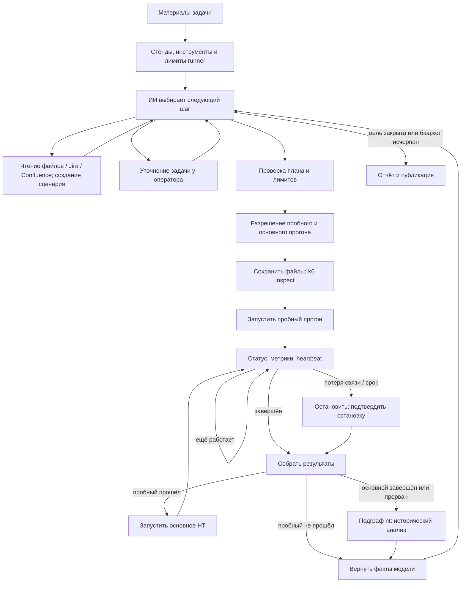

# Проведение нагрузочного тестирования — граф `nt_run`

[Документация](README.md) / [Все сценарии](WORKFLOWS.md)

**Если тест уже выполнен и нужно только разобрать его метрики, используйте [граф `nt`](NT.md).** Эта инструкция — для подготовки и запуска новой нагрузки.

Порядок чтения: [настроить runner](#запуск-runner) → [передать задачу](#пример-задачи) → [прочитать результаты](#как-читать-результаты). Отдельно: [остановка и восстановление](#остановка-и-восстановление), [демо без платной модели](#проверка-без-внешнего-стенда-и-без-оплаты-модели), [полный пример nt-testbed со снимками](NT_RUN_TESTBED.md).

Кампания — одно выполнение `nt_run` по задаче. Она может включать несколько экспериментов. Каждый эксперимент состоит из пробного (`smoke`) и основного (`load`) прогонов k6 с разными `test_id`.

`nt_run` получает задачу, читает материалы инструментами, создаёт сценарий k6,
проводит пробный и основной прогоны и вызывает существующий граф `nt` для
исторического анализа. В каталоге интерфейса он называется **«Проведение
нагрузочного тестирования»**. Граф `nt` по-прежнему доступен отдельно для анализа
уже выполненных тестов.



Неудачная подготовка, отказ оператора и неизвестный исход операции завершаются
отчётом с причиной. При неподтверждённой остановке граф не продолжает нагрузку.
Фактическая топология с этими ветками отображается на полотне в интерфейсе.

## Запуск runner

**В Docker runner уже запущен.** `up.cmd` / `up.sh` поднимает его вместе с backend и интерфейсом: k6 внутри образа, токен генерируется, `config/nt-runner.json` создаётся из шаблона, если его нет. Остаётся вписать свои стенды в `targets` и выполнить `docker compose restart runner`. Цели на `localhost` той же машины работают без правок: в контейнере runner переводит их на `host.docker.internal`. Подробности — в [развёртывании](DEPLOYMENT.md#runner-нагрузочного-тестирования). Шаги ниже нужны для запуска без Docker.

Сначала выполните [обычную установку Orbita](GETTING_STARTED.md): Python-зависимости, `.env`, ключ модели, токен API, backend и frontend. Следующие команды запускайте **из корня Orbita**. Нужны три отдельных процесса: backend, frontend и runner. Тестируемый HTTP-сервис запускается отдельно.

Runner — отдельный локальный HTTP-сервис. Ему нужен установленный k6
([официальная установка](https://grafana.com/docs/k6/latest/set-up/install-k6/)).
Сквозная проверка выполнена на k6 **1.6.1**; совместимость с другими версиями
нужно проверять командой демо ниже.

1. Если своей конфигурации ещё нет, скопируйте [шаблон](../config/nt-runner.example.json) в `config/nt-runner.json`:

   ```powershell
   Copy-Item config/nt-runner.example.json config/nt-runner.json
   ```

   Шаблон разрешает `local-demo` на `http://127.0.0.1:8088`, но **не запускает сервис по этому адресу**. Укажите свою работающую тестовую цель или используйте [nt-testbed](NT_RUN_TESTBED.md).

2. В `targets` задайте разрешённые стенды. `url` — HTTP origin без пути, логина
   и пароля; `target_service`, `environment`, `namespace` связывают тест с
   историческими метриками. `k6_binary` — `k6` из PATH или абсолютный путь к бинарнику. Лимит `max_duration_seconds` включает разгон и плато; `max_rps` и `max_vus` ограничивают план. Полный пример конфигурации — в шаблоне выше.
3. Добавьте в `.env`:

   ```dotenv
   NT_RUNNER_URL=http://127.0.0.1:8077
   NT_RUNNER_TOKEN=<случайный токен длиной не менее 16 символов>
   NT_RUN_MAX_STEPS=16
   NT_RUN_MAX_RUNS=2
   NT_RUN_AUTO_APPROVE=0
   ```

4. Запустите отдельный терминал:

   ```powershell
   .venv\Scripts\python.exe scripts/serve_nt_runner.py --config config/nt-runner.json
   ```

5. Перезапустите backend Orbita после изменения окружения и регистрации графа.
   Выберите **«Проведение нагрузочного тестирования»** и отправьте задачу.

На Linux/macOS замените `.venv\Scripts\python.exe` на `.venv/bin/python`.
После смены `config/nt-runner.json` перезапустите runner. После смены общего токена перезапустите оба Python-процесса. Runner загружает обычный `.env`; `.env.nt-testbed` сам по себе на него не влияет.

Без флагов сервис слушает только `127.0.0.1`: схема рассчитана на backend и runner на одном хосте. В штатном Compose runner слушает сеть Compose (`--host 0.0.0.0`), но его порт на хост не опубликован. Управляющие запросы требуют того же bearer-токена,
который указан у Orbita. Настройки стенда и лимитов не берутся из сообщения модели.
Для авторизации запросов к тестируемому API задайте `auth_env` в конфигурации
стенда: это имя переменной окружения runner с тестовым bearer-токеном. Значение
попадает только в окружение k6, не в сценарий, модель или журнал графа.

## Пример задачи

```text
Проведи НТ стенда local-demo, GET /health, ожидается HTTP 200.
Цель: проверить стабильность при 10 запросах в секунду.
Разгон 5 секунд, плато 30 секунд, максимум 3 виртуальных пользователя.
SLA: p95 <= 500 мс, доля ошибок <= 1%.
Остановить при p95 > 2000 мс или доле ошибок > 10%.
Тестовые данные и авторизация для этого endpoint не нужны.
```

Если контракт API находится в файлах задачи, выберите пакет в интерфейсе.
Модели доступны `list_task_files`, `read_task_file`, `jira_issue`, `jira_search`,
`confluence_search`, `confluence_page`, `write_test_files`. Обращения к Jira и
Confluence используют обычные настройки проекта. Запись во внешние трекеры
не является инструментом этого графа.

### Что проверить перед разрешением запуска

Раскройте «Сводку конвейера» в карточке **«Запуск НТ: пробный и основной прогон»**. Проверьте настроенную цель, HTTP-шаги, тестовые данные, RPS, VU, разгон, плато, SLA и отдельные аварийные пороги. В этой же карточке показан скомпилированный k6-скрипт.

Модель формирует план и набор шагов. `write_test_files` проверяет его и создаёт
артефакты `scenario` и `script`. После разрешения запуска runner сохраняет реальные
`scenario.json` и `test.js`, проверяет скрипт через `k6 inspect`, выполняет один
пробный сценарий, затем основную нагрузку. Разрешение показывается на конкретный
план, данные и скрипт; изменённый эксперимент требует нового разрешения.
`NT_RUN_AUTO_APPROVE=1` задаёт серверную политику самостоятельного выполнения
в пределах настроенных стендов и лимитов.

Одно разрешение покрывает пробный и основной тесты этого плана. Успешный пробный тест автоматически переходит к основному; отдельной паузы между ними нет. Пробный тест выполняет одну итерацию сценария с одним VU (не обязательно один HTTP-запрос).

Публикация отчёта согласуется отдельно через `PUBLISH_REQUIRE_APPROVAL`. `NT_RUN_AUTO_APPROVE` не разрешает автоматически публикацию или диагностические запросы вложенного `nt`. Отказ от публикации не отменяет уже выполненную нагрузку.

## Сценарии и данные

Сценарий поддерживает последовательность GET/POST/PUT/PATCH/DELETE, JSON body,
ожидаемый HTTP-статус и извлечение значений из JSON-ответа:

```json
{
  "steps": [
    {"name": "create", "method": "POST", "path": "/orders", "expected_status": 201,
     "body": {"sku": "{{sku}}"}, "extract": {"order_id": "data.id"}},
    {"name": "read", "path": "/orders/{{order_id}}", "expected_status": 200}
  ],
  "dataset": [{"sku": "test-product"}]
}
```

Это фрагмент плана, а не готовое тело `write_test_files`. Полный контракт [`Plan`](../src/agent/nt_run/plan.py) модель получает в системном промпте. Обязательны также `objective`, `target`, `target_rps`, `duration_seconds`, `sla_p95_ms`, `sla_error_rate`, `stop_p95_ms` и `stop_error_rate`.

Длительность задаётся в секундах, p95 — в миллисекундах, доля ошибок — числом от 0 до 1 (`0.01` означает 1%). Пороги остановки не могут быть строже SLA. Поддерживается 1–10 шагов и 1–1000 строк данных, размер сериализованного плана ограничен 64 000 символами.

Данные перебираются циклически; уникальность на весь тест
не гарантируется. При ошибке шага текущая итерация заканчивается. Произвольный
JavaScript не выполняется: код компилируется из проверенного описания.
Подготовка бизнес-данных выражается шагами сценария или готовым `dataset`;
отдельного универсального доступа на запись в БД нет.

`target_rps` — желаемая суммарная частота HTTP-запросов. Для N шагов одна итерация
содержит N запросов, поэтому k6 получает `timeUnit: Ns` и `rate: target_rps`.
Это целевой средний профиль, не строгий предел запросов в каждой секунде:
порядок шагов может давать кратковременные всплески, а ошибки и нехватка VU —
снижение фактической RPS. В результатах доступны фактическая частота и
`dropped_iterations`. `duration_seconds` означает плато; разгон считается отдельно.

Профиль состоит из необязательного линейного разгона и одного плато. Произвольные ступени, изменение RPS на ходу, загрузка своего JavaScript и полноценные браузерные сценарии этим контрактом не поддерживаются. `virtual_users` задаёт одновременно выделенное и максимальное число VU; автоматически выше него k6 не масштабируется.

## Остановка и восстановление

- Идемпотентные ключи закреплены за кампанией, попыткой и типом прогона.
  Повтор запроса запуска возвращает тот же `test_id`. SQLite сохраняет связь
  при перезапуске HTTP-сервера. Один runner допускает один активный тест.
- Отдельный worker следит за временем, heartbeat графа, наличием метрик и
  порогами. По умолчанию отсутствие heartbeat более 20 секунд останавливает k6.
  Потеря потока метрик более 15 секунд также останавливает нагрузку.
- Пороги ошибок и p95 проверяются worker по окну 5 секунд после первых 5 секунд
  прогона. Дополнительно k6 имеет собственные `abortOnFail` и конечную длительность.
  Пороги остановки отделены от SLA; SLA оценивается после прогона.
- Отмена графа пытается остановить активный тест. Если процесс графа исчез,
  worker остановит нагрузку по heartbeat. Закрытие вкладки без отмены серверного
  прогона само по себе не означает остановку НТ.
- Если worker пропал и его завершение нельзя подтвердить, статус становится
  `unknown`, новые тесты блокируются. Автоматического повторного запуска k6 нет.
  Оператор должен проверить процессы и фактическое завершение теста; нельзя
  удалять журнал активного runner ради повторного старта. Убедившись, что
  процесса k6 не осталось, снимите блокировку:

  ```powershell
  .venv\Scripts\python.exe scripts/serve_nt_runner.py --config config/nt-runner.json --release <test_id>
  ```

  Прогон помечается `failed` со `stop_reason: worker_lost`, и runner снова
  принимает тесты. Команда локальная и намеренно не выведена в control API:
  граф не должен уметь списывать собственный потерянный прогон. Освободить
  можно только прогон, который runner уже показывает как `unknown`.
- Если ответ `start` потерян даже после транспортного повтора, граф сообщает
  неопределённый исход и прекращает кампанию. Заброшенный прогон ограничен lease.
- `NT_RUN_MAX_STEPS` ограничивает вызовы планировщика; `NT_RUN_MAX_RUNS` — основные
  прогоны и неудачные пробные попытки. Успешный пробный прогон отдельно бюджет попыток не расходует. Общий денежный бюджет проекта также применяется.

В PowerShell вместо `<test_id>` в команде восстановления подставьте реальный ID вида `k6-…`. Если runner запущен с нестандартным `--root`, укажите тот же каталог при `--release`.

`stop_reason` объясняет механизм завершения: `operator_stop` — команда остановки (включая отмену графа), `lease_expired` — пропал heartbeat, `metrics_lost` — перестали поступать метрики, `deadline` — истёк срок, `error_threshold` / `latency_threshold` — превышен порог worker. `k6_exit_*` означает ненулевой код k6; это может быть и срабатывание его собственных порогов.

## Как читать результаты

В интерфейсе доступны план, текущий `test_id`, статус и живые метрики, журнал действий, выполненные прогоны, вложенный анализ и итоговый отчёт кампании. Проверяйте структурированные поля рядом с текстом модели:

| Поле | Что означает | Как использовать |
| :--- | :--- | :--- |
| `test_status` | Состояние выполнения k6: `completed`, `stopped`, `failed`; `unknown` — завершение не подтверждено | `completed` означает нормальный выход k6, а не прохождение SLA |
| `metrics` | Последнее окно 5 секунд: RPS, p95, доля ошибок, пропуски итераций | Для наблюдения и порогов worker; не итог за весь тест |
| `summary` | Итоговые агрегаты k6, если записан `summary.json` | Для всего прогона, включая разгон; RPS не равна автоматически RPS плато |
| `run_analysis.analysis_result` | Вычисленный `nt` вердикт `PASSED` / `FAILED` / `INCONCLUSIVE` по историческим рядам | Основной структурированный результат исторической проверки SLA |
| `run_analysis.diagnostic_status` | Полнота диагностики, например `PARTIAL`; при отказе подграфа — `NOT_RUN` | Читать вместе с `diagnostic_gaps`, отдельно от вердикта SLA |
| Текст отчёта | Вывод планировщика, факты прогонов и вложенный анализ | Формулировка модели «PASS» не меняет вычисленный `analysis_result` |

### Метрики k6

`summary.http_req_duration["p(95)"]` — p95 всего прогона в миллисекундах. `summary.http_reqs.count` и `.rate` — количество HTTP-запросов и средняя частота за прогон. Последнее окно может показывать 20 RPS при среднем около 18 RPS за разгон и плато; такие значения относятся к разным периодам.

`summary.nt_errors.rate` — доля неуспешных проверок шагов. Шаг считается неуспешным при неожиданном HTTP-статусе, ошибке извлечения значения или исключении. Текущий runner выдаёт понятные счётчики `failed_requests` и `ok_requests`. Их названия относятся к проверкам шагов; при исключении до HTTP-вызова их сумма может отличаться от `http_reqs.count`.

В **сыром** `summary.json` k6 и в старых отчётах сохранены имена `passes` / `fails` метрики Rate. Для `nt_errors` скрипт вызывает `errors.add(!ok)`, поэтому ненулевые `passes` здесь означают ошибки, а `fails` — успешные проверки. Это не дефект доли `rate`; runner переименовывает счётчики при выдаче результата. Нулевые ошибки в последнем live-окне не исключают ошибок раньше в прогоне.

`dropped_iterations` означает пропуски запланированных итераций. Сверяйте итоговое значение из summary, если оно есть, и окно `metrics` отдельно. Одно последнее окно не доказывает отсутствие пропусков за весь тест. По одному среднему RPS и общему p95 нельзя подтвердить устойчивость каждого интервала плато.

### Исторический анализ и ограничения вывода

Для SLA, плато и гипотез `nt` нужны исторические источники и `NT_METRIC_QUERIES` из [его настроек](NT.md). Runner передаёт метаданные теста, но не загружает k6 summary в Prometheus/InfluxDB. Без достаточных рядов вердикт может быть `INCONCLUSIVE`, даже если k6 завершился нормально и его агрегаты укладываются в пороги.

Проверьте, что исторические ряды относятся к нужному сервису, окружению, периоду и популяции запросов. Совпадения названия сервиса недостаточно. В [nt-testbed](NT_RUN_TESTBED.md) историческая телеметрия симулируется отдельно от HTTP-трафика k6; её нельзя использовать как измерение реакции цели на этот прогон.

Прерванный основной тест передаётся в `nt` со статусом `stopped`/`failed` и фактическим периодом; он не может получить `PASSED`. Нехватка точек, baseline и ошибки источников отражаются отдельно. Отказ подграфа анализа сохраняет результаты runner и даёт `INCONCLUSIVE` / `NOT_RUN`.

Граф не заменяет вычисленный вердикт отдельной детерминированной SLA-проверкой k6 summary. Планировщик видит оба набора данных и может неточно сформулировать вывод; при расхождении цитируйте численные измерения и `analysis_result` раздельно. Пример такой ситуации разобран в [каталоге прогонов](examples/README.md).

### Где сохраняются данные

Runner хранит `.nt-runs/runner.sqlite3`, подготовленные файлы в `.nt-runs/<prepared_id>/` и файлы каждого теста в `.nt-runs/<test_id>/`. Каталог меняется параметром `--root`. `scenario.json` и `test.js` фиксируют исполненный план; `summary.json` появляется, если k6 успел записать итог. При аварийной остановке могут остаться только последние живые метрики в SQLite. Полный поток точек и тела HTTP-ответов не сохраняются.

Отчёт кампании публикуется отдельно по общим настройкам `PUBLISH_TARGET`, `PUBLISH_DIR` и Confluence. Публикация отчёта не экспортирует каталог runner. История планировщика `run_history` хранится в состоянии треда; [CLI-стенограмма](NT_RUN_TESTBED.md) выгружает сообщения и результаты до завершения временного процесса. `analysis_1`, `analysis_2` в артефактах относятся к отдельным анализам, а `run_analysis` — к последнему.

## Проверка без внешнего стенда и без оплаты модели

```powershell
.venv\Scripts\python.exe -m scripts.demo_nt_run --k6 C:\tools\k6.exe --check-stops
```

Демо создаёт временные локальные HTTP API и runner, вызывает настоящий k6 через
настоящий граф, проверяет пробный и основной тесты, явную остановку и остановку
по пропавшему heartbeat. Только ответы модели заданы заранее. Проверка не
использует личные API-ключи и не запускает нагрузку на внешний сервис.

Контракты k6: [ramping arrival rate](https://grafana.com/docs/k6/latest/using-k6/scenarios/executors/ramping-arrival-rate/),
[JSON output](https://grafana.com/docs/k6/latest/results-output/real-time/json/),
[handleSummary](https://grafana.com/docs/k6/latest/results-output/end-of-test/custom-summary/).

Для прогона с настоящей моделью, снимков интерфейса и разбора сохранённых результатов перейдите к [инструкции nt-testbed](NT_RUN_TESTBED.md).
