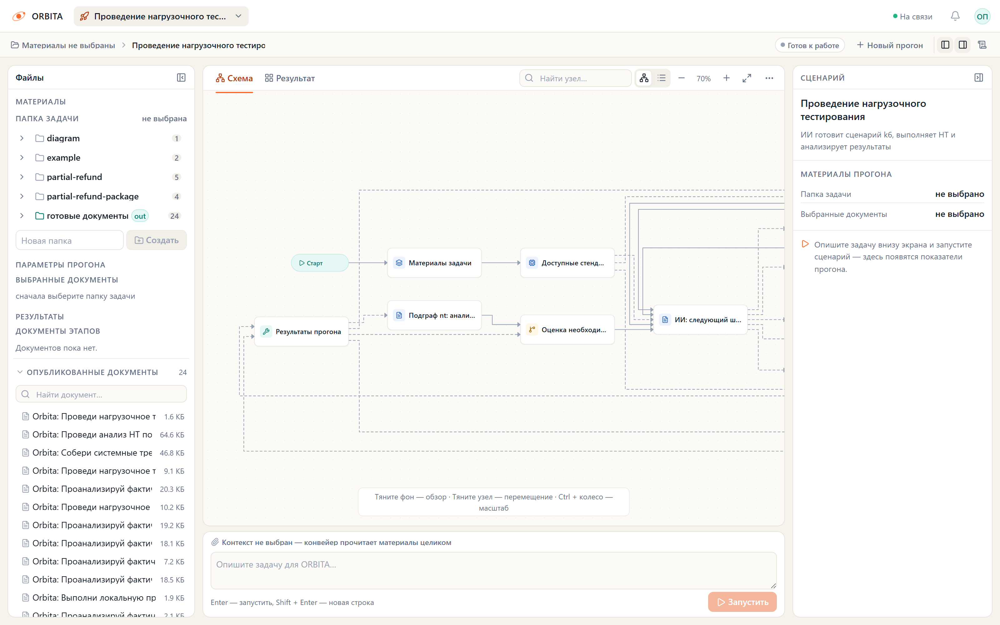
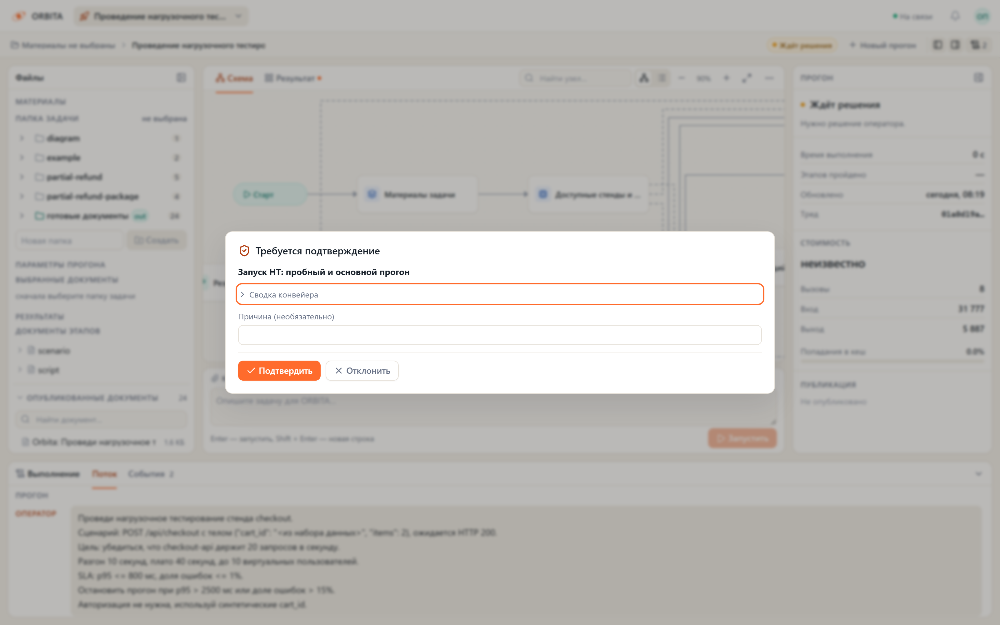
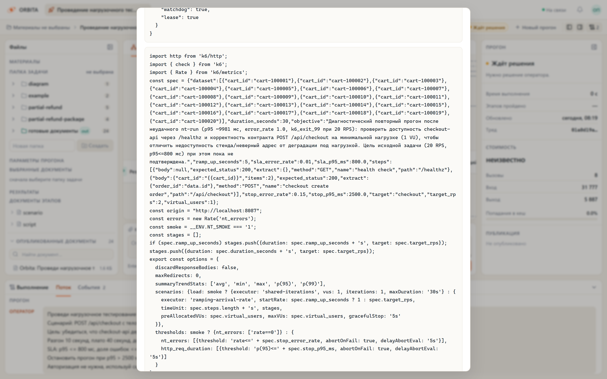
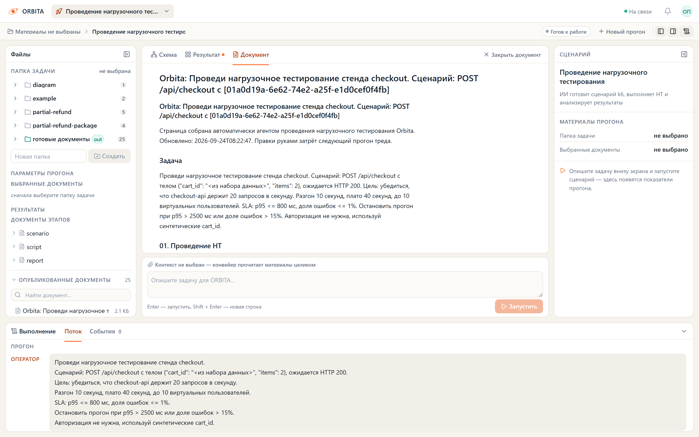

# Проведение НТ на локальном nt-testbed

[Документация](README.md) / [Граф `nt_run`](NT_RUN.md) / Локальный пример

Это инструкция для демонстрационного стенда: настоящий k6 обращается к `checkout-app`, модель готовит план, а вложенный `nt` читает исторические источники. Для своей тестовой среды используйте [основную инструкцию](NT_RUN.md).

**Ограничение примера:** в проверенной конфигурации nt-testbed Prometheus собирает сервисную телеметрию с `nt-sim`. Эти ряды генерирует симулятор; они не измеряют HTTP-поток k6 к `checkout-app`. Поэтому пример проверяет работу компонентов и передачу данных, но не доказывает причинную связь между созданной нагрузкой и ресурсными метриками сервиса.

Сам `checkout-app` тоже является HTTP-моком: он задаёт задержки и вероятность ошибок по текущему состоянию симулятора. k6 действительно отправляет запросы и измеряет ответы, но таким прогоном нельзя определить производительность реального checkout-сервиса.

## Что потребуется

- Установленная Orbita по [первому запуску](GETTING_STARTED.md), включая `.env` с моделью и `API_ADMIN_TOKEN`.
- Репозиторий [nt-testbed](https://github.com/IST0VE/nt-testbed) рядом с Orbita и работающий Docker. Инструкции этого раздела предполагают каталог `..\nt-testbed` относительно корня Orbita.
- Установленный k6 и конфигурация runner ниже.
- `.env.nt-testbed` в корне Orbita с координатами стенда, настройками источников и картой метрик из [NT.md](NT.md#карта-метрик-и-источники). Это локальный файл, а не готовый файл чистого checkout.

Для интеграций используйте имена переменных Orbita из [`.env.example`](../.env.example): в частности, `JIRA_BASE_URL`, `CONFLUENCE_BASE_URL`, `NT_LOAD_TESTING_URL`, `NT_PROMETHEUS_URL`, `NT_INFLUX_URL`, `NT_METRIC_QUERIES`. Названия вроде `JIRA_URL` или `LOADTEST_API_URL` в материалах внешнего стенда не являются их автоматическими алиасами. Адреса и тестовые реквизиты возьмите из конфигурации своего nt-testbed; карту метрик настройте под его exporter.

Скрипты `serve_nt_testbed.py` и `demo_nt_run_testbed.py` объединяют `.env` и `.env.nt-testbed` в памяти, причём второй файл имеет приоритет. Они также добавляют loopback-адреса в `NO_PROXY`. Провайдер и ключ модели обычно остаются из `.env`. Обычный `serve_nt_runner.py` загружает только `.env` и окружение процесса.

## 1. Поднимите стенд

Из корня Orbita, в отдельном терминале:

```powershell
Push-Location ..\nt-testbed
docker compose up -d
docker compose ps -a
Pop-Location
```

Дождитесь готовности источников и окончания начального наполнения данных согласно README стенда. `Pop-Location` возвращает в Orbita: следующие команды используют её `.venv` и `scripts/`.

Проверьте доступность цели:

```powershell
Invoke-WebRequest http://localhost:8087/healthz
```

Цель нагрузки — `POST /api/checkout` на `localhost:8087`. Jira и Confluence в этой демонстрации — HTTP-моки стенда. Сам граф использует обычные интеграционные инструменты; успех поиска зависит от возможностей моков и запроса модели.

## 2. Настройте и запустите runner

Создайте отдельный `config/nt-runner-testbed.json`, чтобы сохранить конфигурацию своих других целей. Замените `k6` на абсолютный путь, если бинарник отсутствует в PATH:

```json
{
  "k6_binary": "k6",
  "max_rps": 200,
  "max_vus": 50,
  "max_duration_seconds": 300,
  "lease_seconds": 20,
  "targets": {
    "checkout": {
      "url": "http://localhost:8087",
      "target_service": "checkout-api",
      "environment": "nt01",
      "namespace": "nt01",
      "auth_env": ""
    }
  }
}
```

В обычном `.env` задайте `NT_RUNNER_TOKEN` длиной не менее 16 символов. Если это имя также есть в `.env.nt-testbed`, значения должны совпадать. В `.env.nt-testbed` задайте:

```dotenv
NT_RUNNER_URL=http://127.0.0.1:8077
NT_RUN_MAX_STEPS=16
NT_RUN_MAX_RUNS=2
NT_RUN_AUTO_APPROVE=0
```

В отдельном терминале из корня Orbita:

```powershell
.venv\Scripts\python.exe scripts/serve_nt_runner.py --config config/nt-runner-testbed.json
```

Оставьте процесс работающим. Не запускайте второй runner на тот же порт. Все команды ниже используют один runner; выполняйте демонстрации последовательно.

## 3. Выберите способ прогона

### Вручную через интерфейс

В новом терминале из корня Orbita:

```powershell
$env:PYTHONUTF8="1"
.venv\Scripts\python.exe scripts/serve_nt_testbed.py
```

Этот backend занимает порт 2024. Остановите обычный backend на этом порту перед его запуском. В ещё одном терминале:

```powershell
npm.cmd --prefix web run dev -- --host 127.0.0.1
```

Откройте `http://localhost:5173`, выберите **«Проведение нагрузочного тестирования»**, создайте новый диалог и отправьте:

```text
Проведи нагрузочное тестирование стенда checkout.
Сценарий: POST /api/checkout с телом {"cart_id": "<из набора данных>", "items": 2}, ожидается HTTP 200.
Цель: проверить checkout-api при 20 запросах в секунду.
Разгон 10 секунд, плато 40 секунд, до 10 виртуальных пользователей.
SLA: p95 <= 800 мс, доля ошибок <= 1%.
Остановить прогон при p95 > 2500 мс или доле ошибок > 15%.
Авторизация не нужна, используй синтетические cart_id.
```

Проверьте план и скрипт перед разрешением. Пример не требует чтения NT-123: контракт задан в сообщении. Если нужен отдельный эксперимент с чтением Jira/Confluence, явно попросите прочитать конкретные материалы и согласовать расхождения до запуска.

### Через CLI со стенограммой

Нужны стенд, runner и настроенная модель. Backend на порту 2024 и frontend для этого режима не требуются:

```powershell
.venv\Scripts\python.exe scripts/demo_nt_run_testbed.py --out .tmp/nt-run-trace.md
```

**Это реальная нагрузка и платные вызовы модели.** Скрипт строит граф с `auto_approve=True` независимо от `NT_RUN_AUTO_APPROVE=0` и автоматически подтверждает возникающие паузы, включая запросы вложенного анализа. Он предназначен для подготовленного локального стенда. Публикация отключена.

Скрипт записывает Markdown и одноимённый JSON. Явный `--out` выше сохраняет результаты в `.tmp/`; без него перезаписывается `docs/examples/nt-run-trace.md` и соседний JSON. При нестандартном каталоге runner задайте `NT_RUN_ARTIFACTS` для чтения его файлов при экспорте; эта переменная не меняет `--root` самого runner.

В стенограмме видны сообщения планировщика, аргументы инструментов, ответы, исполненный план, k6-скрипт, результаты, стоимость и отчёт. Ответы инструментов в Markdown могут быть сокращены до 4000 символов; JSON сохраняет сообщения `run_history`. Это журнал доступных сообщений, а не запись скрытых рассуждений модели. История внутренних вызовов подграфа `nt` не входит в историю планировщика целиком.

### Автоматически со снимками интерфейса

Этот режим нужен для обновления иллюстраций документации. Он требует работающих стенда, runner, backend и frontend, extra `[docs]` и Chromium Playwright:

```powershell
.venv\Scripts\python.exe -m pip install -c requirements.lock -e ".[docs]"
.venv\Scripts\python.exe -m playwright install chromium
.venv\Scripts\python.exe scripts/shoot_nt_run_portal.py --out .tmp/nt-run-portal
```

Скрипт сам отправляет задачу и нажимает подтверждения в интерфейсе: запускает настоящую нагрузку и тратит токены. Оставьте `NT_RUN_AUTO_APPROVE=0`, чтобы карточка разрешения появилась и попала в кадр. Это не ручное согласование оператором. Без `--out` снимки записываются в `docs/image/NT_RUN/`; смотрите код скрипта перед обновлением опубликованных материалов.

Для скрипта съёмки `API_ADMIN_TOKEN` должен быть явно задан в `.env.nt-testbed`: он читает токен только из этого файла. Убедитесь, что backend запущен с тем же значением; наличия токена только в `.env` для съёмки недостаточно.

## Что видно в интерфейсе

Снимки ниже относятся к сохранённому демонстрационному прогону; текущие численные значения могут отличаться.



Перед пробным тестом появляется разрешение на пробный и основной прогоны:



Раскройте «Сводку конвейера»: предмет подтверждения — конкретный план, данные и скомпилированный скрипт.



Во время теста справа обновляются `test_id`, статус и последнее пятисекундное окно метрик. Итоговый отчёт содержит результаты прогонов и отдельный исторический анализ:



## Как читать сохранённый пример

[Стенограмма от 13 сентября 2026 года](examples/nt-run-trace.md) и [её JSON](examples/nt-run-trace.json) описывают основной тест `k6-12c3ef1192156b03dff06a0db42745b30df8e844`:

| Данные | За весь прогон k6 | Последнее окно 5 секунд |
| :--- | :--- | :--- |
| Запросы и RPS | 905 запросов, средняя частота 18,069 req/s | 20 req/s |
| p95 | 132,800 мс | 135,070 мс |
| Ошибки | 2 неуспешные проверки из 905, доля 0,002210 (0,221%) | 0 |

Разгон 10 секунд и плато 40 секунд объясняют различие средней и целевой частоты. Последнее окно не заменяет статистику всего плато. Стоимость, записанная в этой стенограмме, — около $0,008 за 6 вызовов; это историческая оценка, а не тариф или обещание стоимости следующего теста.

Выполнение k6 завершилось с `completed`, а исторический анализ вернул **`INCONCLUSIVE` / `PARTIAL`**: недостаточно точек, не выделены устойчивые плато, есть диагностические пробелы. Фраза модели «цель достигнута по детерминированным критериям» не является дополнительным вычисленным вердиктом. Агрегаты k6 можно сравнить с заданными порогами, но они не подтверждают ресурсные выводы из телеметрии симулятора.

Сервисные RPS, CPU, память и перезапуски из вложенного `nt` относятся к симулируемому контуру. Для оценки реального влияния k6 нужны метрики самой цели с проверенными фильтрами и периодом. Подключение Prometheus без проверки принадлежности рядов этого не обеспечивает.

Более ранний [отчёт checkout](examples/nt-run-checkout.md) содержит другие результаты: 904 запроса и p95 150,501 мс. В нём старые имена `passes` / `fails` и ошибочная трактовка модели; не смешивайте его цифры со стенограммой. [Каталог примеров](examples/README.md) объясняет различия и статус каждого файла.

## Завершение и повтор

Перед остановкой backend проверьте, что k6 завершился. Отмена серверного запуска пытается остановить нагрузку; закрытие вкладки само по себе не гарантирует отмену. Если runner показывает `unknown`, действуйте по [инструкции восстановления](NT_RUN.md#остановка-и-восстановление), сохраняя тот же `--root` и конфигурацию.

Для нового эксперимента создайте новый диалог и проверьте новый план. Не нужно воспроизводить исторические числа в точности: оценивайте корректность сценария, реальные статусы, происхождение измерений и достаточность данных для вывода.
