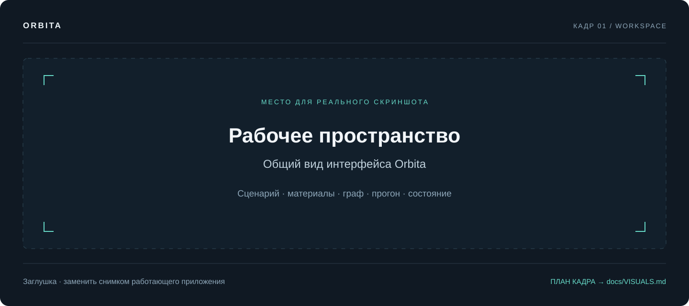
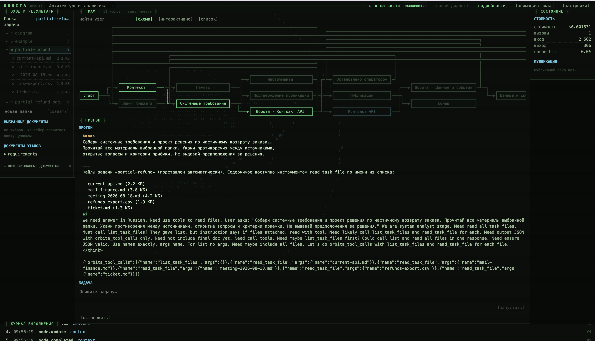
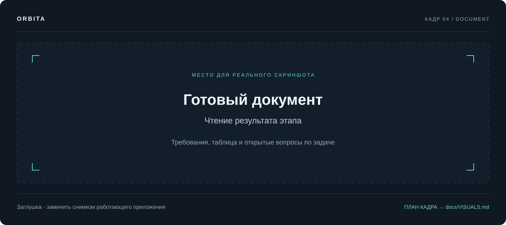
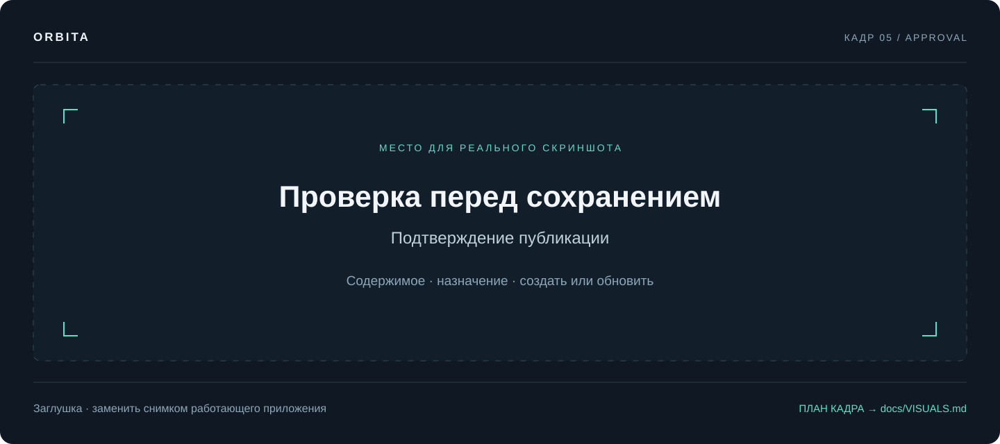
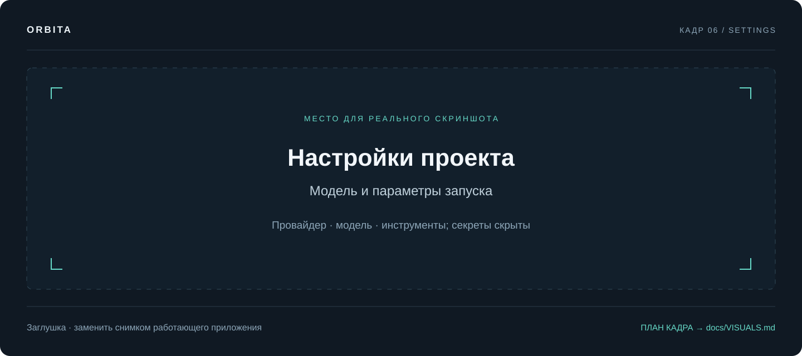

# Работа в интерфейсе

[Документация](README.md) / Руководство пользователя

**Обычный цикл:** выберите сценарий и материалы, отправьте задачу, проверьте документы, подтвердите нужное действие. Для другой задачи создайте новый диалог.

## Рабочее пространство



| Область                              | Для чего нужна                                                                                                                   |
| :------------------------------------------ | :------------------------------------------------------------------------------------------------------------------------------------------- |
| Верхняя строка                 | Выбор сценария, связь с сервером, новый диалог, подробности и настройки           |
| **ВХОД И РЕЗУЛЬТАТЫ**  | Папка задачи, выбранные файлы, документы этапов и опубликованные результаты |
| **ГРАФ**                          | Схема выполнения и состояние отдельных этапов                                                        |
| **ПРОГОН**                      | Запрос, ответы, служебные сообщения и ввод следующей задачи                                |
| **СОСТОЯНИЕ**                | Стоимость и результат публикации                                                                                |
| **ЖУРНАЛ ВЫПОЛНЕНИЯ** | Подробности событий; открывается кнопкой`[подробности]`                                     |

Состав полей меняется со сценарием. Например, у схемы есть выбор `.drawio`, у Jira — проект, а у обновления — отдельные блоки исходного документа и новых материалов. Кнопка `[анимация: …]` меняет визуальное оформление. Ширину левой колонки можно менять перетаскиванием разделителя.

## 1. Выберите сценарий и начните диалог

Выберите сценарий в верхнем списке. Подробный выбор — в [шести сценариях](WORKFLOWS.md). Во время активного выполнения переключение заблокировано.

Нажмите **`[новый диалог]`**, если начинаете независимую задачу. Тред хранит сообщения, результаты и накопленную стоимость. Следующий запрос в том же диалоге запускает граф с прежним контекстом; он не является автоматической точечной правкой последнего документа.

Браузер запоминает текущий тред для каждого сценария. Это не каталог всех запусков: полноценного поиска по истории в текущем интерфейсе нет.

## 2. Выберите материалы

В левой панели выберите папку. При необходимости отметьте конкретные документы. Файлы заранее должны лежать на backend-сервере — [как их подготовить](INPUTS.md).

Для первого знакомства используйте `partial-refund`. Для проверки готового пакета — `partial-refund-package`. Для схемы — `diagram` и файл `orders-export.drawio`.

Напишите конкретную задачу. Хороший запрос называет действие, границы и способ обращения с неизвестным:

```text
Проверь комплект документов по частичному возврату.
Сопоставь требования, API, данные и архитектуру. Для каждого расхождения
укажи документы-источники, последствия и что нужно уточнить.
Не исправляй отсутствующие решения предположениями.
```

## 3. Следите за выполнением

После отправки запроса граф проходит этапы. Служебное чтение источника может идти до первого ответа модели. Документы появляются по мере завершения ролей, а длинный ответ требует времени.



Откройте `[подробности]`, чтобы увидеть журнал и понять, какой шаг выполняется. Пауза с надписью **«ТРЕБУЕТСЯ ПОДТВЕРЖДЕНИЕ»** означает ожидание вашего решения. Простое ожидание или повторная отправка задачи её не заменяют.

При потере соединения сначала восстановите доступ к серверу. Интерфейс сверяет состояние с backend; полная временная история событий после закрытия потока не гарантирована. Не запускайте тот же запрос повторно, пока не проверили текущий результат.

## 4. Прочитайте документы

Нажмите на документ этапа слева: он откроется в области **«ДОКУМЕНТ»**. Проверьте не только итоговое ревью, но и исходные требования: неверное решение в начале может перейти во все следующие документы.



| Проверить                                    | Пример                                                                                                                     |
| :---------------------------------------------------- | :------------------------------------------------------------------------------------------------------------------------------- |
| Учтены ли источники                  | Встреча и более позднее письмо рассмотрены вместе                                     |
| Выделены ли противоречия        | Два разных срока хранения не превратились в один без объяснения            |
| Проверяемы ли требования        | Вместо «работает быстро» есть измеримый критерий или открытый вопрос |
| Видны ли неизвестные решения | Неизвестное отмечено как вопрос/TBD                                                                  |
| Подтверждён ли вывод                | Указан документ, факт или ограничение проверки                                           |

Стоимость в правой панели — расчёт по usage модели и настроенным тарифам. Это не счёт провайдера. Нулевое значение при неизвестном тарифе не доказывает бесплатный запуск.

## 5. Ответьте на подтверждение



| Подтверждение                | Что произойдёт после`[подтвердить]`                                      |
| :---------------------------------------- | :------------------------------------------------------------------------------------------------------ |
| Следующий этап               | Продолжится конвейер; используется при`PIPELINE_REQUIRE_APPROVAL=1` |
| Публикация                      | Подготовленные документы запишутся в выбранную цель       |
| Создание Jira                     | Будут созданы задачи в показанном проекте                           |
| Сохранение обновления | Появится отдельная новая версия основного документа       |

Перед публикацией смотрите **адрес назначения, заголовок, содержимое и действие «создать/обновить»**. Совпавший заголовок может привести к обновлению существующего результата. Поле «Причина» необязательно; отказ сам по себе не запускает исправление документа.

В Confluence может быть доступно действие **`[создать черновики в Confluence]`**: оно записывает черновики во внешнюю систему и возвращает ссылки на редактор. Для существующих страниц создаются отдельные копии. Окончательно отредактировать и опубликовать их можно в Confluence.

В Jira действие **`[подготовить формы для проверки в Jira]`** возвращает формы для ручного создания. Откройте форму, проверьте поля и создайте задачу в Jira. Получение формы ещё не означает, что задача создана.

Сценарий «Обновление документа» всегда согласует сохранение новой версии, даже если `PUBLISH_REQUIRE_APPROVAL=0`. Используйте обычное подтверждение; отдельного режима создания Confluence-черновиков этот граф не реализует.

## 6. Найдите сохранённый результат

При `PUBLISH_TARGET=file` документы лежат в `PUBLISH_DIR` — по умолчанию `published/`. При публикации в Confluence интерфейс показывает ссылки на страницы. Созданные задачи появляются в блоке «Задачи Jira» с ключами и ссылками.

| Что видно                         | Как понимать                                                                                                        |
| :---------------------------------------- | :----------------------------------------------------------------------------------------------------------------------------- |
| Документ этапа               | Текст подготовлен; запись в файл ещё не подтверждена                               |
| `created` / `updated`                 | Есть результат создания или обновления; проверьте отдельные записи   |
| `drafts`                                | Подготовлены внешние черновики; это ещё не окончательная публикация |
| `rejected` / `disabled` / `skipped` | Запись отклонена, выключена или пропущена; смотрите причину                 |
| `failed` / `partial`                  | Ошибка или частичное выполнение; проверьте каждый объект                      |
| `unchanged` в обновлении     | Подтверждённых изменений нет; новая версия не требуется                        |

Если общей зелёной строки недостаточно, откройте файл, страницу или задачу. Особенно важно проверить это после частичного сбоя: уже созданные объекты автоматически не откатываются.

## Остановка, повтор и настройки

Остановка активного прогона не отменяет уже выполненные внешние действия и не возвращает стоимость сделанных LLM-вызовов. Отказ на межэтапном согласовании прекращает оставшиеся роли; готовые результаты могут затем пройти отдельное согласование публикации.

Чтобы исправить содержание, уточните материалы и запустите подходящий сценарий в новом диалоге. Для изменения существующего текста используйте «Обновление документа». Повтор отдельного произвольного узла в UI не поддерживается.

Кнопка `[настройки]` открывает параметры `.env`, поиск по ним и сохранение изменений. Секреты показываются маской. **После сохранения перезапустите backend:** запись файла не перестраивает уже созданный клиент модели. Особенности Docker описаны в [развёртывании](DEPLOYMENT.md).



---

Далее: [Сценарии с примерами →](WORKFLOWS.md) · [Настройки →](CONFIGURATION.md) · [Диагностика →](TROUBLESHOOTING.md)
