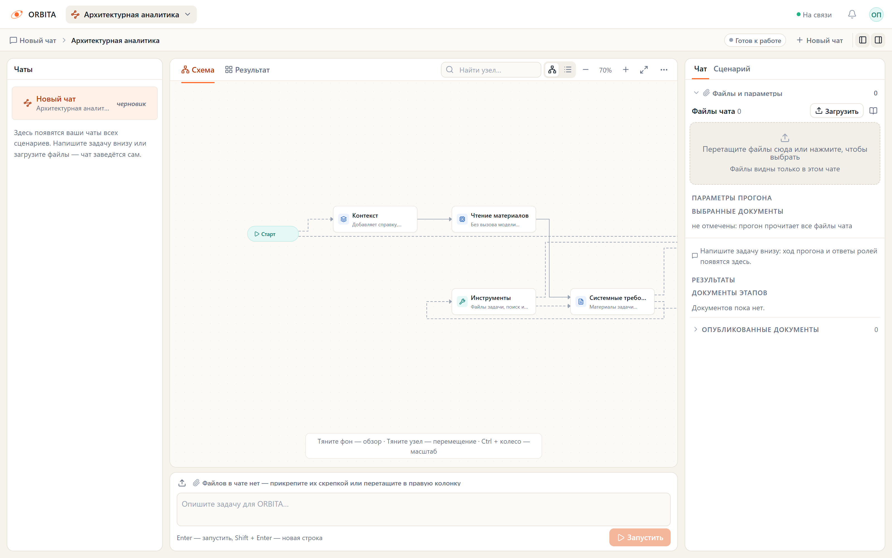
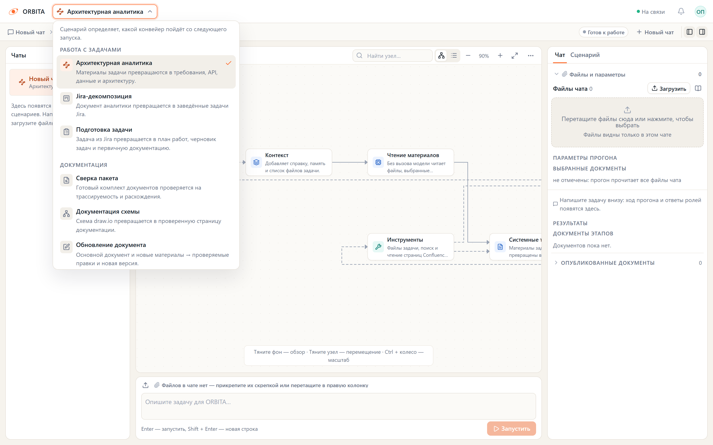
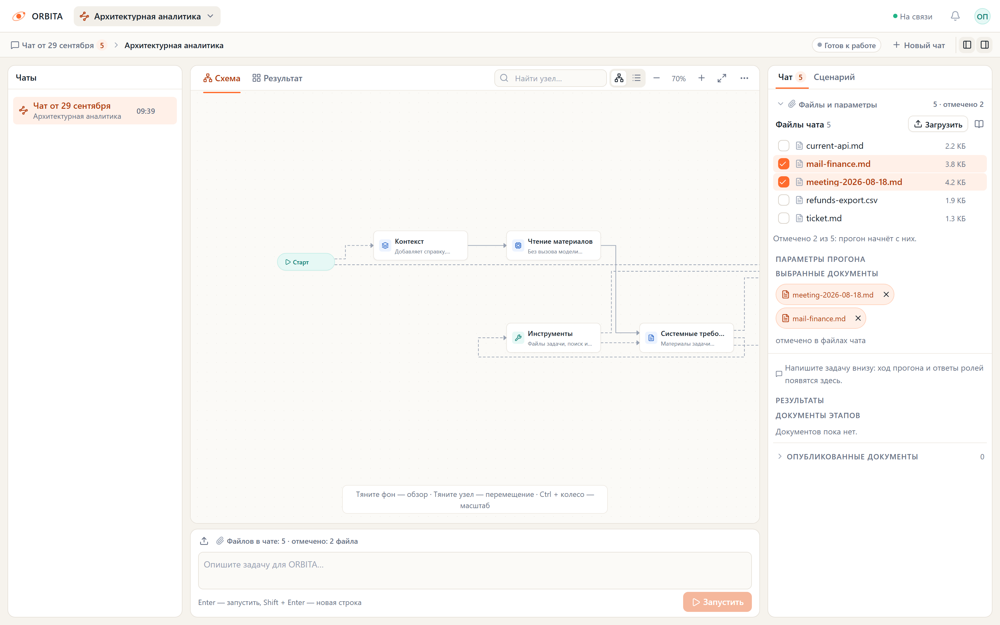
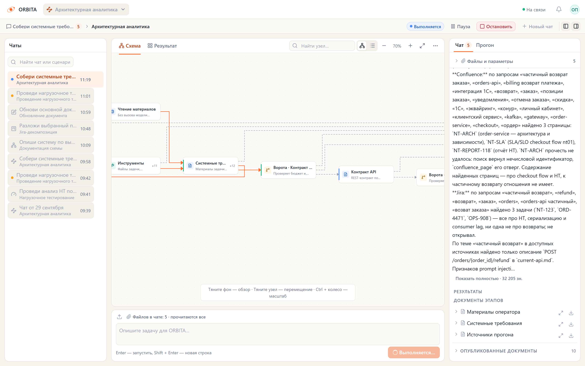
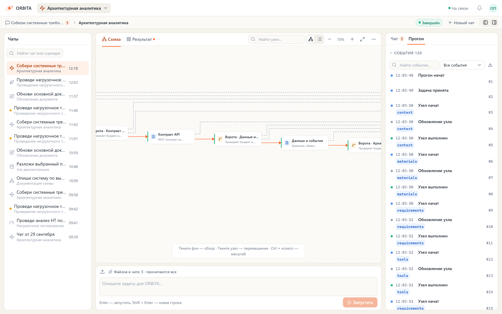
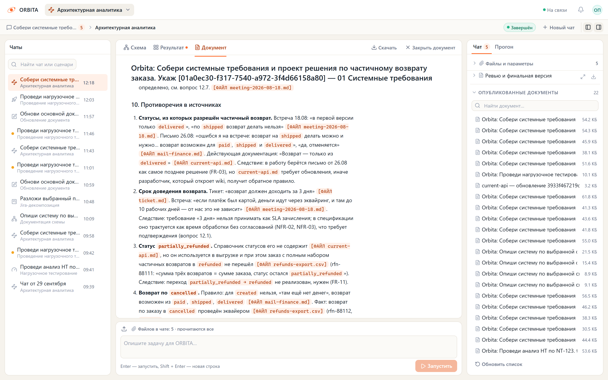
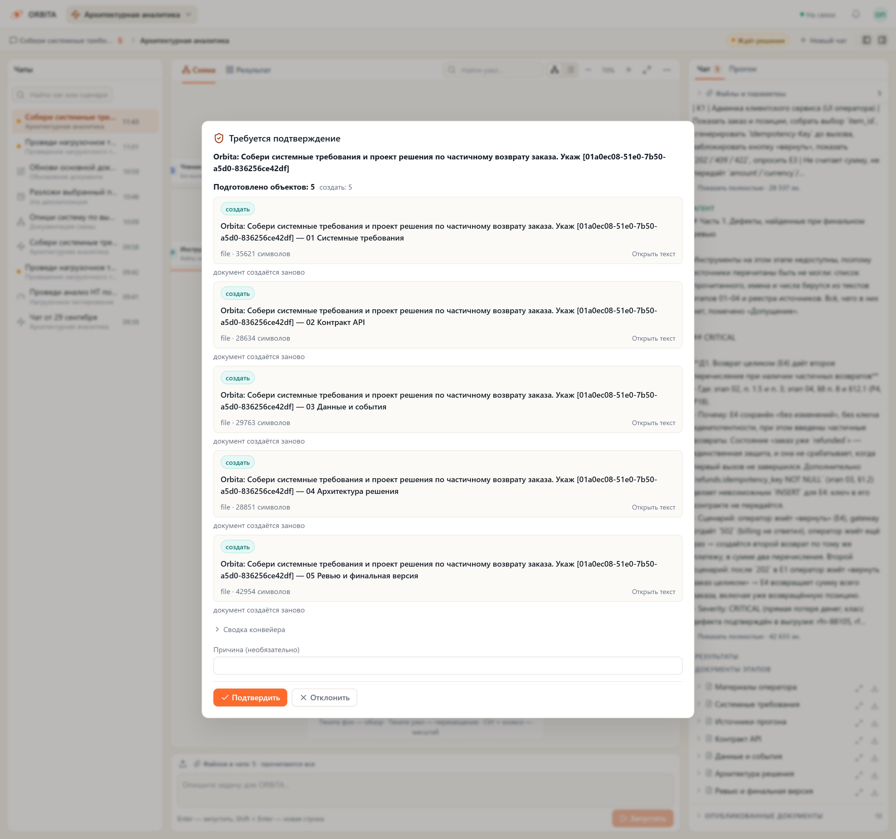
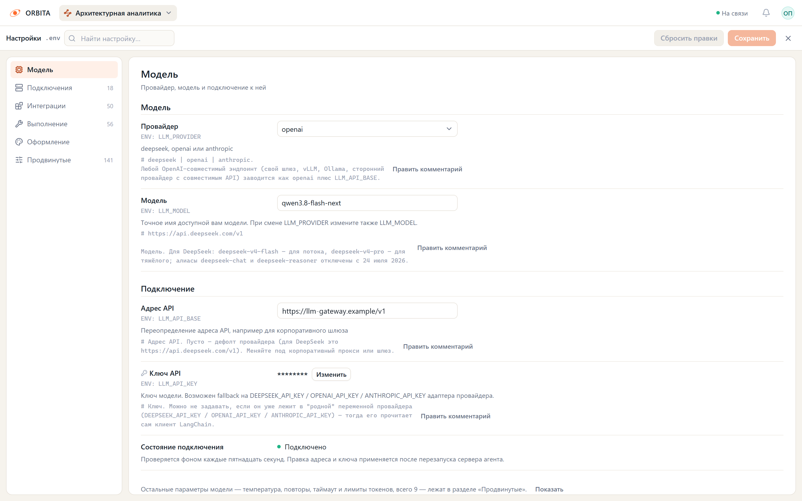

# Работа в интерфейсе

[Документация](README.md) / Руководство пользователя

**Обычный цикл:** выберите сценарий, загрузите файлы в чат, отправьте задачу, проверьте документы, подтвердите нужное действие. Для другой задачи начните «Новый чат».

## Рабочее пространство



| Область                              | Для чего нужна                                                                                                                   |
| :------------------------------------------ | :------------------------------------------------------------------------------------------------------------------------------------------- |
| Верхняя строка                 | Марка (возврат в рабочую область), переключатель сценария, связь с сервером, уведомления и меню профиля |
| Строка контекста             | В каком чате и каком сценарии вы работаете и что сейчас происходит; здесь же «Новый чат» и переключатели панелей |
| **Чаты**                         | Левая колонка: все ваши чаты всех сценариев, свежие сверху; под названием чата — его сценарий. Удаление чата — вместе с файлами |
| **Рабочая область**       | «Схема» — граф выполнения, «Результат» — итог прогона, «Документ» — открытый текст |
| **Задача**                        | Композер внизу: строка контекста, поле запроса и одна главная кнопка «Запустить» |
| **Чат**                            | Правая колонка, вкладка «Чат» — весь открытый чат одной лентой: сверху файлы и параметры прогона, ниже разговор с ролями по ходу прогона, в конце «Результаты». Вторая вкладка — подробности выбранного узла, показатели и события прогона или справка о сценарии |

Состав полей меняется со сценарием. Например, у схемы есть выбор `.drawio`, у Jira — проект, а у обновления — отдельные блоки исходного документа и новых материалов. Пустые разделы не показываются.

Отдельной консоли выполнения нет: ход прогона идёт в колонке чата. Когда прогон начинается, колонка открывается сама на вкладке «Чат», а файлы и параметры сворачиваются в строку — раскрыть их можно щелчком. Высоту поля задачи меняют перетаскиванием верхней кромки; двойной щелчок по кромке возвращает две строки. Боковые колонки сворачиваются кнопками в строке контекста, ширину обеих меняют перетаскиванием разделителя между колонкой и схемой (двойной щелчок по нему возвращает ширину по умолчанию). Выбор узла на схеме сам переключает правую колонку на подробности. В окне уже 1024 пикселей колонки приезжают поверх рабочей области и закрываются щелчком мимо.

## 1. Выберите сценарий и начните диалог

Откройте переключатель сценария в верхней строке: сценарии разложены по разделам («Работа с задачами», «Документация», «Тестирование»), под каждым названием стоит строка о том, что он делает, а сверху — недавно использованные. Подробный выбор — в [рабочих сценариях](WORKFLOWS.md). Во время активного выполнения переключение заблокировано.



Нажмите **«Новый чат»**, если начинаете независимую задачу. Чат — это тред LangGraph: он хранит сообщения, результаты, накопленную стоимость и загруженные в него файлы. Следующий запрос в том же чате запускает граф с прежним контекстом; он не является автоматической точечной правкой последнего документа.

Все ваши чаты — одним списком в левой колонке, свежие сверху, какого бы сценария они ни были; под названием чата подписан его сценарий, и поиск по списку ищет и по нему. Название чат получает по первому запросу. Щелчок по чату другого сценария переключает и сценарий: чат открывается только тем сценарием, которым его вели.

Смена сценария в верхней строке зависит от открытого чата. Если в чате ещё не было запроса — только загруженные файлы, — он переходит в выбранный сценарий вместе с файлами: можно сначала положить материалы, а потом решить, что с ними делать. Чат, в котором уже был прогон, остаётся в своём сценарии и в списке, а в новом открывается черновик. Чужие чаты сервер не отдаёт: их не видно ни в списке, ни по прямой ссылке. Удаление чата (корзина у строки, второе нажатие подтверждает) убирает его вместе с файлами.

## 2. Выберите материалы

Загрузите файлы в чат: кнопка «Загрузить» во вкладке «Чат» справа, скрепка у поля задачи или перетаскивание в список файлов. Файлы видны только в этом чате и только вам. Ничего не отмечено — прогон прочитает все файлы чата; отметьте конкретные документы, если нужны только они. Отмеченные видно галочкой в списке, компактной строкой в «Параметрах прогона» и в строке над полем задачи. Как подготовить материалы — [здесь](INPUTS.md).



Готовые примеры и свои опубликованные документы добавляются в чат копией: значок книги («Добавить из библиотеки») рядом с «Загрузить». Для первого знакомства возьмите пример `partial-refund`, для проверки готового пакета — `partial-refund-package`, для схемы — `diagram` с файлом `orders-export.drawio`.

Напишите конкретную задачу. Хороший запрос называет действие, границы и способ обращения с неизвестным:

```text
Проверь комплект документов по частичному возврату.
Сопоставь требования, API, данные и архитектуру. Для каждого расхождения
укажи документы-источники, последствия и что нужно уточнить.
Не исправляй отсутствующие решения предположениями.
```

## 3. Следите за выполнением

После отправки запроса граф проходит этапы. Служебное чтение источника может идти до первого ответа модели. Документы появляются по мере завершения ролей, а длинный ответ требует времени.



Ход прогона идёт в колонке чата справа: ваша задача, ответы ролей и вызовы инструментов появляются по мере работы, лента держится последнего сообщения. Длинный ответ — документ этапа или прочитанный файл — показан началом с кнопкой «Показать полностью»; целиком документы этапов читают в «Результатах». Журнал движка — что произошло и когда, с поиском, фильтром по типу и выгрузкой JSON — во вкладке «Прогон» той же колонки, раздел «События»; колокольчик в верхней строке открывает его сам. Над журналом на той же вкладке — расход прогона: число вызовов, входные и выходные токены, доля попаданий в кеш.

 Пауза с карточкой **«Требуется подтверждение»** означает ожидание вашего решения. Простое ожидание или повторная отправка задачи её не заменяют.

Рабочая область переключается между видами «Схема», «Результат» и «Документ». У схемы два представления — полотно и список узлов (значки справа в той же строке); мини-карта включается в меню «⋯» там же. На полотне удерживайте левую кнопку на пустом месте, чтобы двигать холст, или на карточке, чтобы передвинуть отдельный узел. Короткое нажатие открывает сведения об узле. Стрелки следуют за портами карточек; условные переходы показаны пунктиром. Выбор узла выделяет его связи.

Масштаб меняют кнопки «−» и «+», Ctrl с колесом (⌘ на macOS), щипок двумя пальцами и клавиши `+`, `−`, `0` при фокусе на схеме. `0` возвращает 100%; кнопка «Вписать граф» помещает схему в панель по обеим осям. Обычное колесо перемещает холст. Длинный конвейер первоначально открыт у старта в читаемом масштабе: вписывать его целиком там, где подписи перестают читаться, интерфейс не станет. На отдалении узел показывает значок и название крупнее, описание скрывается — вблизи возвращается целиком. Мини-карта показывает видимую область; по ней можно перемещаться и менять масштаб.

Расстановка и положение камеры сохраняются при переключении видов, открытии документа и обновлении состояния прогона. «Авторасстановка» в меню «⋯» сбрасывает ручные позиции. Расстановка действует, пока открыт этот граф: перезагрузка страницы или смена конвейера создаёт её заново. Список имеет независимый масштаб. С клавиатуры выберите узел через Tab, нажмите Enter или пробел для открытия/закрытия сведений, стрелки — для перемещения выбранного узла; Escape снимает выбор.

При потере соединения сначала восстановите доступ к серверу. Интерфейс сверяет состояние с backend; полная временная история событий после закрытия потока не гарантирована. Не запускайте тот же запрос повторно, пока не проверили текущий результат.

## 4. Прочитайте документы

Документ этапа раскрывается прямо в разделе «Результаты» слева — щелчком по названию этапа. Опубликованный документ открывается вкладкой **«Документ»** в рабочей области: щёлкните его имя в «Опубликованных документах» той же колонки. Итог прогона, вердикты и таблицы лежат во вкладке **«Результат»**. Проверьте не только итоговое ревью, но и исходные требования: неверное решение в начале может перейти во все следующие документы.



| Проверить                                    | Пример                                                                                                                     |
| :---------------------------------------------------- | :------------------------------------------------------------------------------------------------------------------------------- |
| Учтены ли источники                  | Встреча и более позднее письмо рассмотрены вместе                                     |
| Выделены ли противоречия        | Два разных срока хранения не превратились в один без объяснения            |
| Проверяемы ли требования        | Вместо «работает быстро» есть измеримый критерий или открытый вопрос |
| Видны ли неизвестные решения | Неизвестное отмечено как вопрос/TBD                                                                  |
| Подтверждён ли вывод                | Указан документ, факт или ограничение проверки                                           |

Стоимость в инспекторе прогона — расчёт по usage модели и настроенным тарифам. Это не счёт провайдера. Нулевое значение при неизвестном тарифе не доказывает бесплатный запуск.

## 5. Ответьте на подтверждение



*Карточка поверх рабочей области: что публикуется, назначение, действие «создать/обновить» и решение. Если объектов много, карточка прокручивается внутри, а кнопки решения стоят под списком. У анализа НТ она короче — [кадр в описании сценария](NT.md#локальный-стенд-и-исторические-примеры).*

| Подтверждение                | Что произойдёт после «Подтвердить»                                      |
| :---------------------------------------- | :------------------------------------------------------------------------------------------------------ |
| Следующий этап               | Продолжится конвейер; используется при`PIPELINE_REQUIRE_APPROVAL=1` |
| Публикация                      | Подготовленные документы запишутся в выбранную цель       |
| Создание Jira                     | Будут созданы задачи в показанном проекте                           |
| Запуск НТ | Runner выполнит пробный сценарий и, при его успехе, основной тест с показанными параметрами |
| Запрос метрик НТ | Будет выполнен предложенный диагностический запрос к источнику |
| Сохранение обновления | Появится отдельная новая версия основного документа       |

Перед публикацией смотрите **адрес назначения, заголовок, содержимое и действие «создать/обновить»**. Совпавший заголовок может привести к обновлению существующего результата. Поле «Причина» необязательно; отказ сам по себе не запускает исправление документа.

В Confluence может быть доступно действие **«Создать черновики в Confluence»**: оно записывает черновики во внешнюю систему и возвращает ссылки на редактор. Для существующих страниц создаются отдельные копии. Окончательно отредактировать и опубликовать их можно в Confluence.

В Jira действие **«Подготовить формы для проверки в Jira»** возвращает формы для ручного создания. Откройте форму, проверьте поля и создайте задачу в Jira. Получение формы ещё не означает, что задача создана.

Сценарий «Обновление документа» всегда согласует сохранение новой версии, даже если `PUBLISH_REQUIRE_APPROVAL=0`. Используйте обычное подтверждение; отдельного режима создания Confluence-черновиков этот граф не реализует.

Для `nt_run` разрешение запуска и публикация — разные действия. В карточке запуска раскройте «Сводку конвейера»: там план, данные и скомпилированный скрипт. При `NT_RUN_AUTO_APPROVE=0` каждый новый эксперимент требует разрешения; между успешным пробным и основным прогонами второй карточки нет. Во время работы смотрите «Текущий test_id», «Статус и метрики» и «Выполненные прогоны» во вкладке «Результат». [Как читать результаты](NT_RUN.md#как-читать-результаты).

## 6. Найдите сохранённый результат

При `PUBLISH_TARGET=file` документы лежат в `PUBLISH_DIR` — по умолчанию `published/`. При публикации в Confluence интерфейс показывает ссылки на страницы. Созданные задачи появляются в разделе «Результаты» вкладки «Чат» блоком «Задачи Jira» с ключами и ссылками. Ваши опубликованные документы собраны в секции «Опубликованные документы» там же: она свёрнута по умолчанию, накапливает документы от прогона к прогону, а щелчок по имени открывает страницу в главной области; кнопка «Скачать» над ней сохраняет документ файлом `.md`.

Документы этапов текущего прогона — в «Документах этапов» той же вкладки, под названиями этапов. У каждого справа две кнопки: открыть в главной области и скачать файлом. Документы ролей скачиваются как `.md`; разобранная схема у графа `drawio` — как `.json` (или `.txt`, если она не поместилась в потолок `DIAGRAM_MAX_CHARS` и приехала обрезанной).

| Что видно                         | Как понимать                                                                                                        |
| :---------------------------------------- | :----------------------------------------------------------------------------------------------------------------------------- |
| Документ этапа               | Текст подготовлен; запись в файл ещё не подтверждена                               |
| `created` / `updated`                 | Есть результат создания или обновления; проверьте отдельные записи   |
| `drafts`                                | Подготовлены внешние черновики; это ещё не окончательная публикация |
| `rejected` / `disabled` / `skipped` | Запись отклонена, выключена или пропущена; смотрите причину                 |
| `failed` / `partial`                  | Ошибка или частичное выполнение; проверьте каждый объект                      |
| `unchanged` в обновлении     | Подтверждённых изменений нет; новая версия не требуется                        |

Если общей зелёной строки недостаточно, откройте файл, страницу или задачу. Особенно важно проверить это после частичного сбоя: уже созданные объекты автоматически не откатываются.

Файлы k6 хранятся у runner в `.nt-runs/`, независимо от публикации отчёта. `completed` в его статусе означает завершение процесса; SLA смотрите отдельно в `analysis_result`.

## Пауза: остановить и дописать

Кнопка **«Пауза»** стоит рядом с состоянием прогона и появляется, пока он идёт. Это не отмена: конвейер доводит начатый этап до конца, останавливается перед следующим обращением к модели и ждёт вас. Пока заявка не взята, кнопка показывает «Пауза запрошена» — щелчок по ней отменяет заявку.

Между нажатием и остановкой проходит один шаг: узел в графе неделим, и остановить его на середине нельзя. Поэтому пауза берётся на ближайшей границе — там, где она дороже всего стоит, перед следующим платным вызовом. Если в этот момент работает длинный этап (чтение файлов, прогон k6), подождите его завершения.

В карточке паузы видно, какие этапы уже готовы и какие остались, а поле «Что добавить» принимает то, чего не хватило: ограничение, уточнение задачи, требование к формату. Указание уезжает в конец сообщения этому и всем следующим этапам и остаётся в колонке результатов блоком «Указания оператора» — так видно, что именно вы попросили и на каком этапе.

| Кнопка в карточке паузы           | Что произойдёт                                                                                        |
| :---------------------------------------- | :------------------------------------------------------------------------------------------------------------------ |
| «Продолжить»                       | Конвейер идёт дальше с того же места; написанное в поле учитывают все оставшиеся этапы |
| «Остановить конвейер»      | Оставшиеся этапы не выполняются; готовые документы проходят обычное согласование публикации |

Пустое поле — тоже ответ: конвейер просто продолжится, как будто паузы не было. Уже потраченные деньги пауза не возвращает и выполненные внешние действия не отменяет.

## Остановка, повтор и настройки

Для `nt_run` отмена серверного запуска пытается остановить k6. Закрытие вкладки само по себе не гарантирует остановку нагрузки; при потере процесса графа действует heartbeat worker. При `unknown` проверьте runner по [инструкции восстановления](NT_RUN.md#остановка-и-восстановление).

Остановка активного прогона не отменяет уже выполненные внешние действия и не возвращает стоимость сделанных LLM-вызовов. Отказ на межэтапном согласовании прекращает оставшиеся роли; готовые результаты могут затем пройти отдельное согласование публикации.

Кнопка «Остановить» обрывает прогон целиком: начатый этап останется неоплаченной работой, а продолжить его будет нечем — придётся запускать заново. Если нужно вмешаться, а не прекратить, используйте [паузу](#пауза-остановить-и-дописать): она сохраняет всё сделанное и даёт продолжить с того же места.

Чтобы исправить содержание, уточните материалы и запустите подходящий сценарий новым прогоном. Для изменения существующего текста используйте «Обновление документа». Повтор отдельного произвольного узла в UI не поддерживается.

Настройки открываются из меню профиля в правом верхнем углу — это отдельный раздел приложения, а не окно поверх работы. Слева разделы: «Модель» (провайдер, модель, адрес и ключ API, состояние подключения), «Подключения», «Интеграции», «Выполнение», «Оформление» и «Продвинутые» — все переменные окружения целиком с поиском. Переменная названа по-человечески, её имя в `.env` стоит второй строкой. Секреты показываются маской. **После сохранения перезапустите backend:** запись файла не перестраивает уже созданный клиент модели. Особенности Docker описаны в [развёртывании](DEPLOYMENT.md).

Закрытие настроек крестиком или Escape сохраняет несохранённые правки в памяти до обновления страницы — кроме секретов: незаписанное новое значение секретного поля при закрытии снимается, его придётся ввести заново. Можно продолжать редактирование во время сохранения: новые изменения останутся для следующего сохранения. Кнопка «Сбросить правки» отменяет черновик. Движение орбитального знака за схемой включается и выключается в разделе «Оформление». Обязательное подтверждение перед внешним действием остаётся модальным окном: Tab и Shift+Tab ходят внутри него, Escape его не закрывает.

Индикатор связи проверяет сервер каждые 15 секунд на видимой вкладке и при возвращении в окно. «Нет сервера» означает, что сервер не отвечает, «Нет доступа» — что он отвечает, но не принял токен: это разные поломки. Если список публикаций не загрузился, раскройте его и нажмите «Повторить загрузку». В режиме списка узлы графа открываются по Enter или пробелу.



---

Далее: [Сценарии с примерами →](WORKFLOWS.md) · [Настройки →](CONFIGURATION.md) · [Диагностика →](TROUBLESHOOTING.md)
