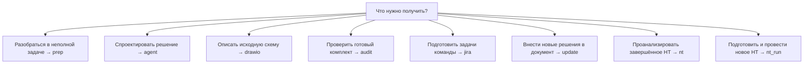
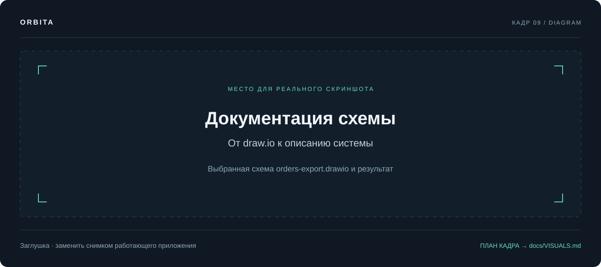
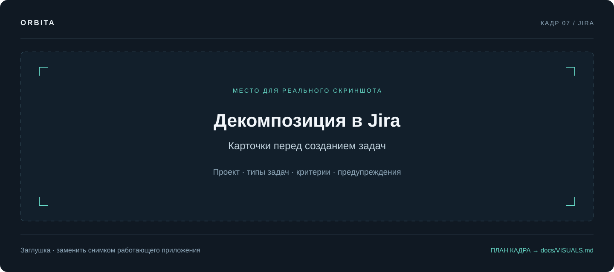
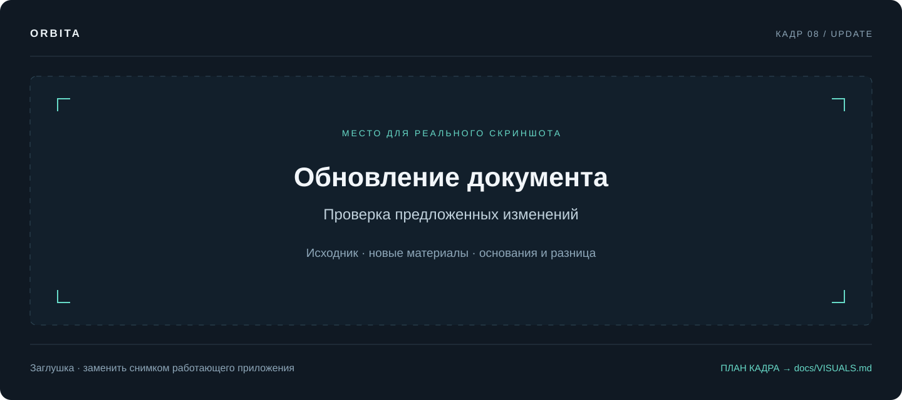
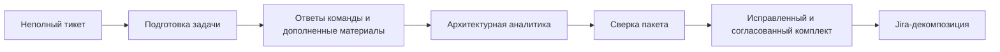

# Рабочие сценарии

[Документация](README.md) / Сценарии

Выбирайте сценарий по результату, который нужен сейчас. Каждый пример ниже запускается отдельным новым прогоном. Инструкция по общим кнопкам — в [руководстве пользователя](USER_GUIDE.md).

## Как выбрать



Обычно вы сами выбираете следующий сценарий и передаёте ему сохранённые результаты. Исключение — `nt_run`: после основного нагрузочного прогона он сам вызывает `nt` для анализа фактического периода теста.

## 01 · Архитектурная аналитика

**ID:** `agent`. **Вход:** задача, материалы папки и/или доступные источники Jira/Confluence. **Пример:** `input/partial-refund/`.

Выберите «Архитектурная аналитика», папку `partial-refund` и отправьте:

```text
Собери системные требования и проект решения по частичному возврату заказа.
Прочитай все материалы папки. Отдельно перечисли противоречия, нерешённые
вопросы и критерии приёмки. Затем подготовь API, данные и архитектуру.
```

Последовательность: **Системные требования → Контракт API → Данные и события → Архитектура решения → Ревью и финальная версия**. Первая роль может использовать файловые инструменты, поиск и чтение Jira/Confluence. Явные внешние ссылки читаются до её первого вызова модели.

Результат — пять документов этапов. При `CONFLUENCE_PUBLISH_MODE=each` сохраняется отдельный документ на этап. Для проверки примера убедитесь, что более позднее письмо финансов не потерялось за решением встречи: допустимые статусы возврата в них различаются.

**Дальше:** передайте сохранённый комплект в «Сверку пакета» или «Jira-декомпозицию». Полный список ожидаемых находок — в [тестовых данных](TEST_DATA.md).

## 02 · Подготовка задачи

**ID:** `prep`. **Вход:** тикет Jira, названный ключом/ссылкой или найденный по описанию. **Настроенная Jira обязательна:** без неё этот граф остановится до первого вызова модели. Локальные файлы могут дополнять задачу, но не заменяют требование настроить трекер. Confluence нужен для поиска внешней документации.

После [подключения Jira](INTEGRATIONS.md) передайте ключ доступного рабочего или тестового тикета:

```text
Подготовь PAY-123 к аналитике. Прочитай задачу и связанные материалы,
найди существующую документацию, перечисли пробелы и предложи план работ.
```

При необходимости выберите папку с дополнительными материалами. Если вместо ключа дано описание для поиска, проверьте, какую задачу выбрал граф: автоматический выбор должен быть явно отражён в результате.

Последовательность: **чтение задачи → Разбор задачи → Что нужно выяснить → Что уже есть → План работ и примерные задачи → Первичная документация**.

Результаты пяти ролей собираются в **один публикуемый документ**. Проверяйте, что найденные факты сопровождаются источниками, а недоступный тикет не пересказан как прочитанный. Этот сценарий готовит черновой план; фактическое создание задач выполняет сценарий Jira.

## 03 · Документация схемы

**ID:** `drawio`. **Вход:** файл `.drawio`. **Пример:** папка `diagram`, файл `orders-export.drawio`.

```text
Опиши систему по выбранной схеме. Перечисли компоненты, границы и интеграции,
восстанови основной поток. Отдели факты со схемы от предположений
и заверши списком вопросов, на которые схема не отвечает.
```

Выберите именно файл схемы. PNG-экспорт не заменяет `.drawio`: код читает структуру диаграммы, а не распознаёт изображение.

Последовательность: **разбор файла кодом → Разбор схемы → Компоненты и интеграции → Страница документации → Ревью достоверности**.

Проверьте направление связей, границы систем и подписи. Отсутствие протокола на схеме не даёт оснований уверенно объявить его REST или Kafka. Для больших схем смотрите предупреждение об ограничении `DIAGRAM_MAX_CHARS`.



## 04 · Сверка пакета

**ID:** `audit`. **Вход:** несколько связанных документов. **Пример:** `input/partial-refund-package/`.

Выберите папку целиком:

```text
Сверь пакет требований, API, данных и архитектуры.
Покажи непокрытые требования, противоречия, невалидные примеры и TBD.
Для каждой проблемы укажи источник и влияние. Дай заключение о готовности.
```

Сначала код читает пакет и проверяет ссылки на требования, маршруты, JSON-примеры и заглушки. Затем модель выполняет **Трассировку → Расхождения → Заключение по пакету**. Результат публикуется одним отчётом.

Во встроенном комплекте намеренно есть ссылка на несуществующее требование `NFR-9`, непокрытые `ФТ-7` и `ФТ-8`, сломанный JSON и три `TBD`. Модель дополнительно должна заметить разные сроки жизни ключа идемпотентности. [Все критерии](TEST_DATA.md).

Пустой список автоматических находок не доказывает корректность бизнес-решения. Итог должен объяснять, какие срезы проверены и какие остались неизвестными.

## 05 · Jira-декомпозиция

**ID:** `jira`. **Вход:** готовая аналитика в файлах или страница Confluence. **Пример:** `partial-refund-package`.

Для первого прогона задайте `JIRA_CREATE_ISSUES=0` и перезапустите backend. Это позволяет проверить backlog до подключения создания задач.

```text
Разложи выбранный пакет аналитики на задачи команды.
Выдели Epic, задачи по сервисам и слоям, зависимости и критерии приёмки.
Нерешённые вопросы сохрани явно; не придумывай согласованные оценки.
```

Последовательность: **чтение источника → Карта реализации → Jira-декомпозиция → Ревью и финальный Jira backlog → Карточки для трекера → создание задач при включённой интеграции**.

Для реального создания настройте Jira, включите `JIRA_CREATE_ISSUES=1`, оставьте `JIRA_CREATE_REQUIRE_APPROVAL=1` и выберите проект. Перед подтверждением интерфейс покажет карточки: тип, заголовок, описание и предупреждения сопоставления полей. Можно подтвердить REST-создание либо подготовить формы для ручной проверки в Jira.



После создания проверьте ключи, ссылки и поля задач. Формы и карточки без выданных Jira ключей не являются доказательством создания.

Повтор шага не заводит задачи заново. Каждая операция записи проходит через журнал (`data/jira-operations.sqlite3`, путь задаёт `JIRA_JOURNAL_PATH`): отправка записывается до запроса, а на задачу вешается устойчивая метка `orbita-op-…`. Если прогон прервался после принятого запроса, повтор находит заведённую задачу по этой метке, а не отправляет её второй раз. Уже завершённые части пачки, родители и связи не повторяются.

Когда сверка с Jira невозможна — трекер недоступен, отозван токен, — результат объявляется неизвестным: задача не отправляется повторно, а в результате появляется раздел с неопределёнными операциями и меткой, по которой их можно найти в трекере руками. Разрешает такую ситуацию человек. Подробности — в [интеграциях](INTEGRATIONS.md).

Таймаут, потерянный/неразбираемый ответ и HTTP 5xx при записи также означают неизвестный результат. Пустой поиск по метке не доказывает отказ POST: индекс Jira может отставать. При повторе узел снова выполняет сверку; новый POST допустим после подтверждённого отказа, но не после пустого поиска. Создание ребёнка откладывается до появления родителя. Для задач, ранее созданных без родителя, повтор восстанавливает Parent/Epic Link отдельной журналируемой операцией.

## 06 · Обновление документа

**ID:** `update`. **Вход:** один основной текстовый документ и явно выбранные новые материалы. Они могут находиться в разных папках.

Воспроизводимый пример из репозитория:

| Поле интерфейса | Выбор |
| :--- | :--- |
| Основной документ: папка | `partial-refund` |
| Основной документ | `current-api.md` |
| Новые материалы: папка | `partial-refund` |
| Новые материалы | `meeting-2026-08-18.md`, `mail-finance.md` |

```text
Обнови основной документ по новым материалам о частичном возврате.
Меняй только подтверждённые фрагменты. Для каждой правки укажи основание.
Если решения противоречат друг другу или данных недостаточно,
оставь открытый вопрос вместо придуманного контракта.
```

Последовательность: **Чтение документов → Предложение изменений → Проверка и применение → Подготовка новой версии → Согласование сохранения → Сохранение новой версии**.

Код проверяет предложенные замены по исходному тексту и основаниям. Материалы читаются целиком: суммарное превышение `AGENT_INPUT_MAX_CHARS` остановит сценарий. Необходим явный выбор файлов, а основной документ нельзя одновременно включить в новые материалы.



Сохранение новой версии **всегда требует подтверждения**. Исходный файл остаётся на месте, новая версия получает отдельный заголовок с идентификатором. Если подтверждённых изменений нет, результат имеет статус `unchanged`. Это не редактор произвольной страницы Confluence «на месте».

## 07 · Анализ нагрузочного тестирования

**ID:** `nt`. **Название в интерфейсе:** «Нагрузочное тестирование». **Вход:** уже выполненный тест, его параметры и исторические метрики. Этот граф не создаёт нагрузку.

После [настройки источников и карты метрик](NT.md) передайте идентификатор теста, доступный вашему gateway:

```text
Проанализируй завершённое НТ <test_id>.
Проверь SLA, выдели плато нагрузки и оцени полноту диагностики.
Отдели подтверждённые отклонения от гипотез и укажи недостающие данные.
```

Если gateway не настроен, задайте сервис, окружение, namespace, фактический период и SLA по [примеру входа](NT.md#запуск). Результат — вычисленный вердикт `PASSED` / `FAILED` / `INCONCLUSIVE`, отдельный статус полноты диагностики и отчёт. Недостаток данных не означает успешное прохождение теста.

## 08 · Проведение нагрузочного тестирования

**ID:** `nt_run`. **Название в интерфейсе:** «Проведение нагрузочного тестирования». **Вход:** цель, настроенный стенд, HTTP-контракт, тестовые данные, профиль нагрузки, SLA и пороги остановки. Нужны отдельный runner и установленный k6.

1. Настройте runner и разрешённую цель по [инструкции проведения НТ](NT_RUN.md).
2. Передайте задачу по примеру из этой инструкции; при необходимости выберите файлы контракта.
3. Ответьте на уточнения. Перед разрешением запуска раскройте план и k6-скрипт, проверьте адрес, данные, интенсивность и длительность.
4. Одно разрешение запускает пробный сценарий и, если он прошёл, основной тест. После сбора результатов граф вызывает `nt` и решает, нужен ли следующий эксперимент в пределах лимита.
5. Проверьте результаты k6 и исторический вердикт отдельно, затем сохраните отчёт.

`completed` — статус выполнения k6. Он не заменяет вердикт SLA. Запуск нагрузки и публикация отчёта имеют разные подтверждения; отказ от публикации не отменяет уже проведённый тест.

Для знакомства с локальным примером используйте [nt-testbed](NT_RUN_TESTBED.md). Там же объяснено, какие данные в демонстрации измерены k6, а какие созданы симулятором.

## Пример сквозной работы с документами



Между шагами проверьте и сохраните результаты. Для следующего графа выбирайте относящийся к задаче комплект из «готовых документов» либо подготовьте отдельную папку в `input/`.

---

Далее: [Интеграции →](INTEGRATIONS.md) · [Тестовые данные →](TEST_DATA.md)
